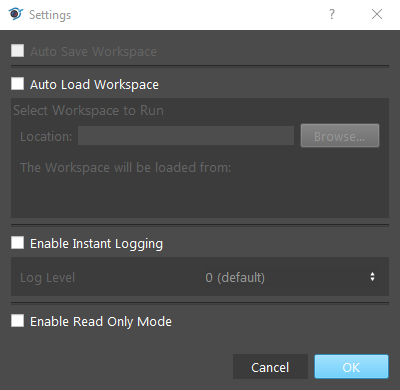

Setting 
-----------

Clicking on the setting logo will pop up a setting dialog. It has 4 checkboxes: Auto Save Workspace, Auto Load Workspace, Enable Instant Logging and Enable Read Only Mode. 

.. toctree::
   :maxdepth: 2
    
   Auto Save Workspace
   Auto Load Workspace
   Enable Instant Logging
   Enable Read Only Mode 