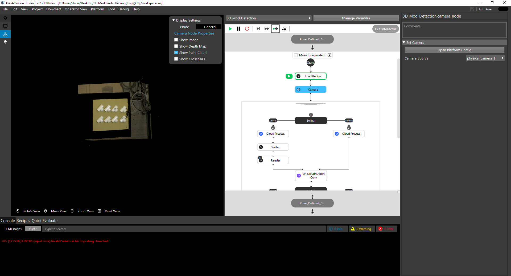
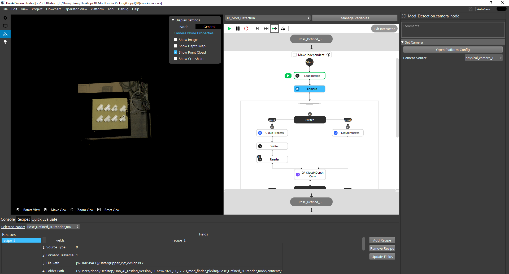
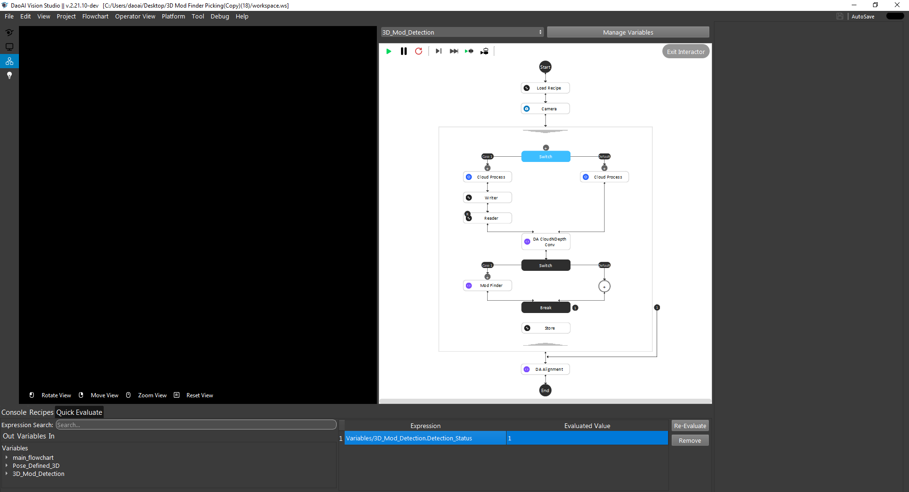

Console window
-----------

.. image:: image/p_main_page.png
   :width: 650

Console window (#10) has 3 tabs: 

i. Console 

Console shows all the messages generated from the program. Error messages, warnings and information of execution. Clear button can clear the messages in console. Search bar is able to search key words from existing messages. 

ii. Recipe 

Recipe tab shows all the existing recipes and all the nodes which are connected with current recipe. The recipe can be changed in this console window at any time, for every node that is connected to this recipe. Add, remove and edit fields for these nodes’ recipe. 

iii. Quick Evaluate 

Evalution console window is able to evaluate the values and expressions for selected nodes. Which allows users to see the values at any time of the program execution flow. Users can also search key words to find the expected nodes or expressions in the whole project. 

