Case Studies
==================================

This section covers the basic examples of the Vision software, including creating a new workspace, and link the node for the vision tasks

.. toctree::
   :maxdepth: 1

   mod_finder

3D Object Finder 
----------------
Objective
~~~~~~~~~
The 3D Object Finder Node aims to consolidate several existing PPF-related nodes, including Model Processing, 3D Detection, and Edge Extraction, into a single, feature-rich node.

Steps
~~~~~~
1. :ref:`Create a new workspace`
2. :ref:`Connect the camera to the Vision software`
3. :ref:`Insert the nodes`
4. :ref:`Configure the link expression inside each node`
5. :ref:`Workspace Data & Video Recordings`

Create a new workspace
~~~~~~~~~~~~~~~~~~~~~~~

Open the Vision Software and click on the New Project button on the top left. 

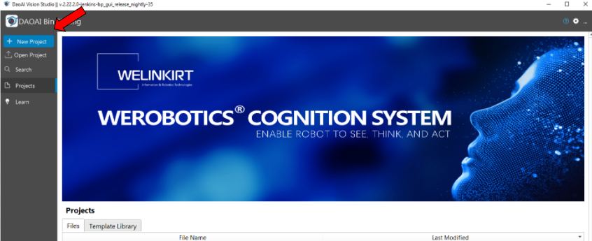
|

In the New Project dialog, the operator should name the project and select the file location, then press “ok”.

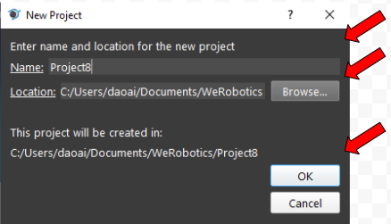
|

Connect the camera to the Vision software
~~~~~~~~~~~~~~~~~~~~~~~~~~~~~~~~~~~~~~~~~~~

Once finishing creating the new project, the operator should click the Platform to config the camera, robot, and server settings.  

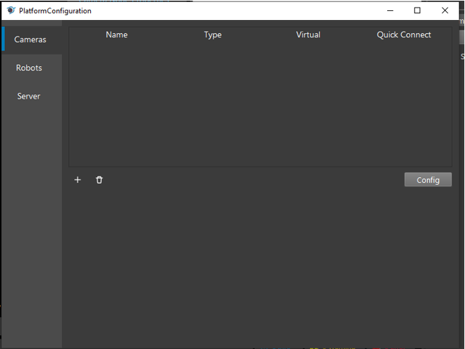
|

All three categories are listed on the left side of the dialog and highlighted by the blue bar. The operator can add cameras, robots, or servers by pressing the “+” button. 

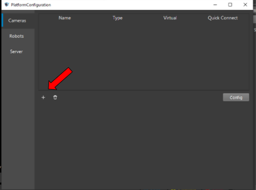
|

Under the Type, click the camera box to view the whole list of options and select the camera that is going to be used for the application by clicking the Accept button. Then, a new dialog will pop up for configuring the specific camera. The operator can also delete the camera by selecting the camera and pressing the trash bin icon to delete it. 

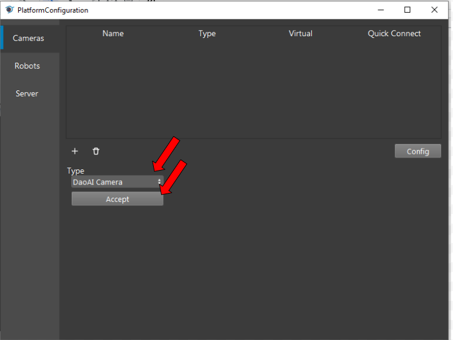
|

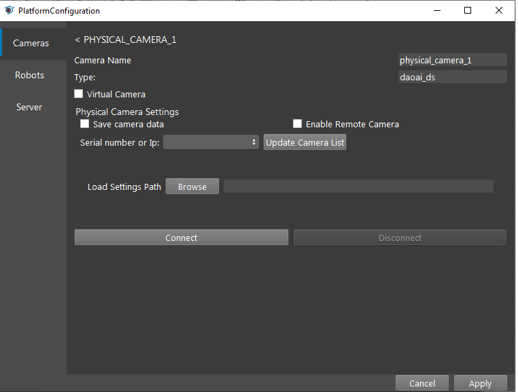
|

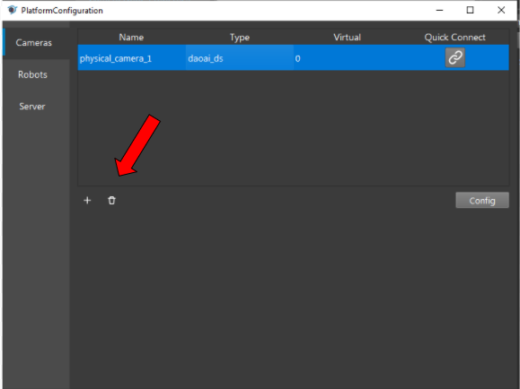
|

The operator can load dcf files that were generated in the past as the camera output. To do so, the operator should check the Virtual Camera box, and choose the option to load the dcf files. The operator can either load the entire dcf folders or just load a single dcf file. Then press the “Connect” button to connect the camera node with the other node.  

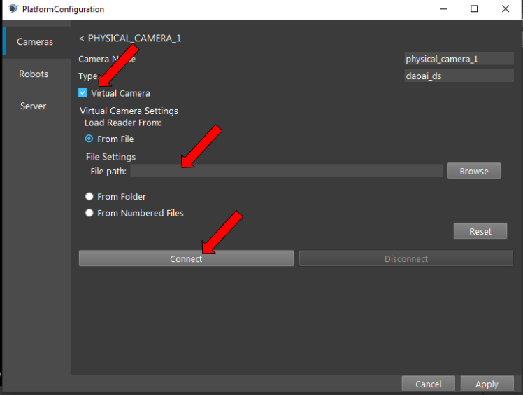
|

To add the real camera, the operator should press the “Updated Camera List”, then press the blank box on the left to discover if the camera’s serial number has been updated. If the number pops up, the operator can select the number by pressing it. The load Setting Path function allows the operator to load the cfg file, which contains the setting the operator configured in the studio to enhance the quality of the image shot from the camera. Then, press the “Connect” button to connect the camera with other nodes. 

.. image:: eheh/26.png
    :width: 100%
    :align: center
|

Once the camera has been connected with other nodes, the operator should select the correct physical camera number in the Camera Source box. 

.. image:: eheh/27.png
    :width: 100%
    :align: center
|

Insert the nodes
~~~~~~~~~~~~~~~~~

In general, we use the 3D Object Finder node to identify the object inside the 3D scene cloud; therefore, the basic setup is to use the camera point cloud as the input of the 3D Object Finder. To make sure the object can be perfectly mapped in the scene, the Alignment node is added under to 3D Object Finder node to improve the accuracy.

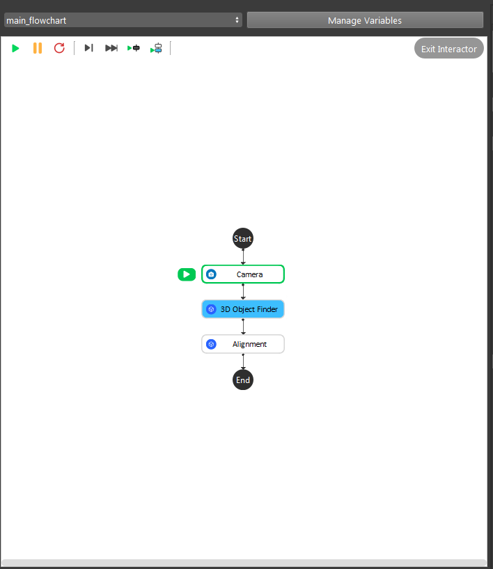
|

Configure the link expression inside each node
~~~~~~~~~~~~~~~~~~~~~~~~~~~~~~~~~~~~~~~~~~~~~~

The first step the operator needs to do is to select the search type

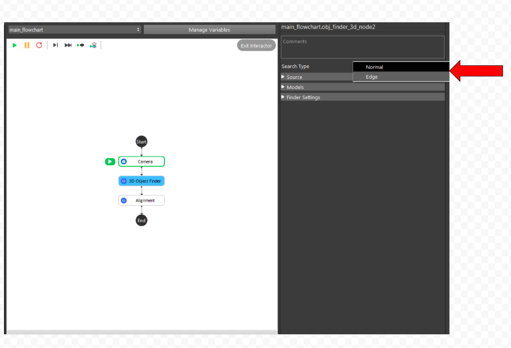
|

By selecting normal, the node's point cloud will consist of planes or curved surfaces.

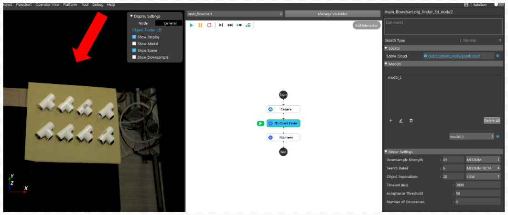
|

If the operator selects edge, the node will create the point cloud using the feature points along the object's edge.

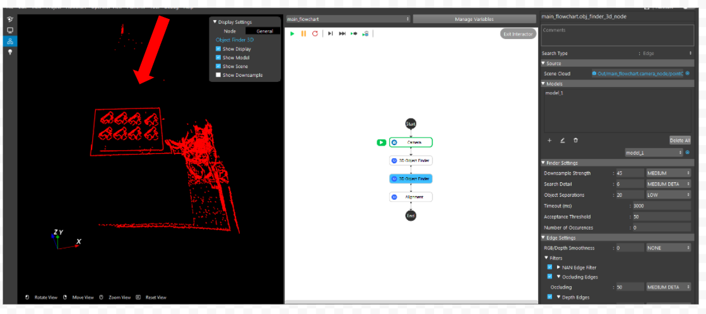
|

Once the operator finishes defining the type, the remaining sections of the dialogue can be visualized.
   
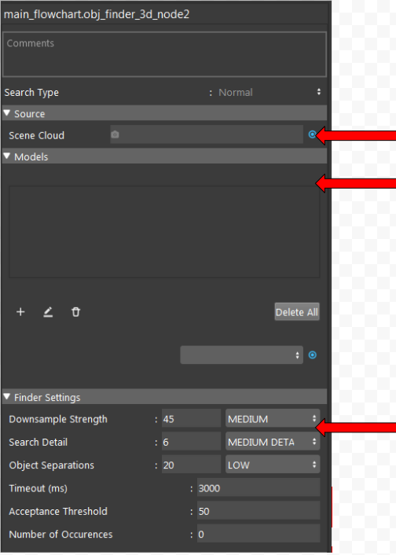
|

If the operator selects normal, the operator should click the blue button to the right of the Scene Cloud node to open the Expression Link Dialog and insert the scene cloud's link.

.. Attention::
   While the camera node is used as the scene cloud's input in the example above, other nodes such as reader and cloud process can also be used as the scene cloud's input.

The result displayed in the View interface varies according to the search type selected by the operator at the start.
The operator can add and define an object's model in the Models section by pressing the "+" button. In the section, a "model x" will be displayed to inform the operator that the model was successfully created.

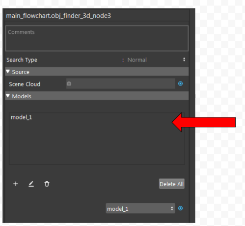
|

By double-clicking on model 1, the ObjFinder3DModelConfig dialogue for editing the model's parameters will open. The operator can either load the model mesh from the device or define the object from the scene cloud within Model Type.

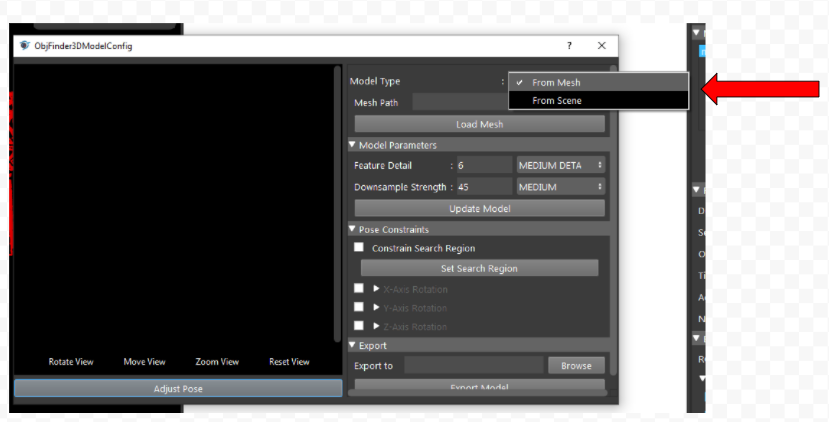
|

By choosing the type as mesh, the program will ask the operator to add the mesh path. 

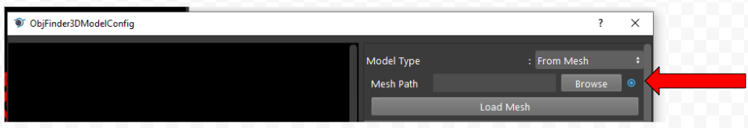
|
.. image:: eheh/17.png
    :width: 100%
    :align: center
|

.. Attention::
   Normally the model type loaded into the path should be ply.

However, if the operator chooses to load the model from the scene, then the program will ask the operator to define the Model from the scene cloud.

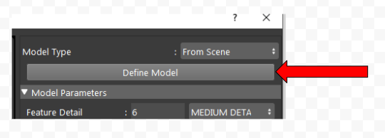
|
.. image:: eheh/10.png
    :width: 100%
    :align: center
|
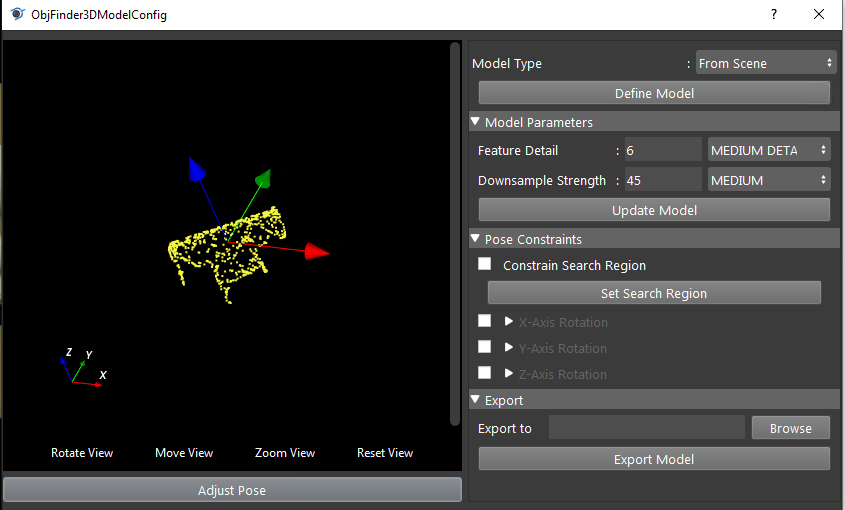
|

The operator can use this function in the Model Parameters node to enhance the quality of the point cloud by editing the Feature Detail and Downsample Strength. By clicking the Update Model button, the operator can update the editing information.

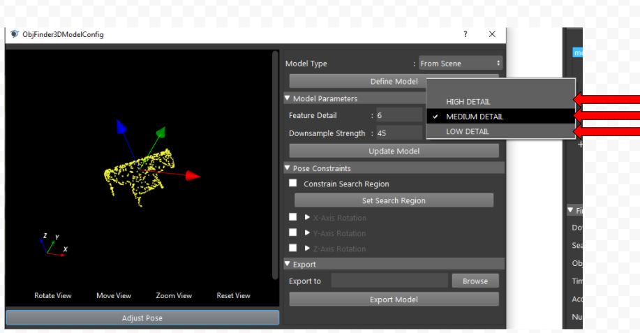
|
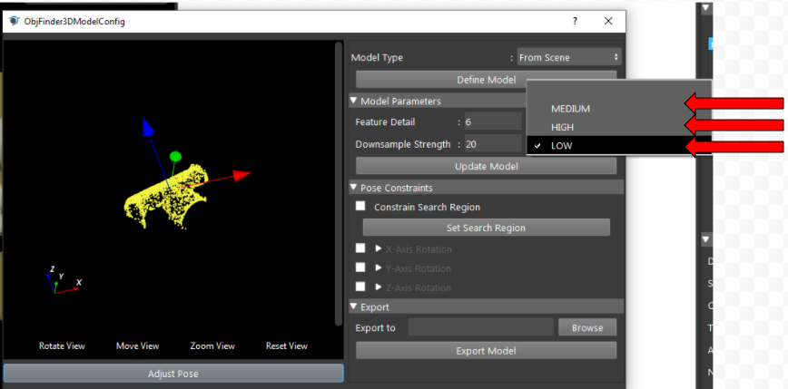
|

Both features have 3 options to choose: 

The Feature Detail property specifies how many model features are used in the calculation. The higher the value, the more features are calculated. Downsampling determines the object's point cloud's quality. A lower value indicates a denser point cloud was used in the subsequent calculation.

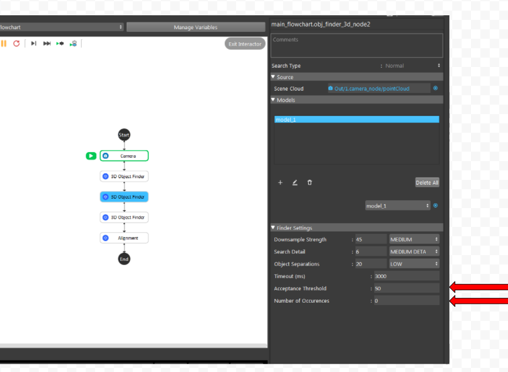
|

The Pose Constraints dialog can be used to help the operator to define objects more accurately. 

After defining the model, the operator can close the ObjFinder3DModelConfig Diglog and edit the parameters inside the Finder Settings. 

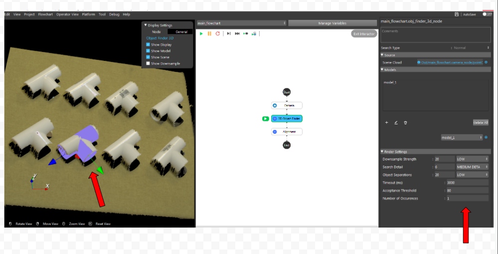
|

The operator should enter the desired number of detected objects in the Number of Occurrences field and adjust the Acceptance Threshold to ensure that no additional or fewer objects are displayed in the scene.

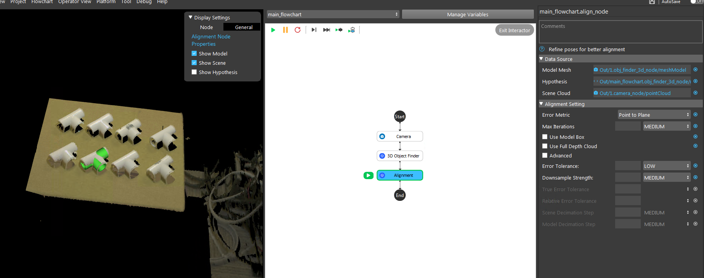
|

The operator can use the Alignment node to perform a second alignment between the detected poses and the scene to increase the accuracy.

Workspace Data & Video Recordings
~~~~~~~~~~~~~~~~~~~~~~~~~~~~~~~~~~

The used data for this demo, and the video recording for this demo was stored online with this:

`3D_Object_Finder <https://daoairoboticsinc-my.sharepoint.com/:f:/g/personal/wzhao_daoai_com/ElfERbA6veVMhl0YbWQOWR4B5nVnXy_vmYAPLFfLXSfawA?e=fGXkUX>`_