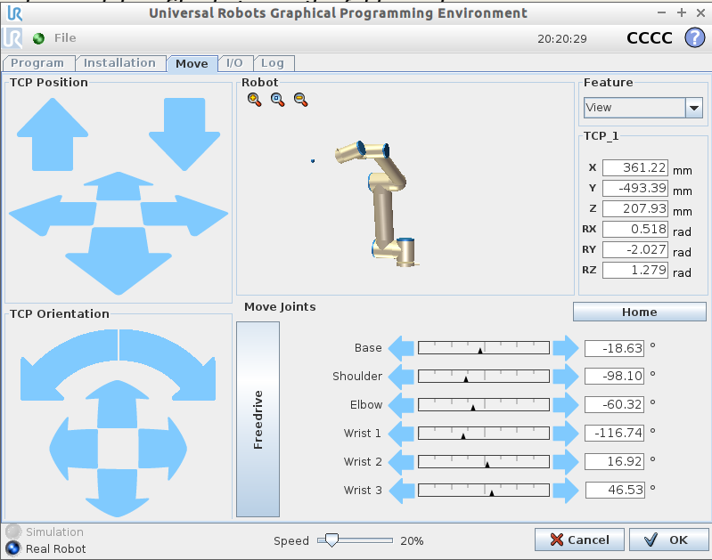

UR-Robot
========

System Setup
------------

Turn on the robot
~~~~~~~~~~~~~~~~~

To turn on the real robot, press the green button on the teaching pendant. 

    
|

Network
~~~~~~~

Once you open the program, we would need to configure the network setting so we can communicate with the robot.  Click on Setup Robot → Network → select static address and we will change the IP address. 

.. image:: Images/nt1.png
    :align: center
    
|

.. image:: Images/nt2.png
    :align: center
    
|

Open the command prompt on your PC, in the command, type “ipconfig” to check all the available networks on your PC:

    
|

Locate the network you will communicate with your robot. If you are using the virtual simulation, go find the VMnet8 network (Or other networks that your VM is using) and copy the IP address and keep the last 3 digits as 129.

    
|

If you are using a real robot, make sure to change your network to a static IP address by going into Network Connections → Right-click on the network and click on properties → right click on TCP/IPv4, and change the IP address. 

.. image:: Images/nt5.png
    :align: center

|

Once the IP address is changed, hit Apply to finish the changes. 

|

In order to make sure your robot is connected, go to the command prompt and type “ping _ “ where _ would be the IP address you assigned the robot to. If the message is displayed like the one shown below, then the robot is connected successfully. If the responses timed out, check if you typed your IP address correctly as well as the settings. 

|

Safety Issue
------------

Moving Speed
~~~~~~~~~~~~

It is important to note the operating speed of the robot as the robot can be dangerous when running at a fast speed. Make sure your robot speed is within the range of 20% speed to reduce the robot operating speed as well as giving the user time to recover the robot if something goes wrong half-way through the operation. 

    
|

Emergency Stop
~~~~~~~~~~~~~~

If something goes wrong using the UR5 robot during the robot operation, press the emergency red button located below the power button. To restart and recover the robot operation, rotate the emergency stop button in the direction indicated on the button (Clockwise) until it becomes unpressed. Then repeat the previous set up procedure. 

    
|

Vision and Robot Communication
------------------------------

Load Program
~~~~~~~~~~~~

Once you finished configuring the network, click Back to go back to the menu and click on Program Robot. Click on Load Program to load the first program, “get pose.urp”,  in the UR Code folder downloaded previously in your Program UR5 folder, and then open the program. 

    
|

Before running the program, the user needs to make sure that the robot is connected to the right IP and port. Go to “Connected==socket_open…” under chushiconnected and change the IP address to the same network as the virtual network (or the network the real robot is on), and change the port to 6969 (or the same port as the Hercules program on the server-side). 

    
|

click on waypoint under the Robot program, and set the waypoint, make some position adjustment and click ok.

    
|

    
|

After setting the waypoint, click run, you should be able to see the connection established between the client and the server-side by checking the Client connection status. 

.. image:: Images/nt5.png
    :align: center

|

Configuration on Vision
~~~~~~~~~~~~~~~~~~~~~~~

On the top menu bar, select ``Platform`` ->  ``Platform config page``. 

.. image:: Images/Robot0.png
    :align: center
    
|

Select ``Robots`` on left side menu bar and click ``+``,

    
|

Press ``Connect`` (Keep the pamameter defualt)

.. image:: Images/Robot2.png
    :align: center
    
|

Now you are good to go with Robot related Nodes.

Interface
------------
This article proposes an Application Programming Interface (API) to be used by robot programs to perform vision-guided pick and place with DaoAI. It consists of a number of global variables and functions that encapsulate the socket communication between a robot and DaoAI. 

The interface is meant to be robot-independent, and consists of global variables and functions written in pseudo-code, using a syntax similar to that of Python. Translating it to a specific robot programming language should consist of adapting to the syntax, features and best practices of the target language. Some deviation from the proposed interface might be necessary due to target language limitations, and the implementer is left with the responsibility of making the best compromise between what is possible and the proposed interface. 

Functions 

The following functions relate to performing object detection. They send a request to DaoAI, but don’t wait for the response to arrive.  

daoai_find_objects_send() 
~~~~~~~~~~~~

Trigger a DaoAI object detection using the currently active setup and product configuration. 

Implementation 

Send RC_DAOAI_LOOK_FOR_OBJECTS and don’t wait for a response. 

daoai_find_objects_with_retries_send(retries) 

Trigger a DaoAI object detection with retries using the currently active setup and product configuration. 

As opposed to daoai_find_objects(), when no objects are found (but the Region of Interest (ROI) is not empty), DaoAI will retry up to retries times to find objects before giving up. 

Parameters 

retries Maximum number of detection retries. 

Implementation 

Send RC_DAOAI_LOOK_FOR_OBJECTS_WITH_RETRIES and don’t wait for a response. 

daoai_process_image_send() 
~~~~~~~~~~~~

Trigger a DaoAI object detection without image capture using the currently active setup and product configuration. 

This function uses the latest captured camera image, which typically comes from calling daoai_capture_image() just before. 

Refer to the documentation of daoai_capture_image() to learn more about the recommended usage of this function. 

Implementation 

Send RC_DAOAI_PROCESS_IMAGE and don’t wait for a response.

daoai_get_next_object_send() 
~~~~~~~~~~~~

Request the next detected object. 

A single object detection run might yield the detection of multiple objects. This function allows to request the next available object, if any, without the need of triggering a new detection and the time overhead it entails. 

It’s recommended to use this command only when objects in the detection region have not moved (significantly) since the last detection took place. A good example of when to use daoai_get_next_object() is when a detection is unreachable by the robot. An example of when using it is not recommended would be the following bin picking scenario: 

Trigger a DaoAI detection that finds multiple objects. 

The first object is picked. Since objects are randomly placed in bin, neighboring objects move and fall into place. 

Call daoai_get_next_object() and attempt to pick next object. If the next object is one of the neighboring parts that moved, the pick is likely to fail. 

When the objects in the detection region have moved, it’s better to re-trigger object detection instead (by calling daoai_find_objects_with_retries(retries), for instance). 

Implementation 

Send RC_DAOAI_NEXT_OBJECT and don’t wait for a response. 

.. note:: 
    |  all calls except daoai_get_next_object() (which is very fast) trigger a DaoAI object detection run, which can potentially take multiple seconds. 

In your robot program, it’s encouraged to perform robot motions or other non-DaoAI-detection actions between calls to these functions to save cycle time in your application.  

  

The following functions are short-running. The robot sends a request to DaoAI and waits for the response, which only consists of a status code. 
   
|
  

The following functions are short-running. The robot sends a request to DaoAI and waits for the response, which only consists of a status code. 

daoai_is_detection_send_recv() 
~~~~~~~~~~~~

Check whether detection mode is enabled in DaoAI. 

Implementation 

Send RC_DAOAI_CHECK_MODE and wait for a response. 

Return 

True if the response status is DAOAI_MODE_DETECTION. 

daoai_configure_send_recv(setup, product) 

Loads the specified DaoAI configuration (setup and product). 

Implementation 

Send RC_DAOAI_CONFIGURE and wait for a response. 

If the response status is not DAOAI_CONFIG_OK, a non-recoverable error is raised and program execution is halted. This can happen, for instance, when the parameters correspond to non-existing setup or product IDs. 

daoai_save_snapshot_send_recv()
~~~~~~~~~~~~

Save a snapshot with the latest detection results. 

For an example usage, refer to the description of the after_end hook of the pick and place program. 

Implementation 

Send RC_DAOAI_SAVE_SNAPSHOT and wait for a response. 

Return 

True if the response status is DAOAI_SAVE_SNAPSHOT_OK. 

daoai_capture_image_send_recv() 
~~~~~~~~~~~~

Capture a camera image without triggering object detection. 

This function blocks until image capture has completed, and is especially useful when working with a robot-mounted camera, where the robot must remain stationary during image capture, but not during detection. This function is meant to be used prior to calling daoai_process_image(). 

For fixed camera mounts, it’s usually more convenient to call functions that combine image capture and processing, like daoai_find_objects_send() or daoai_find_objects_with_retries_send(retries). 

Implementation 

Send RC_DAOAI_CAPTURE_IMAGE and wait for a response. 

Return 

True if the response status is DAOAI_IMAGE_CAPTURED. 

daoai_build_background_send_recv()
~~~~~~~~~~~~

Build the background cloud used by some of the advanced Region of Interest filters. 

Calling this function will trigger a camera capture. So, if the camera mount is fixed, the robot must not occlude the camera view volume. If instead the camera is robot-mounted, the robot must be in the detection point. 

Implementation 

Send RC_DAOAI_BUILD_BACKGROUND and wait for a response. 

Return 

True if the response status is DAOAI_BUILD_BKG_CLOUD_OK. 

 
 

The following functions are helpers that don’t require extra communication with DaoAI. They use the information received in the most recent detection results. These helpers are typically used as part of conditional expressions, such as an if statement. 

daoai_empty_roi()
~~~~~~~~~~~~

Check if an empty Region of Interest (ROI) detected. 

When daoai_object_found() returns False, it can be due to: 

The ROI is not empty, but DaoAI doesn’t detect the active product. 

The ROI is empty. 

Use this function if you need to discriminate between these two situations. 

Return 

True if DaoAI detected an empty ROI. 

daoai_object_found()
~~~~~~~~~~~~

Check if valid detection results produced. 

Return 

True if detection results are available. 

When results are available, the output global variables have valid contents. 

This function returns False when DaoAI replied with no detection results (nominal usecase). 

daoai_no_image_captured()
~~~~~~~~~~~~

Check if object detection was unsuccessful due to a failure to capture a camera image. 

When this is the case, it typically indicates a hardware disconnection issue, such as a loose connector or broken cable. This function can be used as trigger to send an alarm to a higher level monitoring system. 

Return 

True if object detection was unsuccessful due to a failure to capture a camera image. 

daoai_remaining_objects()
~~~~~~~~~~~~

Get the number of remaining detected objects. 

After calling daoai_get_result(), this function returns the total number of object detections minus one, as the first object data is available through the output global variables. 
This value is also equal to the number of times daoai_get_next_object() can be called. As such, the returned value decreases with each call to daoai_get_next_object(). 

Return 

Number of remaining object detections available for query. 
Calibration functions 
There is a single function meant to be used in a calibration robot program. 

daoai_is_manual_calib_send_recv() 
~~~~~~~~~~~~~~~~~~~~~~~

Check whether manual calibration mode is enabled in DaoAI. 
Implementation 
Send RC_DAOAI_CHECK_MODE and wait for a response. 
Return 
True if the response status is DAOAI_MODE_MANUAL_CALI. 

daoai_is_auto_cali_send_recv() 
~~~~~~~~~~~~

Check whether auto-calibration mode is enabled in DaoAI. 
Implementation 
Send RC_DAOAI_CHECK_MODE and wait for a response. 
Return 
True if the response status is DAOAI_MODE_AUTO_CALI. 

daoai_is_auto_cali_accumulate_send_recv()
~~~~~~~~~~~~~~~~~~~~~~
Check whether auto-calibration accumulation mode is enabled in DaoAI. 
Implementation 
Send RC_DAOAI_CHECK_MODE and wait for a response. 
Return 
True if the response status is DAOAI_MODE_AUTO_CALI_ACCUMULATE. 