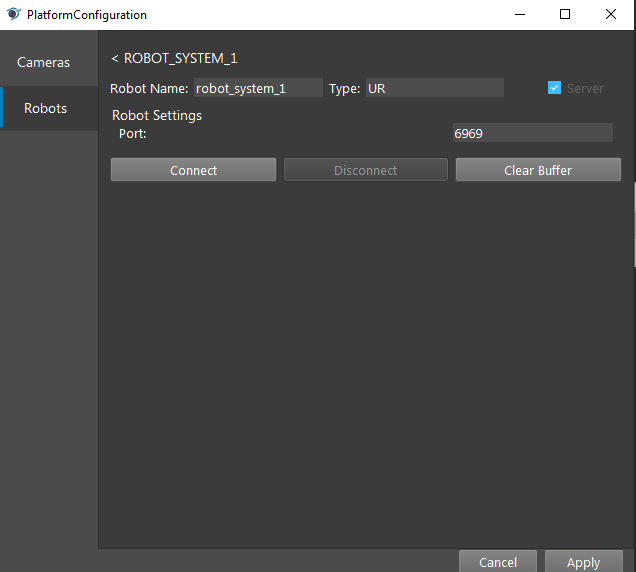

UR-Robot
========

On the top menu bar, select ``Platform`` ->  ``Platform config page``. 

.. image:: Images/Robot0.png
    :align: center
    
|

Select ``Robots`` on left side menu bar and click ``+``,

.. image:: Images/Robot1.png
    :align: center
    
|

Press ``Connect`` (Keep the pamameter defualt)

    
|