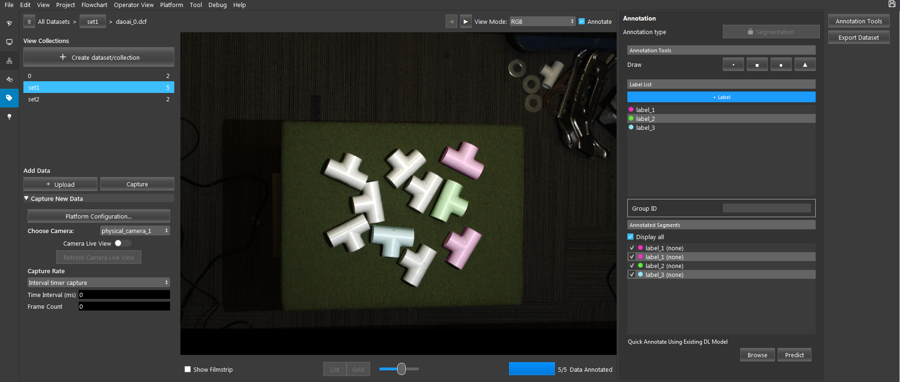
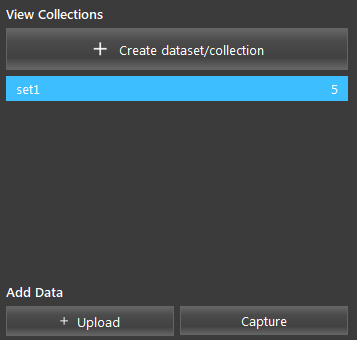
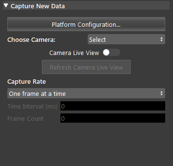
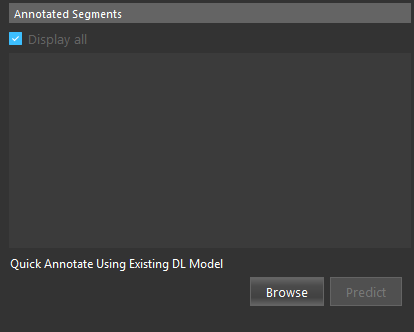
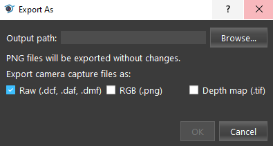

Annotation Tool
================

| This is the built-in annotation tool for DaoAI Vision Studio. 
| Users can use this tool to quickly annotate and export their data for segmentation and classification model training.
| The tool can be accessed via the tag icon on the left vertical bar.

|

View Collections
---------------------

- **+ Upload**
   Upload data (.dcf/.png/.daf/.dmf) files to the selected dataset.

- **Capture**
   Add data to the selected dataset by capturing from cameras.

Camera Configuration
----------------------

- **Choose Camera**
   The camera source to capture frome. Please refer to :ref:`Camera` for details of adding a camera.

- **Camera Live View**
   When selected, the camera view is continuously refreshed.

- **Capture Rate** (Default: One frame at a time)
   Select one from "One frame at a time" or "Interval time capture".
   One frame at a time performs a capture on click.
   Interval time capture performs a capture every **Time Interval** for **Frame Count**.

- **Time Interval (ms)** (Default: 0 ms)
   Available in Interval time capture mode. Amount of time to wait before the next capture.

- **Frame Count** (Default: 0 ms)
   Available in Interval time capture mode. Number of frames to be captured.

Quick Annotate
-----------------

| The Quick Annotate feature allows you to annotate data by using an exisiting model. 
| The Quick Annotate is located in the lower right corner of the annotation page.
| You can use this `data <https://daoairoboticsinc-my.sharepoint.com/:u:/g/personal/xchen_daoai_com/EfrvXd1HCflPkhzOxEV9f3MBVjsdGvJ-EnVh6prfgy_qYw?e=I74U88>`_ and `model <https://daoairoboticsinc-my.sharepoint.com/:u:/g/personal/xchen_daoai_com/EQcko4R156ZLkSiqapQuK08BzMgk1atMy1sXMt73VGVxRA?e=2znzMG>`_  to try out this feature.

- **Browse**
   Select the path for the dl model config file.

- **Predict**
   Predit the annotation segments on the selected data using the exisiting DL model.

Output
----------------

- **Output path**
   The path to export the dataset to.

- **Export Capture Files Format**
   Can select from:
      - Raw (.dcf, .daf, .dmf)
      - RGB (.png)
      - Depth map (.tif)

Procedure to Use
-----------------

This section will introduce the segmentation type annotating for the Annotation Tool.

1. Click the tag icon on the left vertical menu bar to enter the Annotation Tool.

   .. image:: images/annotation_1.png
      :scale: 80%
      
2. Enter the Annotation Tool view.

   .. image:: images/annotation_2.png
      :scale: 60%

3. Create a Dataset/Collection to organize our data. Click "Create dataset/collection" and enter the name for the new dataset.

   .. image:: images/annotation_3.png
      :scale: 80%

4. Click "+ Upload", select some files and click "Open" to upload the data to the dataset.

   .. image:: images/annotation_4.png
      :scale: 60%

5. You can see all the data you have uploaded.

   .. image:: images/annotation_5.png
      :scale: 60%

6. Click "Select.." next to "Annotation Type", and choose "Segmentation". The Annotation Type cannot be changed once it is picked.

   .. image:: images/annotation_6.png
      :scale: 60%

7. Add a few labels. 

   .. image:: images/annotation_7.png
      :scale: 60%

8. Select a draw shape and a label. Left click to start annotating a segment. Right click to finish annotating a polygon segment.

   .. image:: images/annotation_8.png
      :scale: 60%

9. Frames that have been annotated are indicated with a green check mark.

   .. image:: images/annotation_9.png
      :scale: 60%

10. After you have done annotating all the frames, select "Export Dataset" and select a output path to export this datset.

   .. image:: images/annotation_10.png
      :scale: 60%

11. You can find the exported data at the path you selected in step 10.

   .. image:: images/annotation_11.png
      :scale: 60% 

