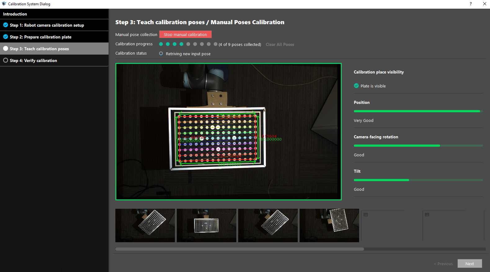
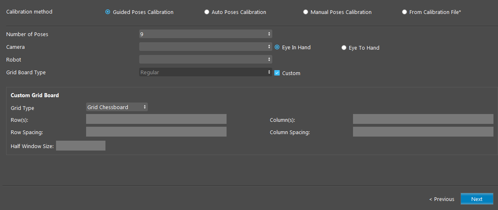
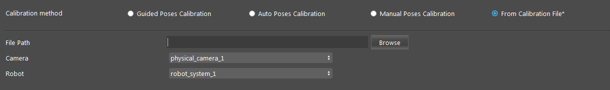
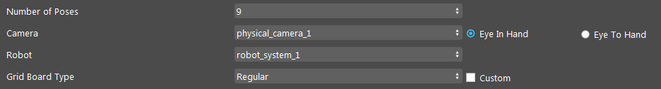
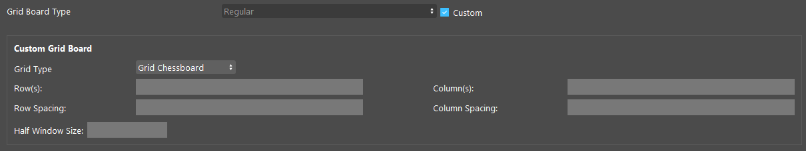

Calibration Tool
=================

The Calibration Tool allows user to calibrate their robot system conveniently.

There are four calibration methods availabe:
    - Guided Poses Calibration
    - Auto Poses Calibration
    - Manual Poses Calibration
    - From Calibration File

This tool serves the same functionality as the Chessboard Calibration template, which can be accessed via the home page's Template tab.

Robot Camera and Calibration Setup
------------------------------------

Calibration Methods
~~~~~~~~~~~~~~~~~~~~~~~

    .. image:: images/ct_calibration_methods.png
        :scale: 80%

- **Guided Poses Calibration**

    .. image:: images/ct_guided.png
        :scale: 60%

- **Auto Poses Calibration**

    .. image:: images/ct_auto.png
        :scale: 60%

- **Manual Poses Calibration**

    .. image:: images/ct_manual.png
        :scale: 60%

- **From Calibration File**
    Load an existing calibration file (.yml) for the camera and robot.
    File Path: the path to the existing calibration file.

Calibration Sources
~~~~~~~~~~~~~~~~~~~~~~~

- **Number of Poses** (Default: 9 poses)
    Select from 9, 13, 17 poses. More poses generally creates more accurate calibration results.

- **Camera**
    Two Camera Hand-Eye Config: Eye In Hand (Default), Eye To Hand.
    The camera to calibrate. 
    Can be configured in the Platform Configuration page.

- **Robot**
    The robot system to calibrate.
    Can be configured in the Platform Configuration page.

Grid Board Parameters
~~~~~~~~~~~~~~~~~~~~~~~

- **Grid Board Type** (Default: Regular)
    Select from one of Regular, Larger, or Custom grid board type.
    For Custom type, the user has to enter the board's parameters (Rows, Columns, Row Spacing, Colum Spacing, Half Window Size) manually.

- **Rows**
    Number of rows on the calibration board, measured in millimeters (mm).

- **Columns**
    Number of columns on the calibration board, measured in millimeters (mm).

- **Row Spacing**
    Spaces between each row.
    The distance (mm) between every two square corners in a row in the chessboard or the distance between every two circles in a row in the circle grid.

- **Column Spacing**
    Spaces between each column.
    The distance (mm) between every two square corners in a column in the chessboard or the distance between every two circles in a column in the circle grid.

- **Half Window Size**
    Available for Grid Chessboard calibration board.
    The size of the window used to detect corners, measured in millimeters (mm).
    Usually half of column spaces.

- **Use Large Circle Orientation**
    Available for Grid Circles calibration board. 
    This option gives flexibility in the rotation of the grid.

Procedure to Use
------------------

| The Calibration System requires a Camera and a Robot System to use.
| You can configure them in the :ref:`Platform Configuration` page. 
| You can get the script used in this demonstration `here <https://daoairoboticsinc-my.sharepoint.com/:u:/g/personal/xchen_daoai_com/Ee7iEfGpg_ZDlzR9Naz3v0UB1G-65w5XMLefFos16yaNpQ?e=nf5sWP>`_ .

1. To access the Calibration Tool, go to "Platform" → "Calibration System". 
   Read the introduction on the first page if you are unfamiliar with robot calibration, then proceed to **Step 1: Robot Camera Calibration Setup**.

    .. image:: images/ct_1.png
       :scale: 70%

2. Select the camera and robot. We will use the Larger type and Eye-to-Hand for this demonstration.

    .. image:: images/ct_2.png
       :scale: 80%

3. Read the instructions on **Step 2: Prepare Calibration Plate** for the , and click ``Next`` to proceed to Step 3.

    .. image:: images/ct_3.png
       :scale: 60%

4. In **Step 3: Teach calibration poses**, the camera view is constantly refreshed. If the calibration board is visible, there will be green lines outlining the board in view. When setting up the robot waypoints, try to move the robot to poses where the calibration board is fully visible.

    .. image:: images/ct_4.png
       :scale: 60%

5. This is an example of a manual calibration script. The number of waypoints should match the number of poses chosen in **Step 2** (which is 9 in this example). Remember to change the **daoai_ip** before running the script.

    .. image:: images/ct_4_1.png
       :scale: 60%

6. To get an optimal calibration, it is advisable to move the calibration board to multiple poses that include significantly different rotation and tilt. You can refer to the three bars on the right side for adjusting optimal calibration poses.

    .. image:: images/ct_4.png
       :scale: 60%

7. After setting the 9 waypoints, click ``Start Calibration`` and run the robot script to start the calibration process.

    .. image:: images/ct_4.png
       :scale: 60%

8. The calibration process will be stopped if the calibration plate is not visible, and the window will be outlined in red. If this happens, reposition the robot to a different pose where the calibration board is fully visible. 

    .. image:: images/ct_5.png
       :scale: 80%

9. After collecting the targeted amount of poses, click ``Next`` to proceed to **Step 4: Verify Calibration**.

    .. image:: images/ct_6.png
       :scale: 60%

10. In **Step 4**, you can verify the calibration results virtually by clicking ``Verify Accuracy`` and sending poses from the robot system.

     .. image:: images/ct_7.png
        :scale: 60%

|
