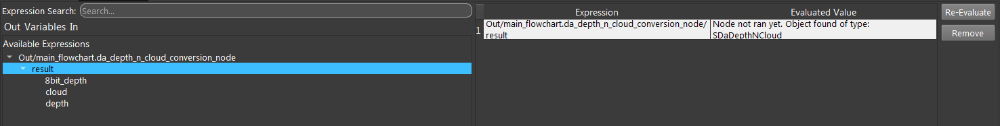

Data Types
==============================

Simple Value, Expression, Advanced Expression
--------------------------------------------------

Data in Vision software is addressed by expression. Expressions can be categorized into 3 types:

* Expressions starting with "In/". These are the input of the nodes. Most of the time these are linked to other expression, or can be set by input. And it can be passed to another node as input as well. And the another node will just use the same input as this node. 
* Expressions starting with "Out/". These are the output of the nodes. These expressions contain valid data only after the node is run.
* Expressions starting with "Variable/". These expressions contain globally available values.

.. tip:: .. image:: Images/link_input.png
	As the image shows, if B node input used A node's output port **A_out_1**, then C node linked B node's input port **B_in_1**, then the C node input **C_in_1** is actually linked to **A_out_1**.

In link value dialog, you can set the value of input directly with simple value, or link it to an expression, or link it to an advanced expression (a python script that evalutes to an expression). 
Check :ref:`Python Interpreter and Advanced Expressions` for details on advanced expression.

Basic Data Types
---------------------

To link expressions, the source and destination expression must have the same data type. Data types can be either basic or complex.
Here are the basic data types used by vision software.

Int:
	An integer value (no decimal places).
Double:
	A numerical value which can have decimal places.
Bool:
	A boolean value which can be either True (1) or False (0).
String:
	Can be any combination of characters (e.g. "xyz123!").
Image:
	A 2D array of information, often RGB or grayscale, represented by pixels. Can be read in using the Camera Node or Reader Node. 
Depth Image:
	A 2D array of information which also includes another value for each pixel that represents distance from the data acquisition device (i.e. a 3D camera). Can be obtained by reading a .dcf file or connecting to a camera with the Camera Node. 
Point Cloud:
	A set of data points that represent an object in 3D, where each point has at least an X, Y, and Z component, and which may often also have color components. Unlike a depth image, a point cloud is not organized into a grid-like array where each array element has data - a point cloud can have no points in part of the cloud and lots of points in other parts. Point clouds can be read in using the Camera Node or Reader Node using .pcd, .daf or .dcf files or by connecting to a camera. 
Mesh: 
	Similar to a Point Cloud as a set of 3D data points are also stored, but a Mesh also includes another set of information that represents a surface defined by points which form polygons that make up the surface. Can be read in using the Reader Node using .ply, .stl, or .obj files.
Camera Intrinsic:
	Holds information about the physical camera in use, such as focal length. Can be obtained by reading a .dcf file or connecting to a camera with the Camera Node. 
Pose3D:
	A numerical description of the position and orientation of an object. Position is given in X, Y, and Z coordinates and orientation can be given in different ways including euler, quaternion or angle-axis representation. Can be generated using the Assemble Pose node or using other nodes. 
Pose2D:
    Similar to Pose3D, pose2d is used to express the position and orientation of an object in 2d. This include x,y coordinate and counter-clockwise rotation, expressed by degree.

Complex Data Types
-----------------------

Complex data types can be constructed using basic data types.

* Container of basic data types. For example, a map of poses. A vector of poses.
* A struct of basic data types. For example, SDaDepthNCloud type contains two image, one depth image.

You can check the type of the expression or the child fields of a data type (if any) in quick expression dialog.

.. tip:: .. image:: Images/access_container.png
	As the image shows, if it's a map, you could specify the string value inside **['']**, and to access the element inside the vector, you could specify the integer inside **[]**.

Save/load data from files
--------------------------

In addition to processing data in runtime, vision software also supports saving data to local files and use them later on.

* Camera capture files (.daf, .dcf, .dmf, etc.). One such file contains the point cloud, rgb image(could be grayscale as well), depth image and camera intrinsic (optional) of one camera capture. These files can be used as input of virtual cameras.
* Image files (.png). This image can be either rgb or grayscale.
* Depth image files (.tif).
* Point cloud files (.pcd).
* Mesh files (.ply, .obj, .stl).
* Bag files (.bag). A bag file contains at least one of : image, depth image, point cloud, pose3d, camera intrinsic.
* Calibration result files (.yml). These files contains the result of a calibration, including the hand-eye configuration, accuracy, relative positions of the calibrated objects (pose3d).
* Reader cache files (.reader). Contains the result of a reader node run. Can contain one of : image, depth image, point cloud, mesh.
* Deep learning files (.pt). These files contains deep learning models for deep learning related nodes. These are read-only files as Vision won't produce such files.

