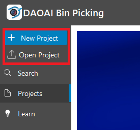
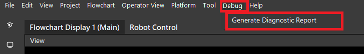
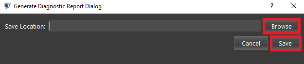
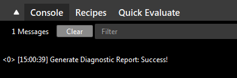
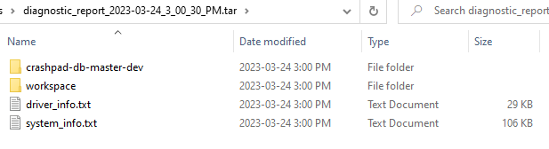

Diagnostic Report
====================

| This tool generates a diagnostic report and saves it as a .gz file at a selected directory.
| It is recommended to make use of this tool to facilitate reporting bugs. 
| For more information on reporting bugs, please refer to the :ref:`How to Report Your Issue` section.

Procedure to Use
-----------------

1. Create a new project or open any existing projects.

2. From the top menu bar, select ``Debug`` → ``Generate Diagnostic Report``.

3. Click ``Browse`` to select a path to save the diagnostic results to. Then click ``Save``.

4. A message will show in the console after it is finished.

5. You can find the diagnostic report in the directory you chose. You can extract the folder to see its content.

