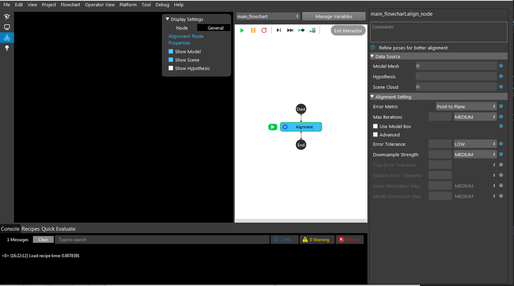
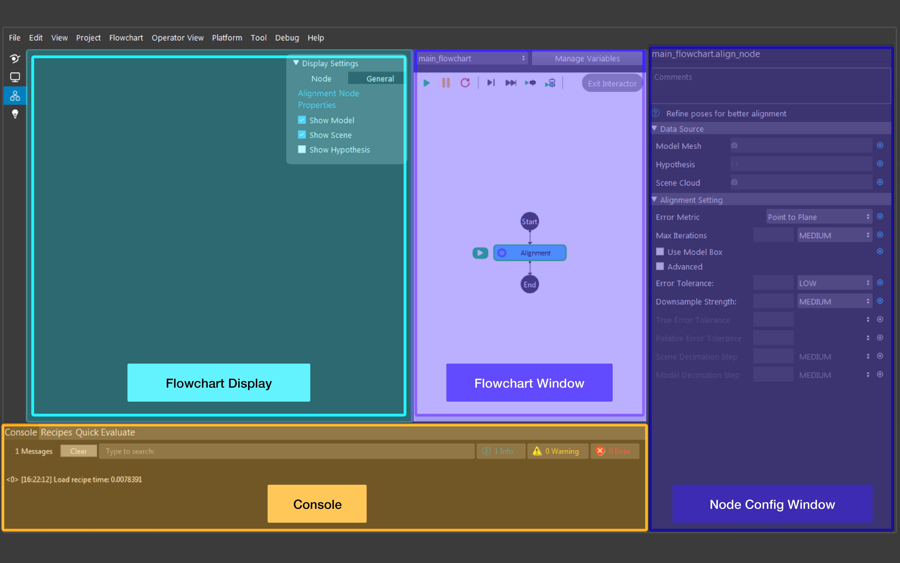
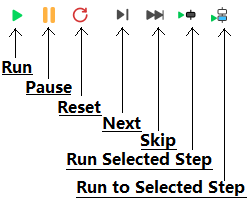
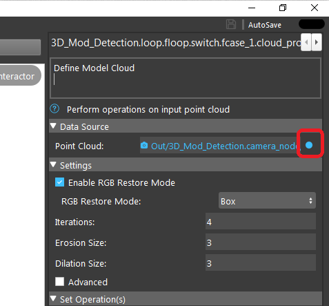
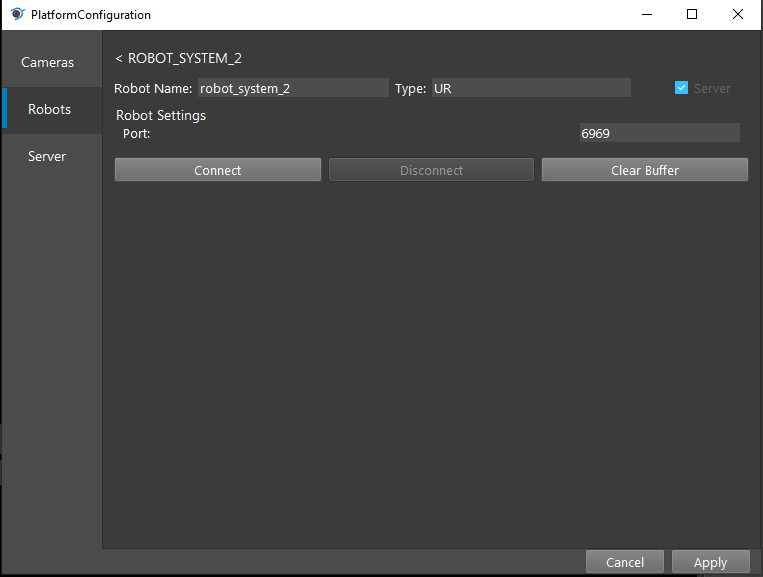

User interface
=========================================================

Getting Started Page 
---------------------------

After openning the software, the welcome page will be displayed.

<<<<<<< HEAD
.. image:: Images/main_page.png
=======
.. image:: image/main_page.png
>>>>>>> ebc3623c6558a2b4a54474a2bcfa1605b231758b
   :align: center

1. This button opens a dialog to create a new project and open it. You can specify name and location of the new project.
2. This button opens a existing workspace by browsing for an existing workspace file (files that end with .ws).
3. This button opens a search tab to search for recent local projects and template projects to open.
4. This is the default tab. It shows the recent projects and templates, as shown in the above picture.
5. This button opens a tutorial page. Click on the topic you want to see to open up your default browser and visit the corresponding website(s). It also supports searching with key words to filter different tutorials. 
6. This tab shows the recently opened workspaces (projects). You can sort the list based on name or the last time the project was modified.
7. This tab contains various template workspaces. This allows you to create a copy of a template workspace in a new location, and open it.

Loaded Configuration
---------------------------------

Once a workspace is opened, this interface will be displayed by default.

<<<<<<< HEAD

=======

>>>>>>> ebc3623c6558a2b4a54474a2bcfa1605b231758b
   :align: center

|

Things to note:

* Menu bar at the top.  
* There are 4 buttons in the top-left corner (below the menu bar). From top to bottom, they are:
  
   1. Close the project and go back to the welcome page 
   2. Open operator view (will be covered later in this page) 
   3. Open flowchart view (default view when opening a project)
   4. Go back to tutorial page from welcome screen
   

* The top-left window is the **flowchart display** (shown here as the large black box). This window displays the result of the selected node. When displaying a node's result, user can change the node's display operation by checking/unchecking Display Properties on the top right of the display window. The flowchart display is also used when a node requires user interaction. See examples section or node specification to learn when interaction is required.
* The middle window is the **flowchart window**. A flowchart is a sequence of well-defined operations to achieve some functionality (e.g. detecting an object in a scene, picking an object). A workspace usually consists of several flowcharts, each managing one procedure in the picking application. A flowchart consists of connected nodes (displayed as circles, or boxes) and has only one start point and one end point.

<<<<<<< HEAD
.. image:: Images/run.png
=======

>>>>>>> ebc3623c6558a2b4a54474a2bcfa1605b231758b
   :align: center

| 

   * You can switch flowcharts using the dropdown menu at the top. Or, you can manage variables (more on data types section) with the *Manage Variables* button.
   * These are the different buttons used while running the flowchart (from left to right):
      * **Run**: Run current flowchart non-stop, the order of nodes being run depends on the flowchart. It stops until it gets an error, or it reaches a node that forces it to. After the end node, it goes back to the start node recursively.
      * **Pause**: Pause current running flowchart.
      * **Reset**: Reset all of the flowchart's current status (node outputs, node's internal counter for sequential file read/write, current node marker, etc.).
      * **Next Step**: Run current node and go to next node in the flowchart.
      * **Skip Step**: Skip current node (without running) and go to next node in the flowchart.
      * **Run Selected Step**: Run a selected node, this node can be arbitrarily selected.
      * **Run to Selected Step**: From the current node, run the flowchart until it reaches selected node. the current node is not Run.
* The right most window is the **node config**. Here, you can view and change the selected node's settings.
* The bottom-left window holds three different tabs.
   * **The console** shows all the logs of the software. You can select the type of messages you wish to see (info/warning/error) by clicking the corresponding button. As well, you can search and clear the console log.
   * **The recipes tab** allows users to manage the recipes in the workspace. (More on recipe section is covered later)
   * **The quick evaluate page** allows users check values within the flowchart (variables, node outputs).

Link Expression Dialog
------------------------------

The vision software connects the input/output of the nodes via *linking*.

In this image, the data source (in the node config) is the input for node Cloud Process. We can see that Cloud Process Node takes a Point Cloud type input. Clicking on the blue dots on the right opens up Link Expression Dialog (as seen below), where you can link expressions from other nodes. 

.. image:: Images/link_dialog.png
   :align: center

Platform Configuration
-----------------------------------

Cameras are used to provide information to the workspace about the physical working environment, such as images and point clouds. The workspace must be connected to cameras (real or virtual)
in order to capture such input data.

In order to pick up the objects, the workspace must similarly be connected to robots.

The vision software provides detection, connection management and configuration of cameras and robots. They are located under platform config page (Platform -> Platform Config Page).

.. image:: Images/acc_cam.png
   :align: center

Camera 
~~~~~~~~~~~~~~~~~~~~~

Cameras can be added by clicking the **+** button, then **Accept**. You can then double click an already added camera to configure a specific camera.

.. image:: Images/cam_config.png
   :align: center

The camera's name (an alias) and the type of the camera is shown at top of the dialog. Check the option *Virtual Camera* unless you are using an actual camera. Users can choose a specific camera from the list using its Serial number and IP. If you cannot find the camera in the list, click on *Update Camera List* to refresh. Camera settings can be loaded from a file (.cfg) which can be generated from DaoAI Studio. Finally, click connect and the camera is connected to the program. 

Robots
~~~~~~~~~~~~~~~~~~~~~~~~~~~~~~~~

You can manage robot configuration in robot tab.

Operator View
------------------

.. image:: Images/operator_view.png
   :align: center

The Operator View can design a user facing application, based on a cell and grid system. Different operator views can be selected from the drop-down menu on the top left. 

