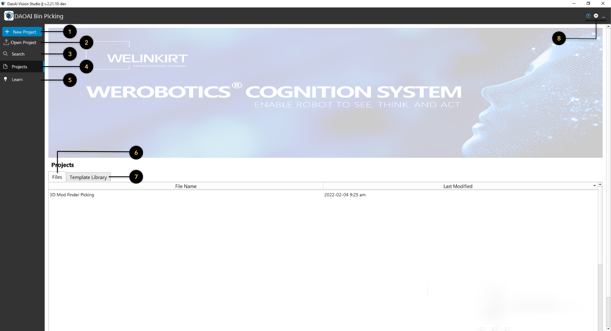

User interface
=========================================================

Getting Started Page 
---------------------------

After openning the software, the welcome page will be displayed.

1. This button opens a dialog to create a new project and open it. You can specify name and location of the new project.
2. This button opens a exsiting workspace by browsing the exsiting workspace file (file that end with .ws).
3. This button opens a search tab to search for recent local projects and template projects and open.
4. This is the default tab. It shows the recent projects and templates, as shown in the above picture
5. This button opens a tutorial page. Click on the topic you want to see to open up browser and visits the corresponding websites. It also supports search with key words to filter different tutorials. 
6. This tab shows the recently opened workspaces(projects). You can sort the list based on name or data last modified.
7. This tab contains various template workspace. This allows user to create a copy of a template workspace in arbitrary location. After the copy is created it will be opened.

Loaded Configuration
---------------------------------

After a workspace is opened this interface will be displayed by default 

.. image:: image/loaded_config.png
   :width: 650

* Menu bar in on the top.  
* There are 4 buttons on the top-left corner. They are 1: close the project and go back to the welcome page; 2: Open operator view (will be covered later in this page); 3: Open flowchart
   view (default view when openning a project); 4: go back to turorial page in the welcome page.
* The flowchart display is in the top-left. This window can display the result of the selected node. When displaying a node's result, user can change the node's display operation by checking/unchecking Display Properties on the top right of the display window. The flowchart displayed is also used when a node requires user interaction. See examples section or node specification on when interaction is required.
* The middle window is the flowchart window. A flowchart is a sequence of well-defined operation that achieves a functionality (e.g. detecting an object in a scene, picking an object). A workspace usually consists of several flowcharts, each managing one procedure in the picking application. A flowchart consists of connected nodes(displayed as boxes) and has only one start point and one end point.
   * You can switch flowchart in the dropdown menu, or manage variables (more on data types section) with *Manage Variables* button.
   * They are differnt buttons to run the flowchart: (from left to right)
      * Run: Run current flowchart non-stop, the order of nodes being run depends on the flowchart. It stops until it gets an error, or it reaches a halt node. After the end node, it goes back to the start node.
      * Pause: Pause current running flowchart.
      * Reset: Reset all flowchart status (node outputs, node's internal counter for sequential file read/write, current node marker).
      * Next Step: Run current node and go to next node in the flowchart.
      * Skip Step: Skip current node and go to next node in the flowchart.
      * Run Selected Step: Run a selected node, this node can be arbitrarily selected.
      * Run to Selected Step: From the current node, run the flowchart until it reaches selected node. the current node is not Run.
* The right most windows in the node config page. You can view and change the selected node's settings.
* The button part holds three different tabs.
   * The console shows all the logs of the software. You can view only info/warning/error message by clicking the corresponding button, search log and clear log console.
   * The recipes tab allows users to manage the recipes in the workspace. More on recipe section.
   * The quick evaluate page allows users check values (variables, node outputs).

Link Expression Dialog
------------------------------

The vision software connects the input/output of the nodes via linking.

.. image:: image/link_general.png
   :width: 650

In this image. The data source (in content view window) is the input for node Cloud Process. We can see that Cloud Process Node takes a Point Cloud type input. Clicking on the blue dots on the right opens up Link Expression Dialog. 

Platform Configuration
-----------------------------------

Cameras are used to provide information about the working environment, such as images and point clouds. The workspace must be connected to cameras (real or virtual)
in order to capture such input data.

Also, in order to pick up the objects, the workspace must be connected to robots.

Vision software provides detection, connection management and configuration of cameras and robots. They are located under platform config menu.

.. image:: image/acc_cam.PNG
   :width: 650

Camera 
~~~~~~~~~~~~~~~~~~~~~

Cameras can be added with + button then accept. You can double click added camera to get configure single camera.

Camera name(alias) and type of this camera is shown at top of the dialog. Check the option Virtual Camera for actual cameras. Users can choose the camera in the list of Serial number and IP. If could not find the camera in the list, click on the Update Camera List to refresh the camera list. Camera setting can be loaded from file(.cfg) which can be generated from DaoAI Studio. Then clicking connect, camera would be connected to the program now. 

Robots
~~~~~~~~~~~~~~~~~~~~~~~~~~~~~~~~

You can manage robot configuration in robot tab.

Operator View
------------------

.. image:: image/operator_view.PNG
   :width: 650

The Operator View can design user preference facing application. Based on a cell and grid system. Different operator views can be selected from the drop-down menu on the top left. 

