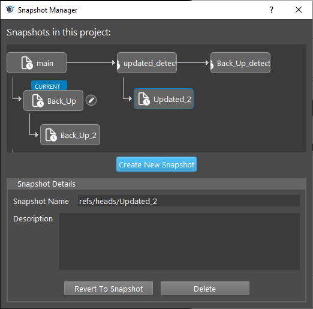
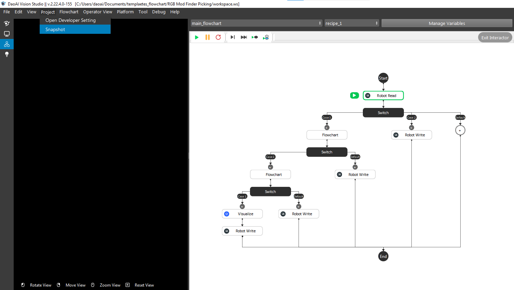
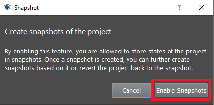
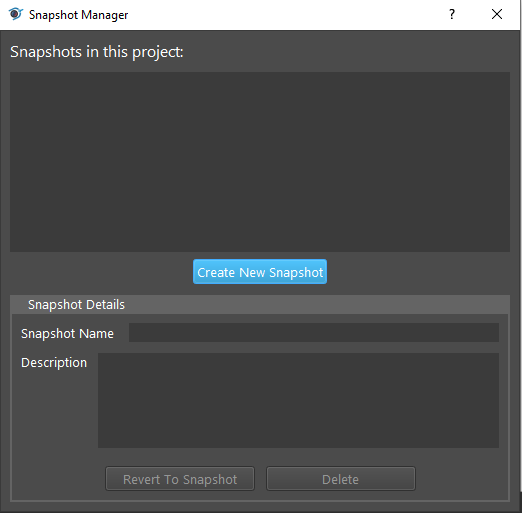
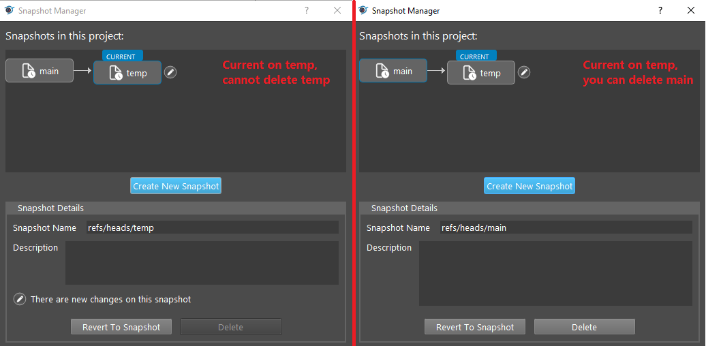
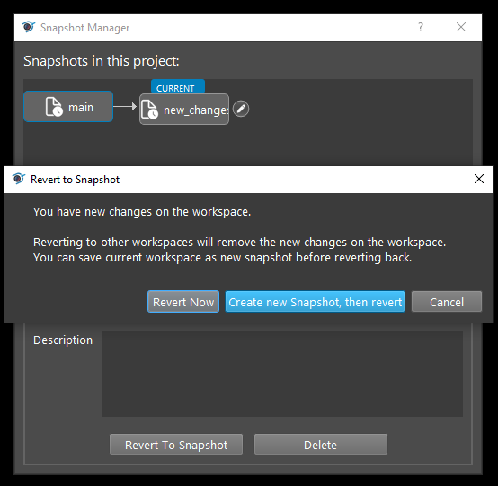
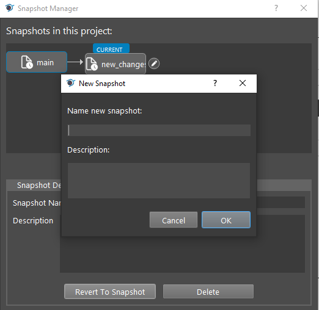

Snapshot Version Control
------------------

Vision has Snapshot Version Control feature for you to backup your process. It is similar to Git version control, but we have a straight forward user interface for you to manage your versions. 
You do not need to type any commands, manage the versions through user interface. 

|

.. warning:: Snapshot is not equal to **Save**! Make sure you saved your process by **Save Project**.
   
|

You can open the Snapshot interface from the top left corner;

Click **Enable Snapshot**;

**Create New Snapshot** enable the Snapshot feature.

You can delete the snapshots, or revert to certain snapshots. 

   * If you want to delete a snapshot, make sure you are not on current snapshot. 

|

   * If you want to revert to a different snapshot, Vision will ask you whether you want to save your current process to a different snapshot.

|

   * **Revert Now** will revert to the selected snapshot, and current process will be **LOST**;
   * **Create new Snapshot, then revert** will ask you to save the current process into a new snapshot;

Name the new snapshot you going to save. Then Vision will revert to the designated snapshot.