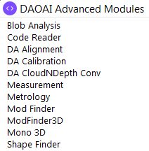

License Check
==================

The License Check Tool helps you to check whether you have a valid key to access the full functionality of the DaoAI Vision Studio.
To use the DAOAI Advanced Modules, a valid license is required.

Here is the list of modules that requires a valid license:

    DA Advanced Modules

|

    MIL/DA Key

|

Procedure to Use
-----------------

1. Create a new project or open any exisiting projects.

    .. image:: images/lc_2.png
       :scale: 90%
       :align: center

2. From the top menu bar, select ``Tool`` → ``License Check``.

    .. image:: images/lc_1.png
       :scale: 80%
       :align: center

3. A pop-up window will appear, showing which modules the license is valid for:

    .. figure:: images/lc_valid.png
        :align: center

        Valid license

    .. figure:: images/lc_invalid.png
        :align: center

        Invalid license

