Robot Pilot
================

Overview
----------

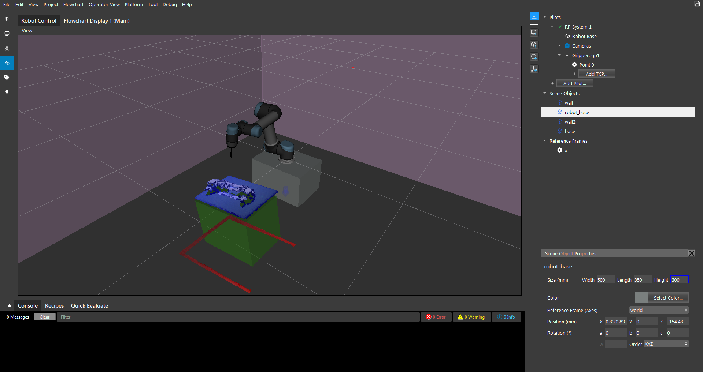

Robot Pilot is an integrated system designed to help you easily plan, control, and program your robot operations in bin pinking applications. 
The scene editing feature can recreate the real picking environment to enhance the visual display. Our collision avoidance and trajectory planning algorithms
can also achieve pickings safely in complex scenarios.

Robot Pilot (RP) System
----------------------------

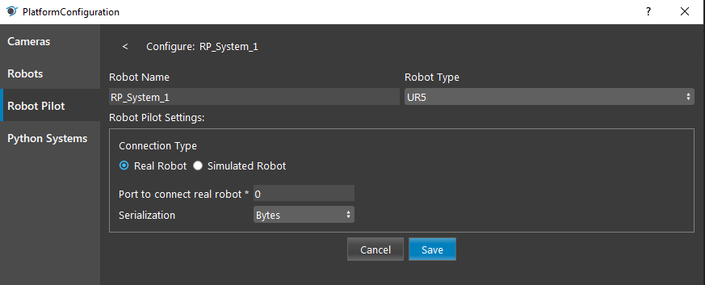

The Robot Pilot System can be created in platform configuration. There are real and simulated robot pilot systems which you can create.
You can also change them after it's created. Real robot pilot systems interacts with robot client through sockets; Simulated robot pilot systems simluates 
the robot in the program and no external communication is made in this mode. 

Configuration Parameters
~~~~~~~~~~~~~~~~~~~~~~~~~~~

- Robot Name:
    Text field, defualt name is RP_System_1. You may also change the name to any string value.

- Robot Type:
    Select from a dropdown menu: UR3, UR5, UR10, to choose a robot type.

- Connection Type:
    Seletct Real Robot or Simulated Robot. Real Robot sends and recieves data to external robot through socket, and Simulated Robot does not make external communications.

- Port to connect real robot (available for real robot):
    Input field, configure the port number for which the server is hosted.

- Serialization (available for real robot):
    Select from a dropdown menu: Bytes or String, to choose how the receive message is encoded.


Robot Control View
---------------------

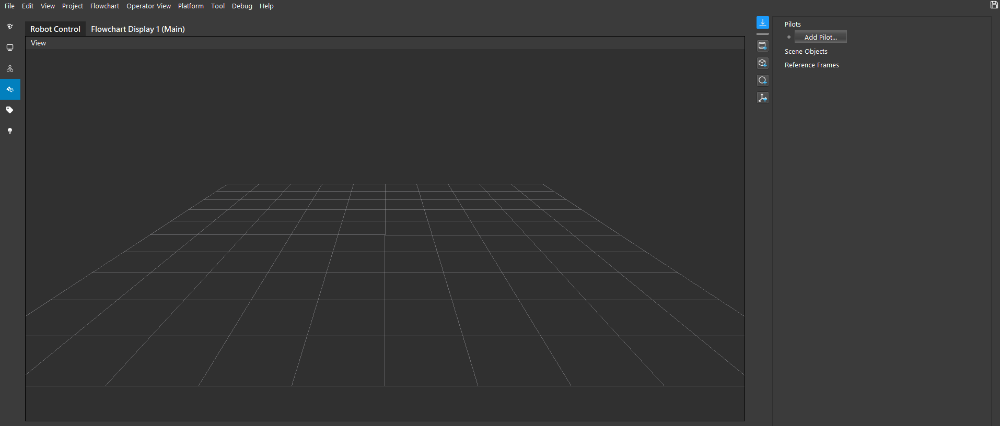

You can enter the Robot Control View through the left navigation bar. This is where you can edit the scene, add and modify elements in the scene.

View
~~~~~~~

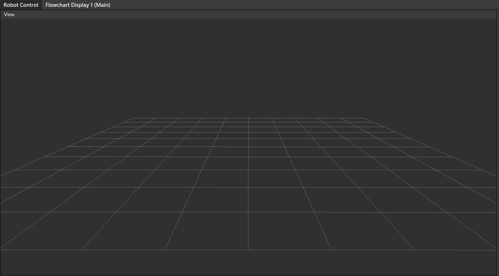


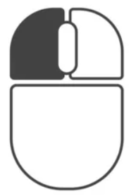

|ico1| : Hold down the left mouse button and drag to rotate the view.

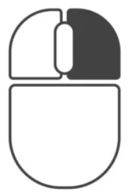

|ico2| : Hold down the right mouse button and drag up and down to zoom-in and zoom-out the view.

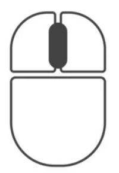

|ico3| : Scroll the mouse wheel to zoom-in and zoom-out the view.

|ico3| : Hold down the mouse wheel to pan around with the center of view.

Scene
~~~~~~~

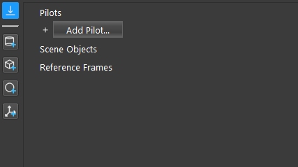

This column is where the elements are added and managed in the scene.

Add Mesh Object
`````````````````

.. |ico4| image:: Images/icon_add_mesh.png

|ico4| : Add mesh object into the scene. 

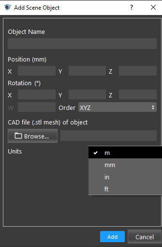

- Need to Enter a name for the object. 
- You may optionally input a position for the object (All zero if empty), you can also edit them later. 
- You need to browse for a mesh file to be added.
- Then you need to choose a unit for the dimension of the mesh (meter, milimeter, inch, or feet).
- Click ``Add`` will add the mesh to the scene.


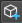


|ico5| |ico6| |ico7| : Add a Cylinder/Cube/Sphere mesh into the scene.

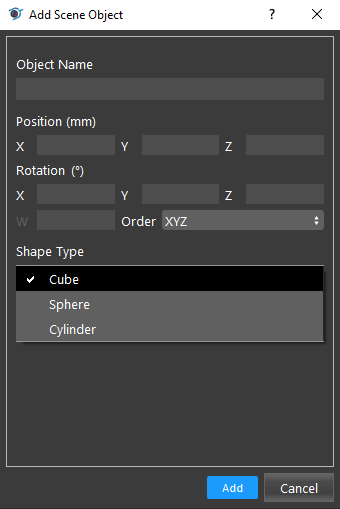

- Need to Enter a name for the mesh. 
- You may optionally input a position for the object (All zero if empty), you can also edit them later. 
- Click ``Add`` will add the mesh to the scene.


|ico8| : Add a reference frame into the scene. 

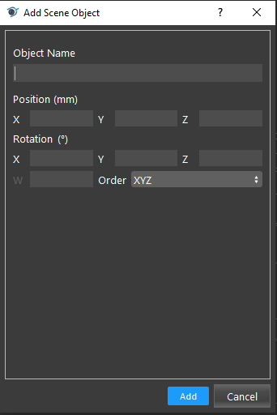

- Need to Enter a name for the reference frame. 
- You may optionally input a position for the object (All zero if empty), you can also edit them later. 

Add Robot Pilot System
`````````````````````````````

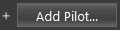

|ico9| : Add a Robobt Pilot System into the scene.

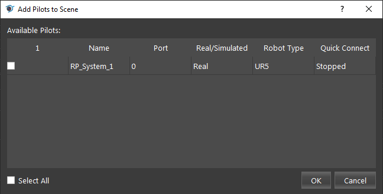

- Select the Robot Pilot System and Click ``OK`` to add.

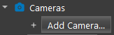

|ico10| : After a Robot Pilot System is added, you can add a camera to the system (Camera is created in Platform Configuration then can be added to RP System).

- If the Robot type is ``Real``, then the camera needs to be calibrated through the Calibration Tool, or import a Calibration file to add to the RP System.
    .. image:: Images/add_camera_real.png

- If the Robot type is ``Simulated``, then the camera pose need to be manually entered.
    .. image:: Images/add_camera_sim.png

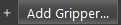

|ico11| : Add a gripper to the robot flange.

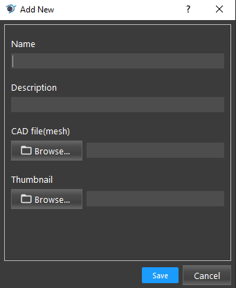

- Need to Enter a name for the gripper. 
- You may optionally a description for the gripper.
- Need to browse for a mesh file for the gripper.

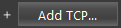

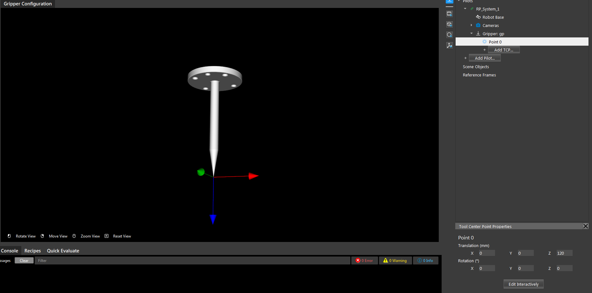

- You can either configure the tcp by input the tcp pose (shown as the axis in the view).
- or you can Edit Interactively in the display by dragging the coordinate axis.
- You can add multiple TCPs to the gripper

Using Robot Pilot with UR Robot
----------------------------------

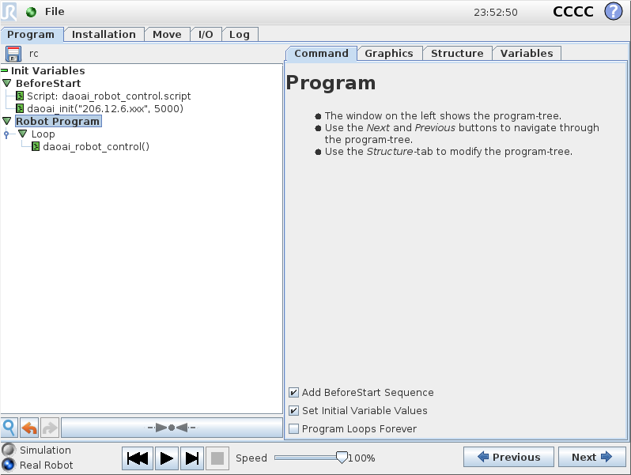

The UR program will look like this. You will need to load our `robot control script <https://daoairoboticsinc-my.sharepoint.com/:u:/g/personal/xchen_daoai_com/EXGXDly5JmhKsNTK2K-xpI0BJ0xTccyK0GJOpO8dD-puLg?e=BaA0BS>`_ .

Then call ``daoai_init("<IP address of your computer>, <port number>")``

- IP(v4) address can be found by open windows Command Prompt and enter ``ipconfig`` command. 

- Port number is the one you defined when creating the Robot Pilot System.

The main program can be as simple as calling ``daoai_robot_control()`` in a loop, which will wait until command from DaoAI Vision Studio is executed, then loops to the next iteration.

You may optionally add more commands before and after ``daoai_robot_control()``.

Then click the Run button will begin UR program.