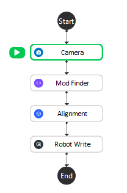
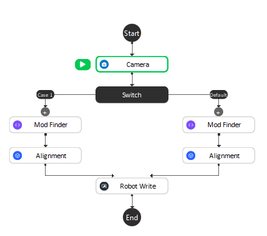
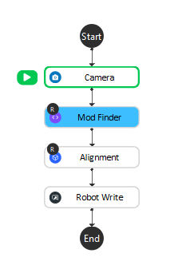

Recipes
-------------------

Imagine you have created a flowchart like the above image to recognize an "apple". And the flowchart is that you are reading the input from **camera**, and use the **Mod Finder** node to recognize the object, then pass the result to **Alignment** to refine the position of the apple. 

Now, you would like to create the functionality to detect an "Orange" from Similar steps, expect that the **Mod Finder** and **Alignment** will need to define the model of the "Orange". One way to do so is to create a flowchart as below, you could use **switch** to go left or right to determine if you wanna detect "Apple" or "Orange".

Another way is to add the **Mod Finder** and **Alignment** node into the recipe, so that when we are switching the recipe, we are switching the definition for both the **Mod Finder** and **Alignment** all at once.

.. tip:: 
    * You will notice a "R" icon on the top-left conner of the step.
    * Usually you should consider use recipe when you want to define multiple models.
    * The recipe will be automatically loaded when you open the workspace.
    * You should consider to add the recipe almost when you finalized the flowchart creation. As you will know which node to add to recipe, and when you create new recipe, all the content of the new recipe is a copy of the default "recipe_1"

For more detailed explanation on how to use recipe feature, check :ref:`Recipe nodes`