Mod Finder
=========================================================
With this example, you are able to define a model from a 2d image, and search the model in other images. Following are the steps:

Steps:
----------------
1. Create new workspace
2. Connect the camera and insert camera node
3. Insert Mod Finder Node and Link the output from camera
4. Define model with mod finder, and tune the parameters
5. Run the search with other images

Detailed Procedures:
------------------------
1. Create workspace
~~~~~~~~~~~~~~~~~
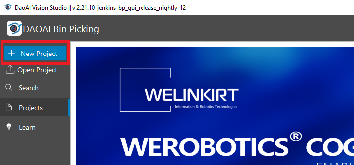
   
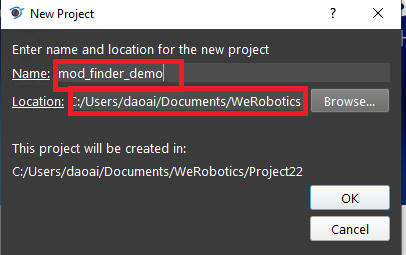
Open the software, and click the **new project** button, then change the project name and where to save the project, click **ok**.

2. Connect camera 
~~~~~~~~~~~~~~~~~
.. image:: Images/new_camera_1.png
   :width: 100%
   
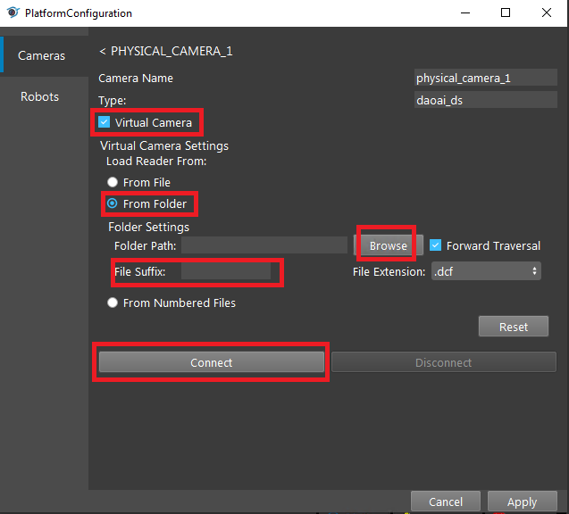

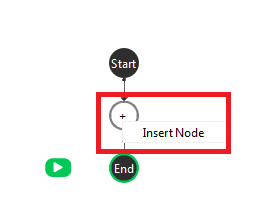

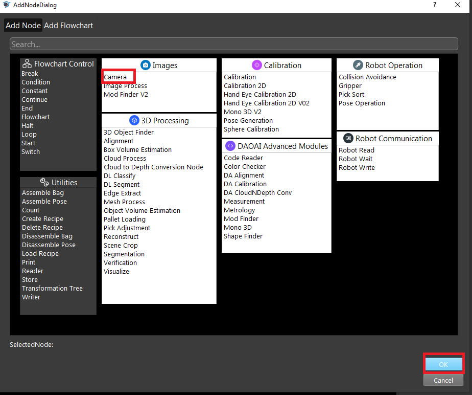
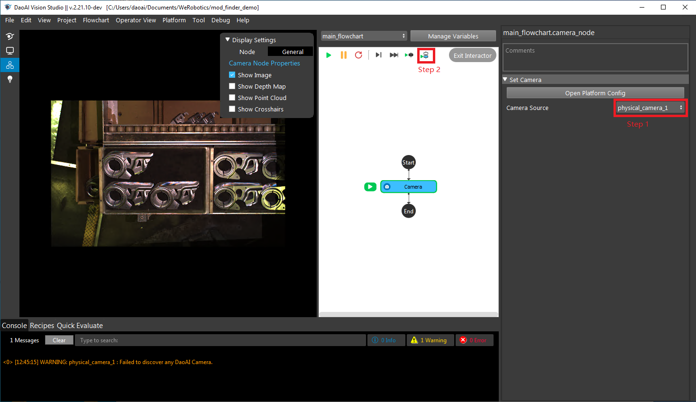

You will first click on the **platform** button, then open the platform config page. Add a camera system, then use virtual camera by reading the data from the disk (which can be dlowloaded with the link at the bottom of this page). Then add a camera node, then select the corresponding camera system. Run the camera node once, so that you will see the image on the display panel on the left.

3. Use mod finder node 
~~~~~~~~~~~~~~~~~
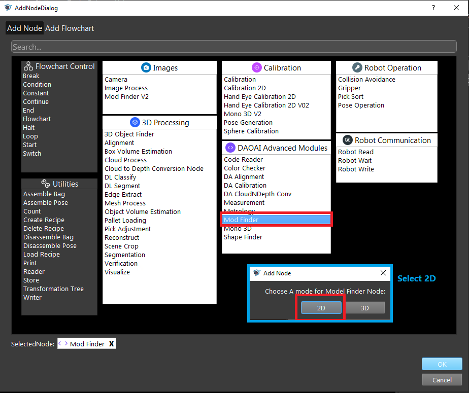
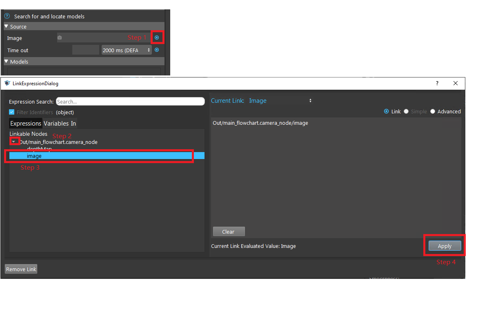
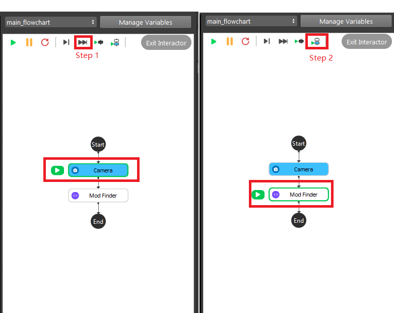
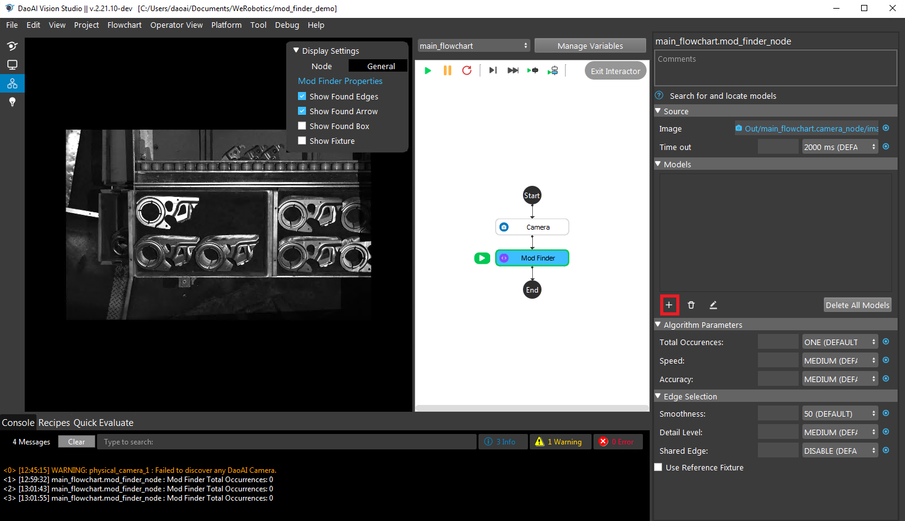
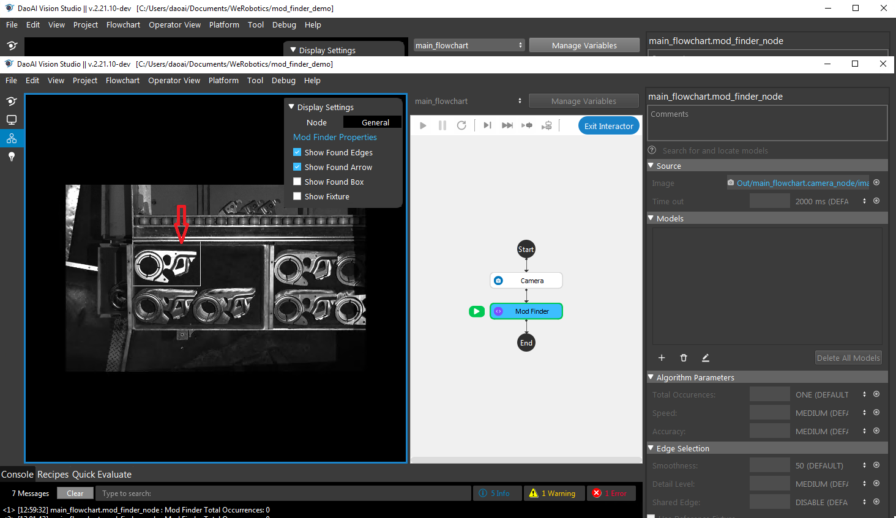
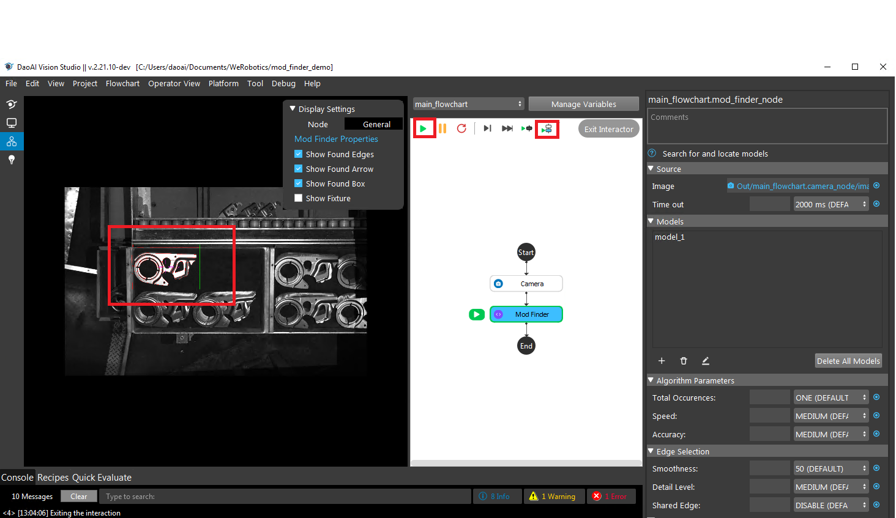
Insert a mod finder node, and select **2D** mode. Once you inserted the mod finder node, now you will need to link the data by click on the **link** button at the **image** selection field. Then click the **skip** button on the top to move the current node to **mod finder** node. Click **run current node** button to run the mod finder node once, this is to **load the image into mod finder**. 

Now, you are able to define the mode. Click on the **+** button, then **left click** on the mouse and select a rectangle in the display. This is how to define the model, then click on **run current node** button to run the detection of the model. You will be able to see the system is able to detect the correct object. 

Finally, you could click on the **run** button to run the flowchart endlessly.

Workspace Data & Video Recordings:
~~~~~~~~~~~
The used data for this demo, and the video recording for this demo was stored online with this `link <https://daoairoboticsinc-my.sharepoint.com/:f:/g/personal/xchen_daoai_com/EiXHSWVok5lMqMDsEYUdBzUB2sKYNa8FFTKZhk5Ne5Je3w?e=PA3XVs>`_
