New workspace
===========

Steps
~~~~~

1. :ref:`Create a new workspace`
2. :ref:`Connect the camera to the Vision software`
   
Create a new workspace
~~~~~~~~~~~~~~~~~~~~~~~

Open the Vision Software and click on the New Project button on the top left. 

.. image:: Images/18.png
    :align: center
    
|

In the New Project dialog, the operator should name the project and select the file location, then press “ok”.

<<<<<<< HEAD
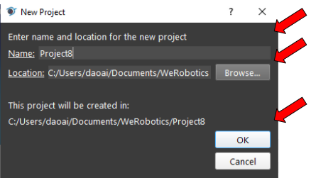
=======
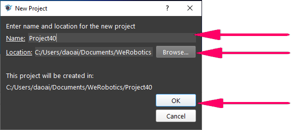
>>>>>>> ebc3623c6558a2b4a54474a2bcfa1605b231758b
    :align: center
|

Connect the camera to the Vision software
~~~~~~~~~~~~~~~~~~~~~~~~~~~~~~~~~~~~~~~~~~~

Once finishing creating the new project, the operator should click the Platform to config the camera, robot, and server settings.  

<<<<<<< HEAD
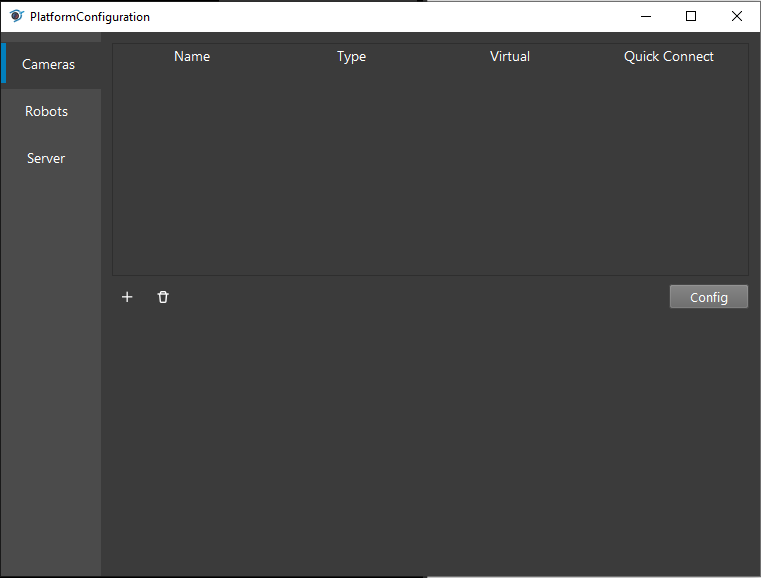
=======

>>>>>>> ebc3623c6558a2b4a54474a2bcfa1605b231758b
    :align: center
|

All three categories are listed on the left side of the dialog and highlighted by the blue bar. The operator can add cameras, robots, or servers by pressing the “+” button. 

<<<<<<< HEAD
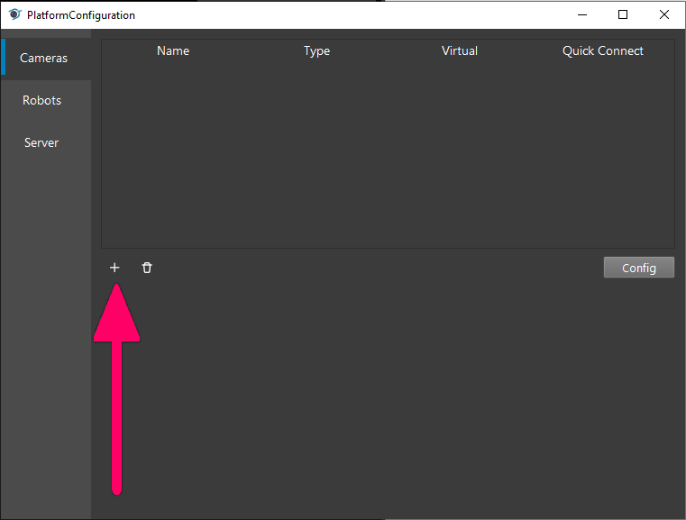
=======
.. image:: images/21.png
    :width: 75%
>>>>>>> ebc3623c6558a2b4a54474a2bcfa1605b231758b
    :align: center
|

Under the Type, click the camera box to view the whole list of options and select the camera that is going to be used for the application by clicking the Accept button. Then, a new dialog will pop up for configuring the specific camera. The operator can also delete the camera by selecting the camera and pressing the trash bin icon to delete it. 

<<<<<<< HEAD
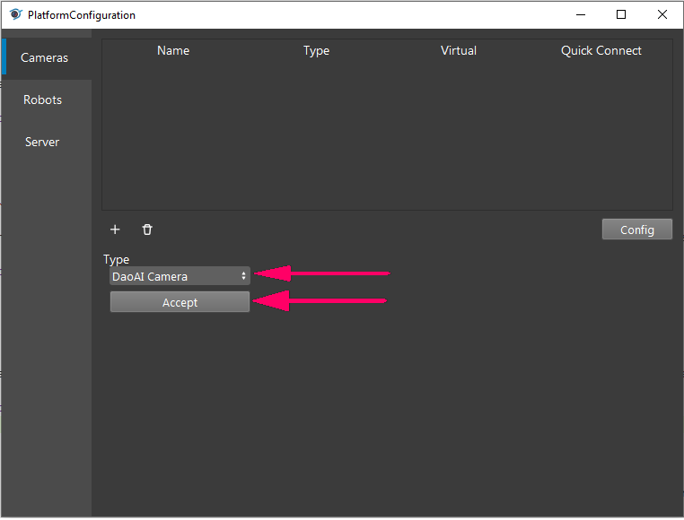
|

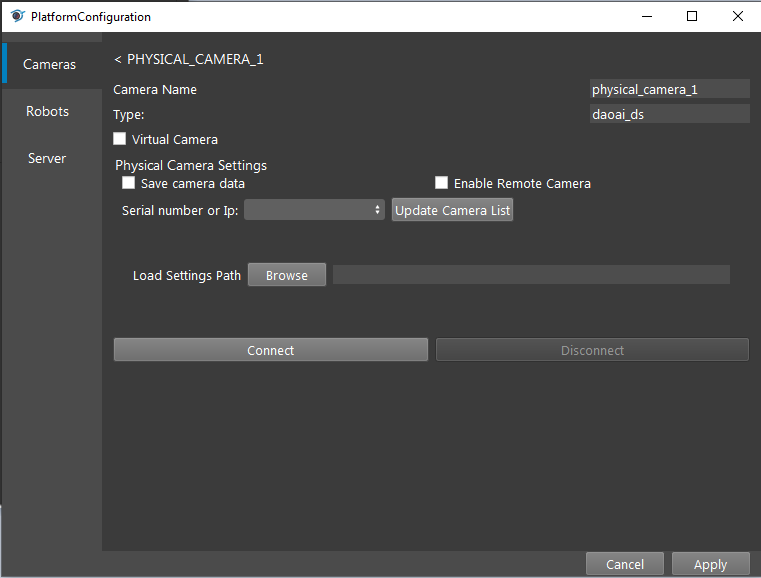
|

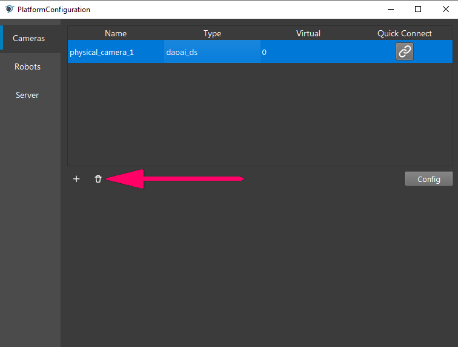
=======
.. image:: images/22.png
    :width: 75%
    :align: center
|

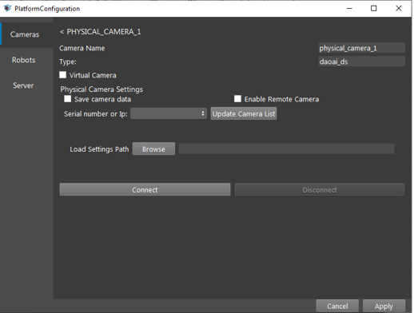
|

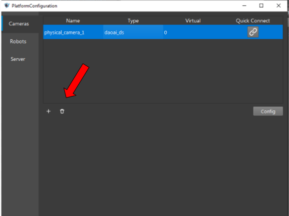
>>>>>>> ebc3623c6558a2b4a54474a2bcfa1605b231758b
    :align: center
|

The operator can load dcf files that were generated in the past as the camera output. To do so, the operator should check the Virtual Camera box, and choose the option to load the dcf files. The operator can either load the entire dcf folders or just load a single dcf file. Then press the “Connect” button to connect the camera node with the other node.  

<<<<<<< HEAD
.. image:: Images/25.png
    :width: 80%
=======
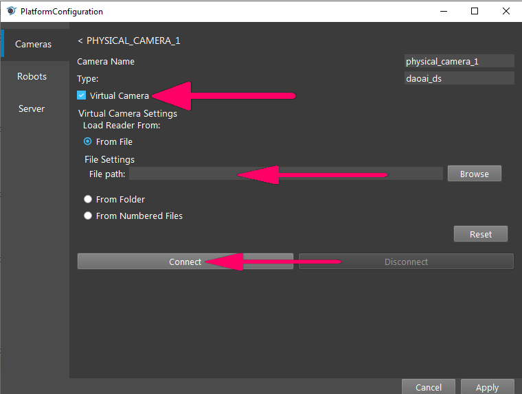
>>>>>>> ebc3623c6558a2b4a54474a2bcfa1605b231758b
    :align: center
|

To add the real camera, the operator should press the “Updated Camera List”, then press the blank box on the left to discover if the camera’s serial number has been updated. If the number pops up, the operator can select the number by pressing it. The load Setting Path function allows the operator to load the cfg file, which contains the setting the operator configured in the studio to enhance the quality of the image shot from the camera. Then, press the “Connect” button to connect the camera with other nodes. 

<<<<<<< HEAD
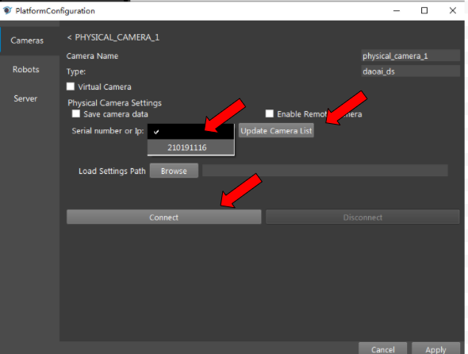
=======

>>>>>>> ebc3623c6558a2b4a54474a2bcfa1605b231758b
    :width: 75%
    :align: center
|

Once the camera has been connected with other nodes, the operator should select the correct physical camera number in the Camera Source box. 

<<<<<<< HEAD
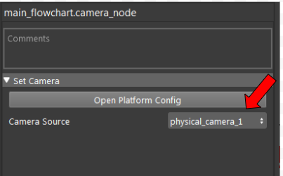
=======
.. image:: images/27.png
    :width: 75%
>>>>>>> ebc3623c6558a2b4a54474a2bcfa1605b231758b
    :align: center
|