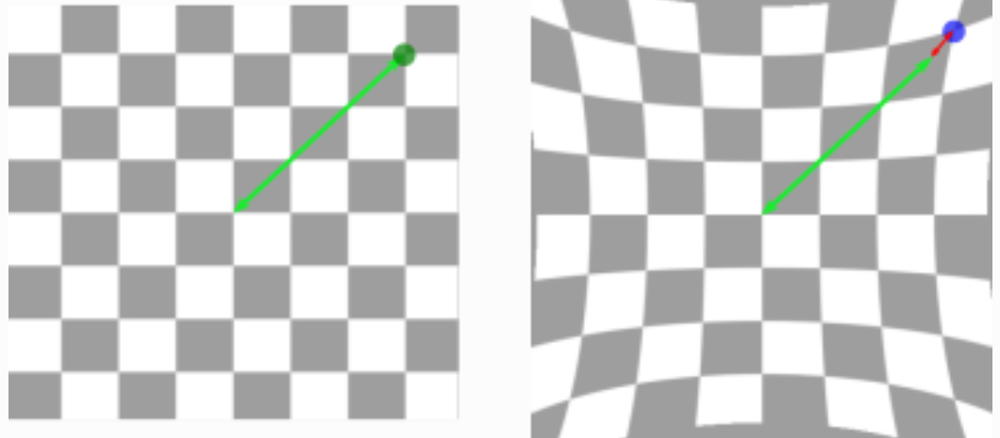

.. _camera-accuracy:

Camera Accuracy
===============

The limiting factor of 3D camera accuracy is typically the camera trueness(refer to :ref:`Accuracy, trueness and repeatability`). Camera repeatability tends to be an order of magnitude better than camera trueness. Therefore, this article focuses on camera trueness and describes what it is and how to measure it.

Camera Trueness
---------------
The trueness of a camera specifies how representative of reality the camera point cloud is. More precisely, it quantifies how relative distances within the point cloud deviate from reality.

The effect of bad camera trueness is exemplified in the drawing below. The left image represents reality as a perfect camera would see it. The right image shows the distorted representation produced by a real camera. The red arrow represents the distance error resulting from this non ideal trueness.

.. tip:: Camera shocks and collisions may significantly deteriorate camera trueness. To prevent this, it is recommended to place your camera inside a protective structure, especially if it’s robot-mounted. If after a camera collision you observe bad picking accuracy, verify the camera trueness, as explained below.

Verifying the camera trueness
-----------------------------
To verify the trueness of the camera, we compare the distance between two objects perceived by the camera with the actual (and known) distance. We therefore need a detection target with objects separated by an accurately known distance. The difference between the known distance and the detected distance indicates the camera trueness error.

This procedure is similar to the way we verify the robot trueness described in :ref:`robot-accuracy`. The difference being that, instead of pointing with the robot, here we detect objects with the camera. The same `distance calculator <https://www.calculatorsoup.com/calculators/geometry-solids/distance-two-points.php>`_ can be used.

Camera trueness is not constant across the field of view. It is therefore recommended to measure trueness inside the Region of Interest (ROI) of the application, where picking is meant to take place.

In order to have meaningful measurements, it is important to use objects that can be accurately detected. It is recommended to first measure the detection repeatability of the objects.

.. tip:: Note also that the longer the distance between the detected objects, the more reliable the trueness measurement will be.

Correcting the camera trueness
------------------------------
Poor camera trueness can only be corrected by a new factory calibration. If the camera trueness error of your camera is unexpectedly high, contact our support team with a snapshot of your trueness verification.