Board Calibration
========================

Board calibration is the recommended method for performing robot-camera calibration in DaoAI Vision. With this method, the robot shows the calibration plate to DaoAI Vision from different viewpoints. We will only discuss the **Circleboard Calibration** here, since there is only one difference in setup between **Circleboard Calibration** and **Chessboard Calibration**.

The placing of the calibration plate and the poses from which it is detected depend on the camera mount.

.. .. tip:: You can learn about the main ideas behind multi poses robot-camera calibration by watching this video tutorial (TODO: add video).

Fixed camera mount
------------------

If the camera is fixed to a static structure, the circle board calibration plate must be attached to the robot flange. It does not matter how the plate is mounted, as long as it’s rigidly attached to the flange. 

How to install the circle board onto the flange
~~~~~~~~~~~~~~~~~~~~~~~~~~~~~~~~~~~~~~~~~~~~~~~

DaoAI provides the necessary equipment for mounting the calibration plate on the flange.

Align the plate, dowel pin, and holes on the robot flange. Then screw the plate to the flange.

How to capture a good quality image
~~~~~~~~~~~~~~~~~~~~~~~~~~~~~~~~~~~

* Due to the robotic vibration, the chessboard coordinates displayed in the camera will be distorted, reducing the accuracy of the final result significantly. It is strongly advised to reduce the robot's speed and set up the waiting time between each pose in order to capture a clear image.

* The chessboard should be positioned at the camera's optimal working distance. 

* When generating the chessboard's coordinating system, the initial pose should always be in the center of the camera's field of view. 

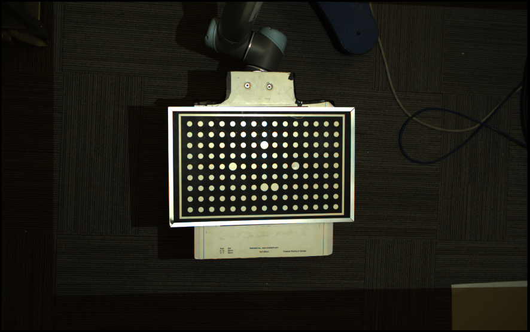

|

The first picture shows the good quality of image pose setting.

.. image:: images/25GoodEyeToHand.png
    :align: center

|

The second image shows a bad quality of image due to bad movement setting.

.. image:: images/24blur.png
    :align: center
|

Calibration Poses
~~~~~~~~~~~~~~~~~

The calibration poses are such that:

* The calibration plate is at a distance to the camera similar to the distance at which parts are expected to be picked.
* The calibration plate can be correctly detected.
* The poses are distinct enough to produce an accurate calibration.
* The order in which the poses are captured is not important.

DaoAI recommends collecting the ten poses shown below to obtain an accurate calibration. It is however allowed to collect a different amount of poses, as long as their quality is good enough.

* The first four poses capture variation in plate position:
.. image:: images/camera_fixed_position_poses.png
    :align: center

* The next two poses capture variation in the camera-facing rotation of the plate:
.. image:: Images/camera_fixed_camera_facing_rotation_poses.png
    :align: center
 
* The last four poses capture variation in plate tilt:
.. image:: Images/camera_fixed_tilt_poses.png
    :align: center

Robot Mounted Camera
--------------------

How to Place the Circle Board
~~~~~~~~~~~~~~~~~~~~~~~~~~~~~
Compared to the Eye-to-hand, instead of fixing the camera, the Eye-in-hand application requires to have the circle calibration board fixed to one place. Therefore, it is highly recommended to place the board on a flat surface that future object being picked will be placed to proceed the calibration.

How to define a good quality image
~~~~~~~~~~~~~~~~~~~~~~~~~~~~~~~~~~
* The first picture shows the good quality of image pose setting 
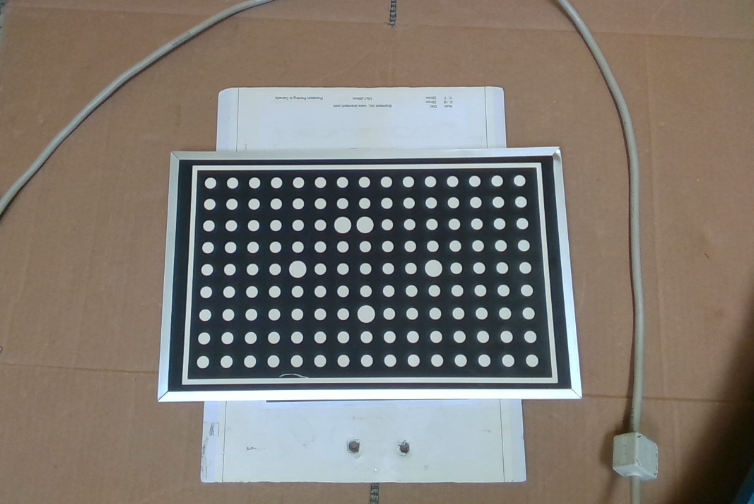

* The second image shows a bad quality of image pose setting 
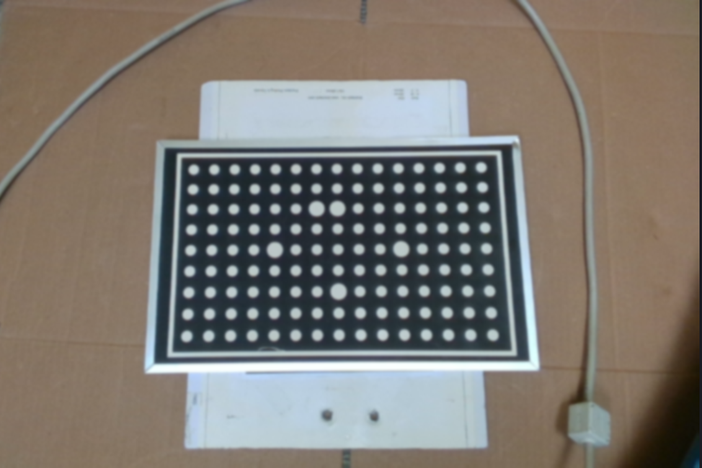

|

Calibrate from DaoAI Calibration Template
----------------------------------------------

To perform a new calibration, open the DaoAI Vision Studio follow the steps below:

1. :ref:`Create workspace and set up calibration`
2. :ref:`Collect calibration bag files`
3. :ref:`Run calibration flowchart`

Create workspace and set up calibration 
~~~~~~~~~~~~~~~~~~~~~~~~~~~~~~~~~~~~~~~~~~~~~~~~~~~~~~~~~~

Open the DaoAI Vision Studio, and select the **Circleboard Calibration** from the Template list. 

.. image:: images/1workspace_template.png
    :align: center
    
|

The chessboard calibration template includes five flowcharts: :ref:`Manual`, :ref:`Calibration`, :ref:`circle-board-auto-calibration`, :ref:`Eye-to-hand`, and :ref:`Eye-in-hand`. Each flowchart serves a unique and critical purpose within the template. 

You need to choose the calibration type depending on the application requirement. By default, the variable will be set to 1 as calibration. 

.. image:: images/3Cali_type.png
    :align: center
    
|

You need also to choose the number of poses you will be using to calibrate. By default, the variable will be set to 9. 

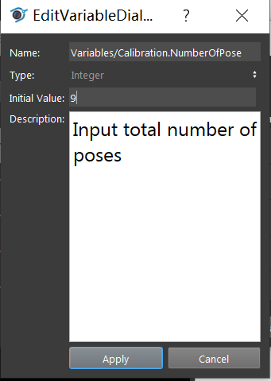
    
|

Then you need to choose the approach for result validation, either using the pen on board, or gripper on TCP. 

.. image:: images/4Validation_type.png
    :align: center
    
|

Collect calibration bag files
~~~~~~~~~~~~~~~~~~~~~~~~~~~~~

Manual
*******

The first flowchart the needs to execute is the Manual flowchart. The purpose of the flowchart is to manage and save the data obtained from the camera and the robot including image, point cloud, depth image, camera intrinsic, and pose. 

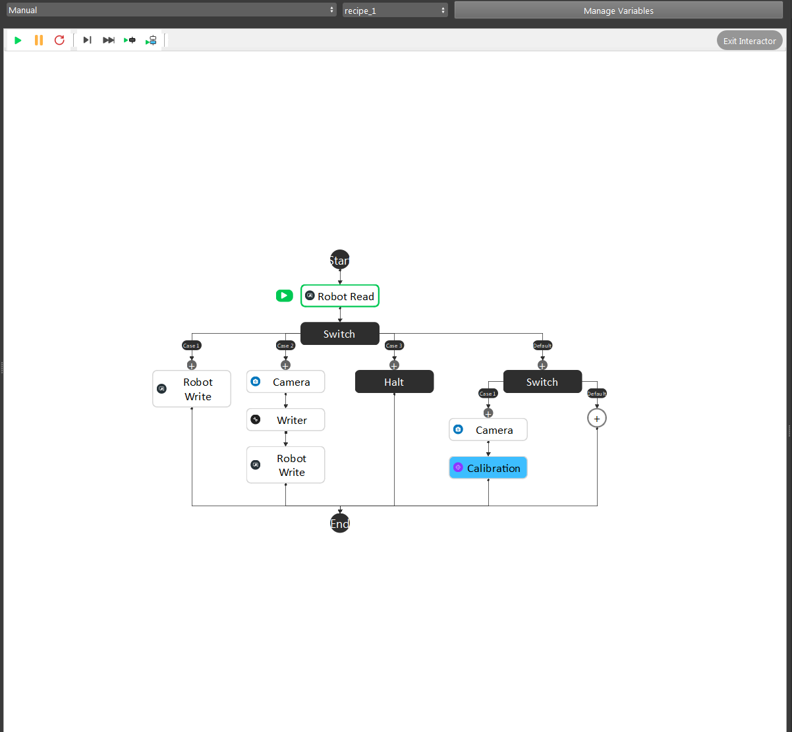
    
|

Modify the path of the ``writer`` node output folder. The data will be assembled into a bag file from the Writer Node. 

Inside the writer node, you can specify the mode for generating the bag file. A single bag file can be saved by selecting the source type into “From file”. 

.. image:: images/22Writer_node.png
    :align: center
    
|

If there is a sequence of bag files, you can select “From Numbered” by defining the folder path and the file name along with its start and end index for each file. 

.. image:: images/6writer_node.png
    :align: center
    
|

.. attention:: 
    Normally we would set the end index into a large number to avoid overwriting previous saved files.

Next thing to setup before start running the flowchart is to set the row and column information in the **Calibration** node preview mode.

.. image:: images/row-col-info.png
    :align: center
    
|

.. note::
    For **Chessboard Calibration**, you should choose the **Grid Type: Grid Chessboard** here.

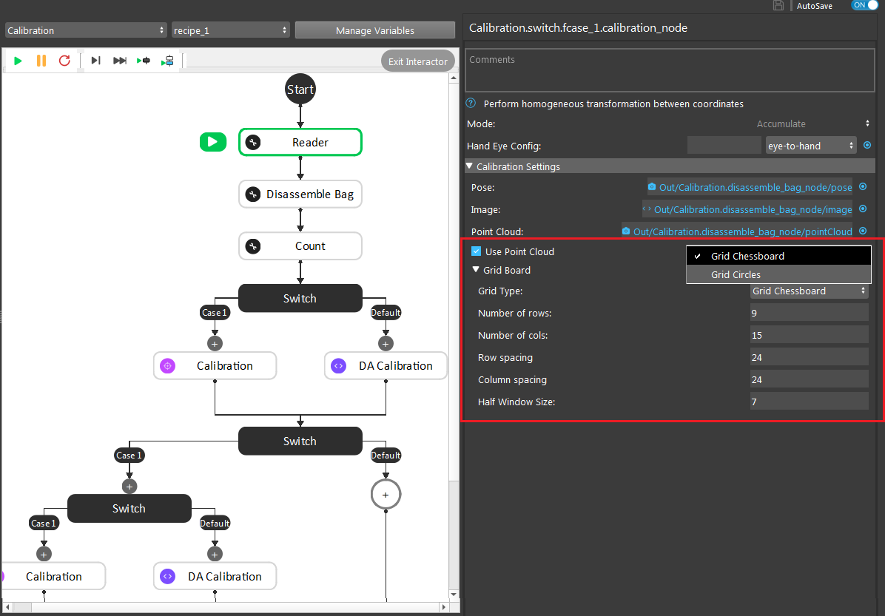

|

To collect poses, you need to setup the ``Manual Calibration`` robot script.

To get good quality image poses, you should run the Manual flowchart before you setup the poses, with camera and robot connected. Click the **Calibration** node so you can see the preview of the image being calibrated.

Adjust the robot arm to the proper position, select the current pose as the :ref:`Robot` waypoint by clicking ok. Then complete all waypoints in the robot script. More details for the camera to Vision Studio connection can be referenced by the previous topic :ref:`camera`.

.. warning:: You should adjust each pose until you see the **calibration marks** show up on your image accurately. The camera will keep capturing the image poses until you start the robot script so that you can constantly monitor the image pose making sure no bad image poses will be added into the bag files.

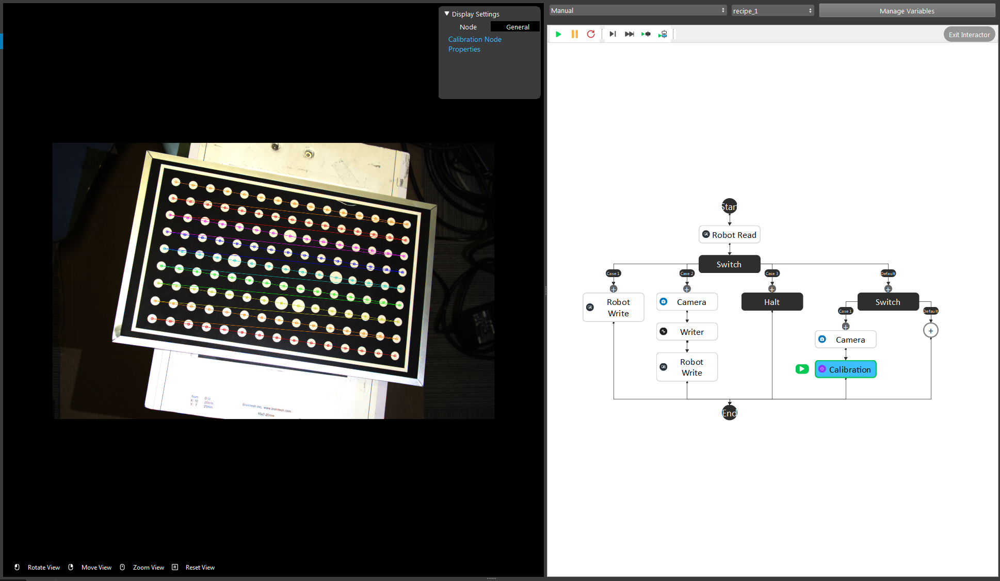
    
|

.. attention:: 
    More details for capturing image poses can reference by the previous topic :ref:`How to capture a good quality image`. 

Run the robot script to send the current robot pose to DaoAI Vision, then the current pose and image will be saved in a bag file.

Run calibration flowchart
~~~~~~~~~~~~~~~~~~~~~~~~~~~~~

Small Circle Method
**********************

.. warning:: If using **Small Circle Method**, you must have your calibration board rotation less than 45 degrees for all bag files.

Run the calibration with the collected bag files, and store the calibraiton result out into the calibration folder of your current workspace.

After running the bag collecting flowchart, you need to load the bag file folder saved previously into the Calibration flowchart to generate .yml file, which will be used for the real picking applications. The yml file tells the threshold value of the accuracy of locating the object in the image. The smaller value, the better accuracy. 

Inside the reader node, use the folder path to load the bag file generated from the previous step. 

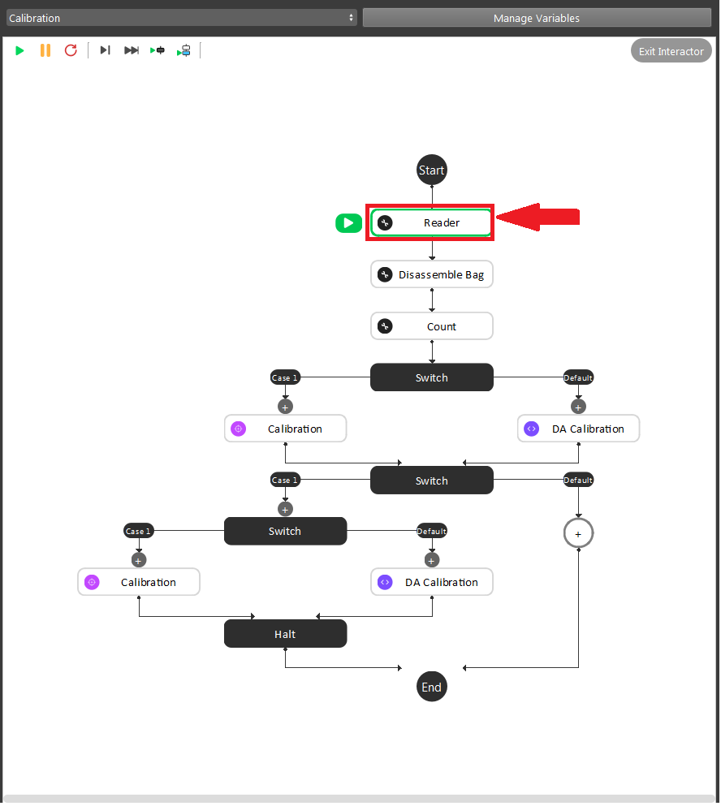
    
|

Inside the node, you can select the source type they want for loading the bag file. If you choose to load a file from Numbered, then it is necessary to define the parameter as *Variable.NumerOfPoses* - 1. 

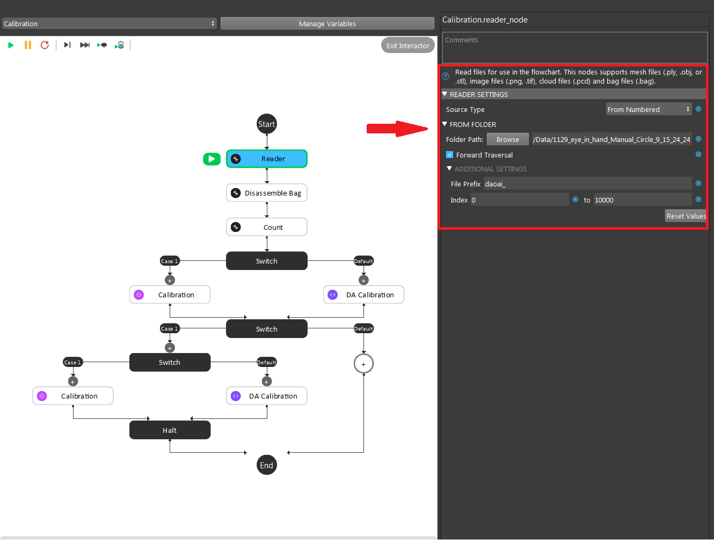
    
|

All bag files will be accumulated in the first Calibration node, which is set to **Accumulate** mode. You should set up the number of rows, cols, spacing of the chessboard correctly to avoid mismatching between the bag file and the real board. 

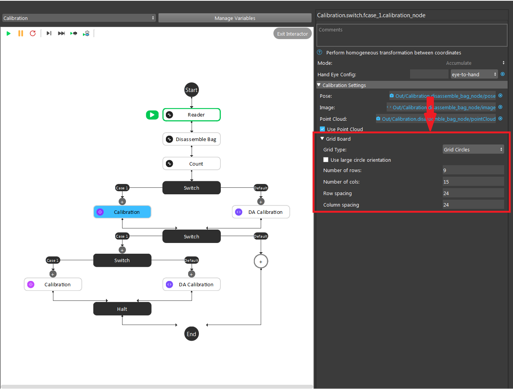
    
|

The second Calibration node, which is set to **Final** mode, will generate the final yml used for the future application. You need to name the file by typing in the File Name section. 

**Large Circle method**

You can also select the Use large circle orientation function, it will allow you to have any rotation of calibration board. However, it is still necessary to make sure to config the number of rows, columns, spacing between each row and column correctly.  

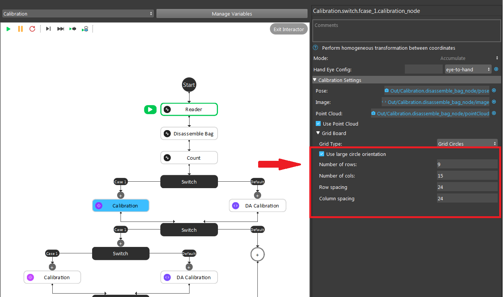
|

Circle Board Output File
~~~~~~~~~~~~~~~~~~~~~~~~~~~~~
You can get your output calibration file from the **calibrations** folder inside the workspace. Copy and paste the folder to your Picking Workspace folder, then you will be able to load the calibration file.

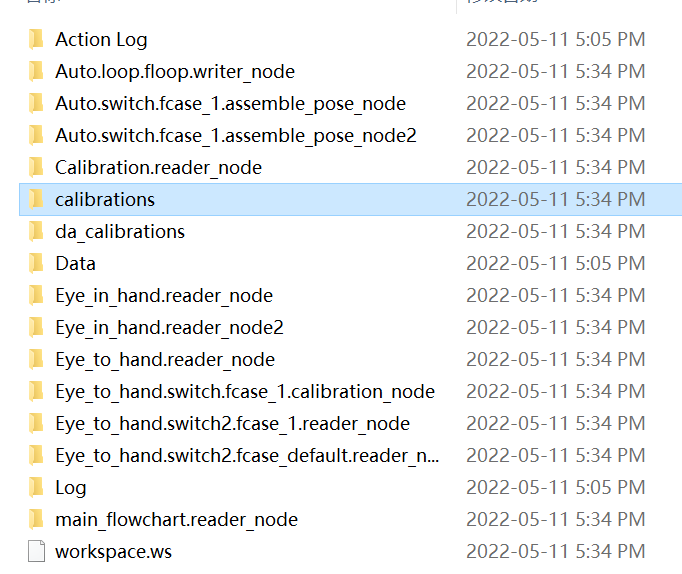
|
