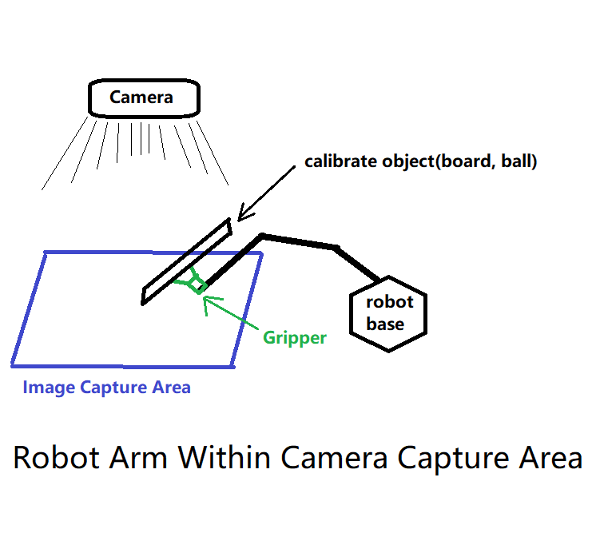
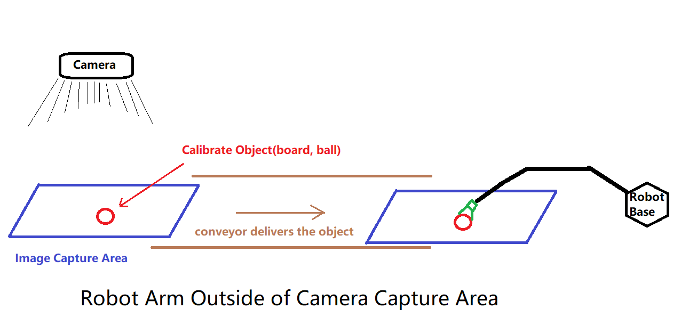
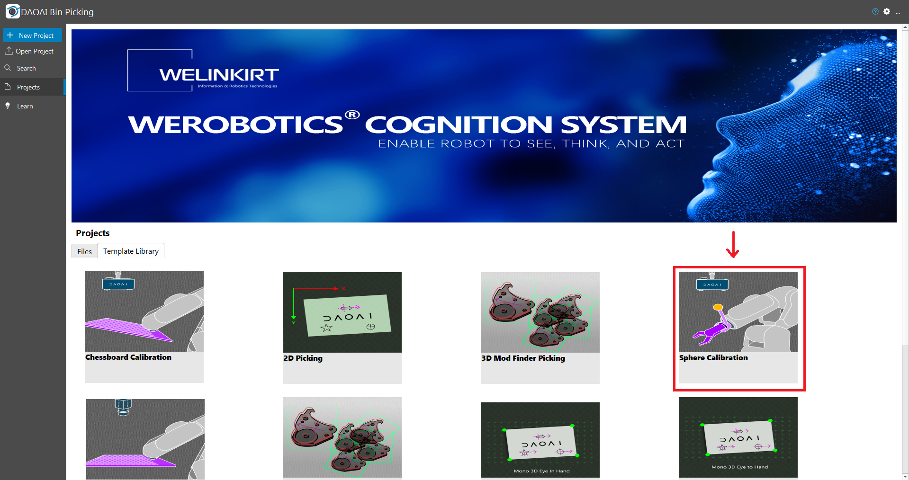
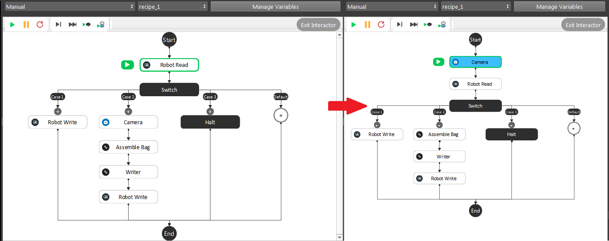
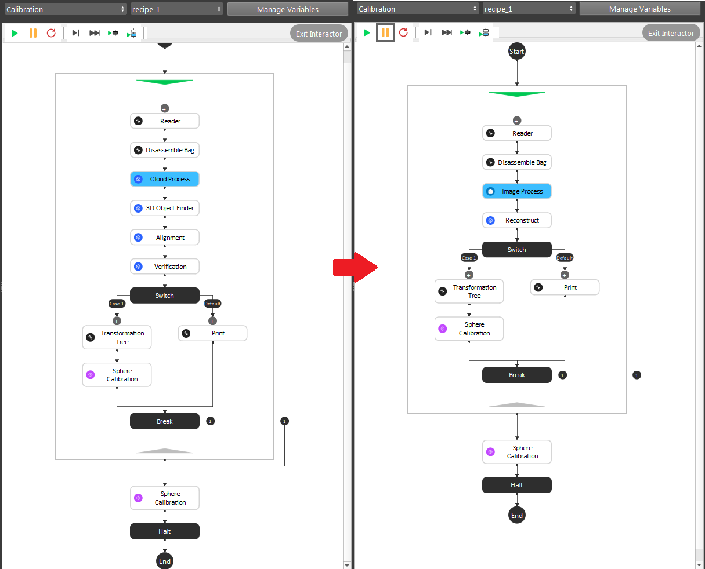
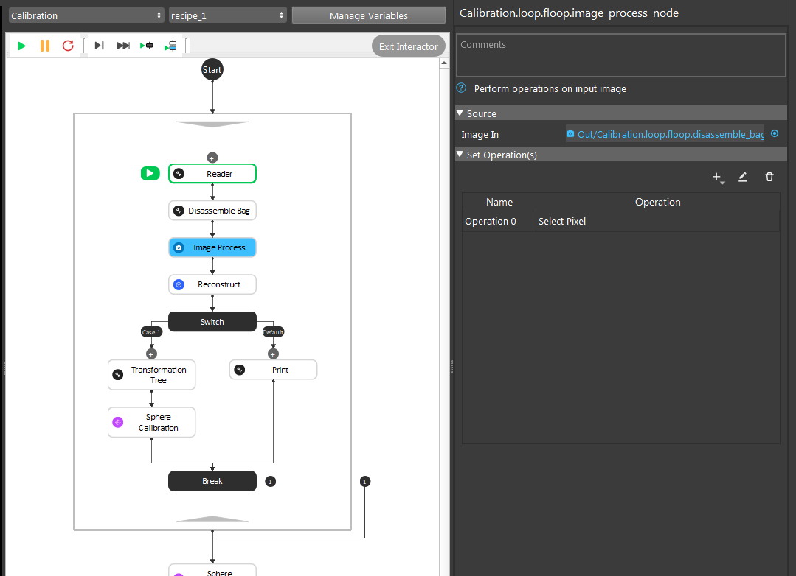
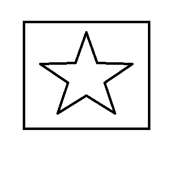

Modified Calibrations
=====================

This article is a sample usage of 3D-Calibration templates. Before continue reading this article, 
you should have a good understanding of :ref:`Board Calibration` and :ref:`Sphere Calibration`. 
We will also discuss the different types of calibration here. 

Scenario Usage and Explanation
------------

Generally speaking, all Calibration methods are trying to achieve one goal: find the relation between robot and camera. 
Based on the specific requirement of one project, you will use either **Eye-in-Hand** or **Eye-to-Hand** configuration. 
After that, you also need to decide which type of Calibration is suitable for it. There are generally 2 types of Calibration:

    #. Chessboard Calibration/Circleboard Calibration;
    #. Sphere Calibration;

As stated from their names, Chessboard/Circleboard Calibration calibrates through a board; where Sphere Calibration calibrates through a special object(in our example, this object is a 40mm Ping-Pong ball). 
You can read the details of these Calibration methods in `here <https://daoai-robotics-inc-daoai-vision-user-manual.readthedocs-hosted.com/en/latest/complete-vision-guidance/calibration_new/3d-calibration/overview.html#>`_.

Projects Descriptions
----------------------

We will discuss 2 example projects here, and see why they are using the calibration methods they need. 

    #. Camera capture area is within robot reachable area: when robot is able to reach the camera capture area, you can use Chessboard Calibration/Circleboard Calibration. Because the robot arm is able to be captured. You can mount the board onto robot arm and setup poses for robot to move under the camera. You can also use Sphere Calibration, either way is fine since robot arm is under the scene;
    #. Camera capture area is outside of robot reachable area; when robot is unable to reach the camera capture area, then it is slightly different. Since robot arm is not under camera capture area, the calibrate object(board or ball) cannot be mounted on the robot arm. You can switch the procedures' order slightly, by capturing the image first, then moving the calibrate object under the robot reachable area. Robot arm approach to the corresponding pose, collecting these information as our calibration pose;

Robot Arm Within Camera Capture Area
-------------------------------------

This will be the most encountered cases when working with **Vision** and Bin-Picking system. The objects are gathered in a box/basket, delivered by conveyor/machine/human to the 
designated detection area. 

.. image:: Images/bp_within_camera.png
    :align: center

This camera and robot position setup is common in industrial production line. With such setup, you can mount the calibrate object on the robot arm, since the robot arm movement is able to be captured by the camera. 
Therefore, you can use either Board Calibration or Sphere Calibration, depending on which calibrate object is handy for you. 

Vision Setup
**************

You can apply the Calibration templates on these situation, since the templates are setup and ready to use!

You can choose one of the Calibration templates from **Template Library**:

    * `Board Calibration Instructions <https://daoai-robotics-inc-daoai-vision-user-manual.readthedocs-hosted.com/en/latest/complete-vision-guidance/calibration_new/3d-calibration/circleboard-calibration/circle-board-calibration.html>`_
    * `Sphere Calibration Instructions <https://daoai-robotics-inc-daoai-vision-user-manual.readthedocs-hosted.com/en/latest/complete-vision-guidance/calibration_new/3d-calibration/sphere-calibration/3d-sphere-calibration.html>`_

You can read the articles above for detail step-by-step instructions.

Validating your Calibration Result
************************************

You can read this article for `Validating Calibration <https://daoai-robotics-inc-daoai-vision-user-manual.readthedocs-hosted.com/en/latest/complete-vision-guidance/calibration_new/3d-calibration/overview.html#validating-calibration>`_.

Robot Arm Outside Camera Capture Area
-------------------------------------

Sometimes you will encounter this: the robot is located somewhere far away from the camera. 
Then the Calibration methods above will not apply in here, since the camera will not be able to capture the calibration-board if you mount the board onto the robot arm. 
Therefore, you need to slightly alter the steps from template to achieve the calibration. Also, for this situation, you may only use the **Sphere Calibration**. 
Because it is impossible to ensure the board will have a fixed tilting angle and relative rotation after moving from one place to the other. Of course, if you can ensure the tilting and rotation is fixed, feel free to use the **Board Calibration** method as well.

Vision Setup
**************

Open up the **Vision** studio then click on the **Template Library** tab, you will see the **Sphere Calibration** template.

Step 1. Go to **manual** flowchart, you can see the template would look like below on the left. 
And you can modify it and it becomes the flowchart below on the right: by simply moving the Camera node to the beginning of the flowchart.

|

In this flowchart, the calibrate object will be captured first. For this method, it will be easier to operate with a **dot calibrate object**. 
A **dot calibrate object** is simply a dot on a paper/board. A dot calibrate object is easier to operate because:

    #. The dot on paper/board can be accurate position in the point cloud;
    #. The dot is on the fixed position according to the paper/board;
    #. Robot is easier to approach the dot location and reduce the risk of changing the dot position when robot is approaching the dot;

You can imagine if your calibrate object is a ball on the conveyor bell, and after the image captured, the ball is easier to roll around on the conveyor bell. 
It will change the ball in point relation after the image was taken. So that the calibration result will be incorrect. 

.. note::
    Even if you can tape, tie or 100% ensure the ball will not move after the image capture: when your robot is approaching and trying the touch the ball, the ball will slightly move. 
    The gripper will needs to touch the ball and ensure the centre point of the ball is a fixed distance to the gripper or flange. 
    Therefore, you will need to use some kind of special gripper which is able to have a fixed gripping pose with the ball. 
    And the robot arm is powerful in terms of strength, the slightly shifts of the ball is inevitable. That is why we recommend a dot calibrate object instead of a ball. 

.. warning::
    When your robot is approaching and trying the touch the dot for the robot pose, be careful of the slightly difference in Z value. It could have safety hazard if your robot arm pressure too hard on the surface. 

Step 2. Go to **Calibration** flowchart, you can see the template would look like below on the left. 
And you can modify it and it becomes the flowchart below on the right: deleting the **Cloud Process**, **3D Object Finder**, **Alignment** and **Verification** node; inserting the **Image Process** and **Reconstruct** node in the flowchart. 

|

Again, this is the example by detecting the dot in cloud(relation **obj in cloud**). Therefore, we apply the **Image Process** and **Reconstruct** node to generate the 3D **obj in cloud** pose from the dot. 

|

We used the **Select Pixel** operation in **Image Process** node, which will allow you to choose the pixel for object's x, y coordinates. Selecting the dot in **Image Process** node, 
pass the result to **Reconstruct** to generate the 3D pose. Then you will have the actual dot in cloud relation here. By keep doing this for all the other poses, eventually collected enough poses for the "Sphere"(dot) Calibration. 

Validating your Calibration Result
******************************************

By validating your calibration result, you may not use the gripper to check your calibration accuracy this time. Since the gripper will never going to show up in the camera, you will need a different way to validate it.

The best way to validate the result, is to pick on it. You can make a simple 2D logo, and try to pick on this logo. 

A star in rectangle is good object to pick on. You can use a 2D **Mod Finder** to determine the object in scene, applying **Reconstruct** to generate the 3D pose for robot to pick it.

.. note:: 
    When you are validating the result, make sure you test the rotation and tilt of object as well. This is important since no rotation and tilting might not able to validate the true Calibration result. 

If the object is correctly get "picked" by the robot in different rotation, tilt and height, it means the Calibration result is promising. If you found the robot is having error less than 1 mm, it is still within the acceptable range.

Calibration related Issue & Knowledge
--------------------------------------

    * :ref:`Camera Accuracy`

    * :ref:`Robot Accuracy`

    * :ref:`Qualitative calibration validation`
    
    * :ref:`Quantitative calibration validation`

.. toctree::
   :hidden:

   camera-accuracy
   robot-accuracy
   qualitative-measurement/3d-qualitative-validating-calibration
   quantitive-measurement/3d-quantitative-calibration-validation

