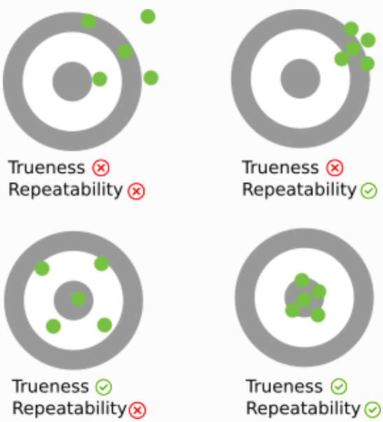
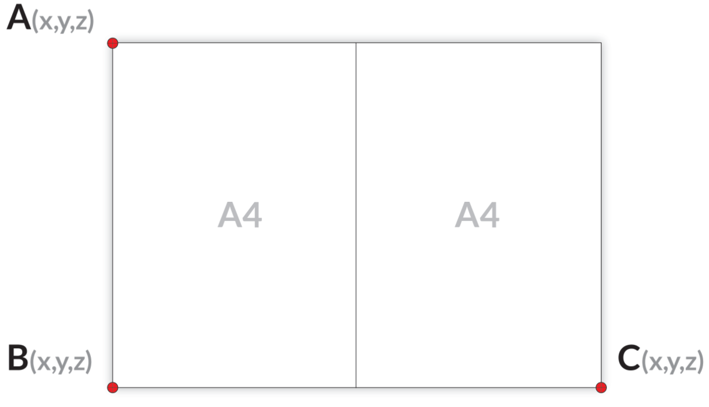

Robot Accuracy 
==============

Accuracy, trueness and repeatability
------------------------------------
* **Trueness** measures how close to reality a measurement is, on average. It is related to the statistical concept of bias.
* **Repeatability** measures how close measurements taken in the same conditions are from each other. It is also called **precision** and is related to the statistical concept of variance.
* **Accuracy** measures how close to reality a measurement can be. It is a combination of both the trueness and the repeatability.

Trueness and repeatability are therefore two independent concepts. As shown in the image below, a measurement with a good trueness can have a bad repeatability and *vice versa*. Good accuracy can only be obtained with both good trueness and good repeatability.

.. note:: For blind applications, where the robot moves between fixed taught points, only the robot repeatability matters. For vision applications, both the robot repeatability and the robot trueness matter. Unfortunately, robot manufacturers usually only communicate robot repeatability in their datasheet and not robot trueness.

Verifying Robot Trueness
------------------------
This section describes an easy way to verify the trueness of a robot by calculating the distance between three known points.

.. warning:: This verification is subject to manual error (jogging the robot to a given point). It is therefore not exact, but it can catch errors larger than 1 mm.

The idea of this test is to compare real and known distances with the distances perceived by the robot. For this, you need an object that contains distinctive points at which the robot can precisely point, and the distances between the points need to be exactly known. This could be corners of a table or corners of a sheet of paper. The robot needs to be able to reach all relevant points. Here we use two A4 sheets (equivalent to one A3 sheet) to illustrate the procedure.
In case of two A4 sheets make sure you attach them accurately and firm to each other as seen in the illustration below.

Lay this paper in such a way that the corners are reachable by your robot.

The robot trueness depends on the robot pose. It is therefore recommended to measure the robot trueness inside the Region of Interest (ROI) of the application, where picking is meant to take place. For camera on robot, it is also interesting to verify the robot truenss at the detection pose(s).

Point your robot TCP exactly to points A, B and C, and write down the TCP coordinates given by the robot.

.. tip:: Make sure that the TCP orientation is kept the same for all points. The easiest is to have the TCP oriented at 0 degrees around X, Y and Z. This makes sure that eventual TCP errors are not affecting this test.

Calculate the distance between three corners by using `this calculator <https://www.calculatorsoup.com/calculators/geometry-solids/distance-two-points.php>`_.

The deviation from the expected distance indicates the trueness error of your robot.

For an A3 sheet of paper, the distances should be close to:

 * A to B: 297 mm
 * B to C: 420 mm
 * A to C: 514.4 mm

Correcting the robot trueness
-----------------------------
If you observed unexpectedly high errors with your robot, contact your robot manufacturer. A new robot factory calibration might be required.

An industrial robot should typically be accurate to less than 1 mm.