Deep Learning KungFuTea Tea Bag Picking
==========================

This article is a sample project for Deep Learning engine detection & picking. 
If you want to know more detail about Deep Learning, you can checkout `this article <https://daoai-robotics-inc-daoai-vision-user-manual.readthedocs-hosted.com/en/latest/deep-learning/index.html>`_ before continue reading; 
We will use the **Reconstruct** node to process the 3D coordinate. If you want to know different picking engines using DL, checkout `these articles <https://daoai-robotics-inc-daoai-vision-user-manual.readthedocs-hosted.com/en/latest/complete-vision-guidance/detection/overview.html#deep-learning-engines>`_. 

Project Description
------------------

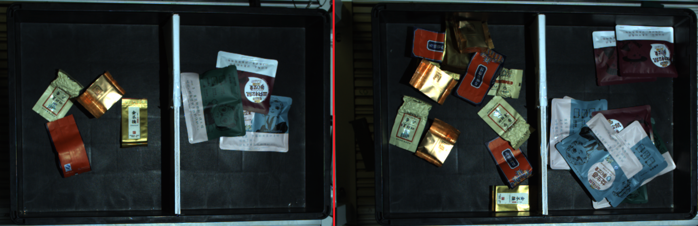

The requirement of this sample project is that: 
    
    #. Capture one image robot perform picking for one object;
    #. You select the designated type of object, robot picks and only picks this type of object;
    #. Picking from the highest;
    #. Collision free;

You can open and modify the **RGB Mod Finder template** (or any other template which has **pose_generation** & **picking** flowcharts). 
In this article, we will use RGB Mod Finder as our example. Some of the structures from template can be used to fit our project. 
In our example, the picking, pose generation and pose define flowcharts are giving the same functionalities to our project. 
Therefore, you only need to change detection flowchart(**Not** all the scenarios are the same, sometimes you still need to change other flowcharts in order to meet the requirements). 

.. note::
    Starting from version 2.22.4.0 **Vision Studio**, **Interface** node supports the generic input/output handling which can simplify the dependencies between flowcharts. This will be discuss later in this article. 

Collect Data
-------------------

In order to check your workspace is working properly as you wish, you should prepare large enough amount of data to test your workspace. 
Depending on the complexity of your project, you might need to collect more than hundreds of testing data for your workspace. 

You should try to simulate the scene as close as to project 's actual working environment, and try to cover all the possible occurrences from actual working environment. 
Save your testing images into local directory, and they will be really useful soon! 

If you want to know how to save image data? Checkout `this section <TODO>`_ before you continuous reading. 

Changing flowcharts
---------------------

Next step, you can start working on the specific project requirements. 

You can delete your detection flowchart on the template, then adding a new flowchart renamed as **detection**. 

.. warning::
    Try to use the same flowchart name when you deleted and added a new flowchart. Naming them the same will save you lots of work, since many different nodes is linking to detection flowchart. If you change the name, even just capitalize one character, the link expression is no longer valid. You will need to change all the links in your workspace. **So, think carefully when you name the flowchart!**

After that, you can start adding nodes into the brand new flowchart. **BUT!!!** Beforehand, you should plan and consider: what kind of detection engine you need? And why? Can you optimize the productivity of this detection flowchart? 

When considering these questions, you should come back into the requirements.

**What kind of objects you need to pick?**
    Object is tea bags and snack bags which either has soft or solid surface. Since this project has different kinds of objects and surfaces. 
    A suction gripper to suck up the object from its surface. 
    Furthermore, since these objects are different in appearance, it is difficult to use **Mod Finder**. 
    Unless, you define 20 models in **Mod Finder**. But if you do this, it is nearly impossible to manage & low in productivity. 
    Therefore Deep Learning is a better method to detect these objects. 

**How many objects your robot will be picking with one image captured? What is the order of picking all these objects?**
    From requirements, robot will pick **ONE** occurrence of the object. Therefore, theoretically you will only need to detect one object in scene. 
    However, if you only detect one object occurrence, this object maybe laying underneath another object. This is not a safe case for robot to perform picking. 
    Hence, you still need to detect all the occurrences of objects then sort these poses from highest Z value to pick. 

**Is it possible to occur collisions during picking?**
    
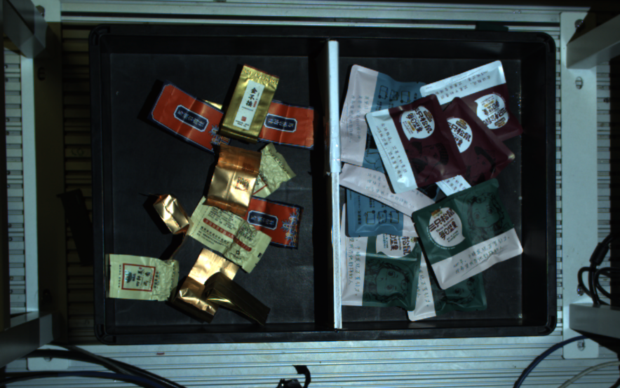
    
|

    From the image above we can see that objects will be laying in the box/basket. 
    Vision is unable to detect the box like edges/walls. 
    You will need to define the box/basket edges/walls for Vision. Hence, collision handling is necessary.

Teach Pose
------------------

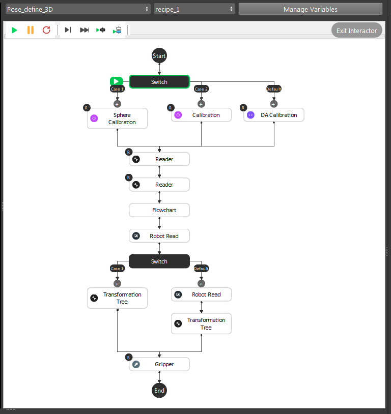

This is the pose define flowchart pipeline. The purpose of this flowchart is that: you can define the picking pose for objects. 
You should define all the poses if different objects have different picking poses. 
In our example project, suction gripper can work generally on all these objects. 
So we only need one pose for this project. 

.. note::
    This flowchart outputs the relation of ``Gripper`` to ``Object``.

General Description of the pipeline:
    #. Loading calibration file for current camera and robot base relation;
    #. Loading the gripper mesh and object mesh(this is optional for better visualization, but mesh/cloud inputs are required for **Gripper** node);
    #. Executing the detection flowchart to calculate the Object in Cloud/Camera relation;
    #. **(Optional)** Moving robot to the pose just like showing robot "how to pick" the object;
    #. **(Optional)** Transforming these relations with/without robot picking pose(You can feed the robot picking pose);
    #. Feeding these results to **Gripper** to generate our final Gripper to Object relation;

Detail steps are like below:

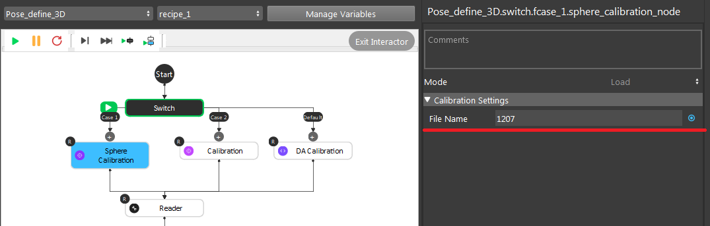

The ``.yml`` file name which contains the current Camera to Robot Base relation;

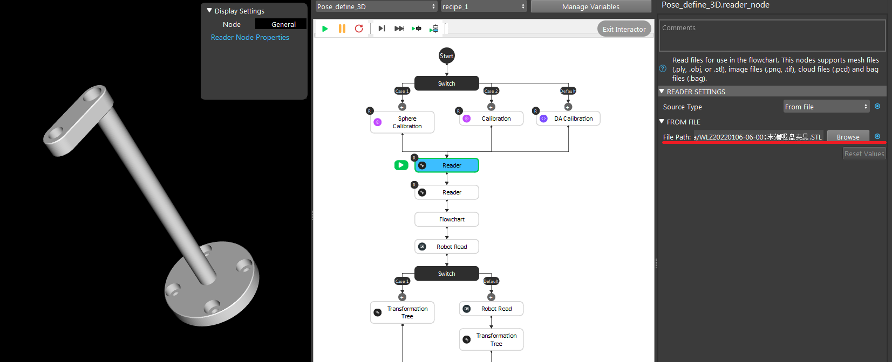

Loading the gripper mesh(``.stl`` or ``.ply`` file), Same for object mesh/cloud model(``pcd`` or ``ply`` file). In this example, we used a plane as our object mesh for this visualization;

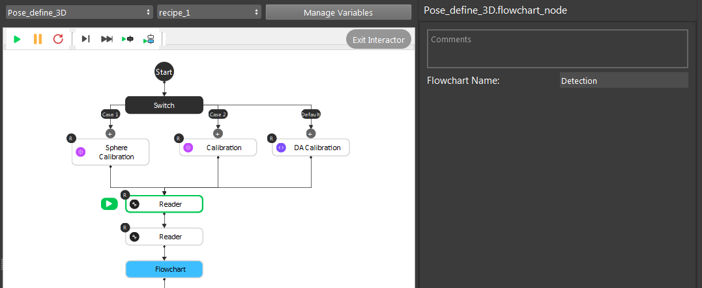

Executing the detection flowchart to get Object to Cloud relation;

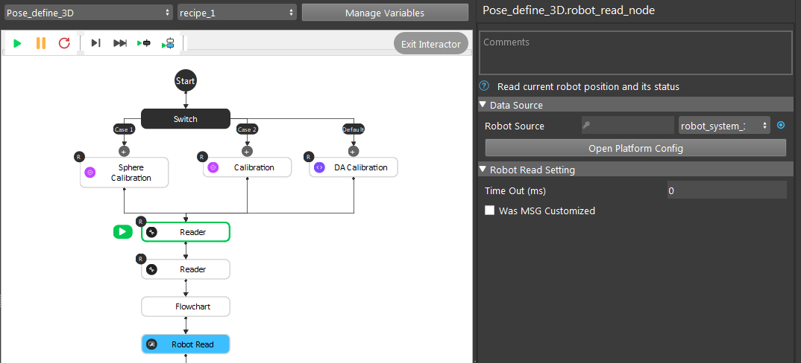

**(Optional)** Robot picking pose;

After the transformation process, here comes the interesting part. And this is the main operations you will need to take care of: the **Gripper** node. 

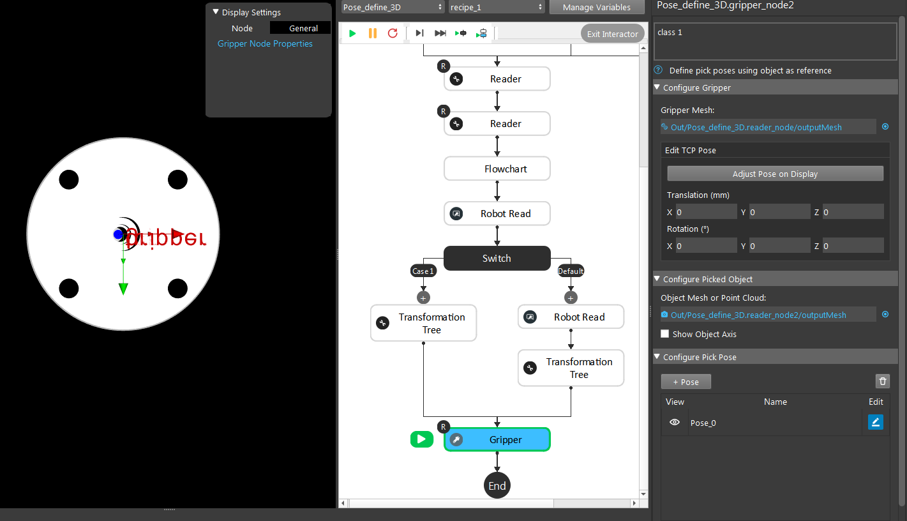

First of all, the **Gripper** node requires gripper and object models. It will display the current setting's visualization of Gripper to Object relation. 
If you used the robot picking pose above, you should click the **Use initial Pose** and you will see the visualization of the pose you taught robot. 

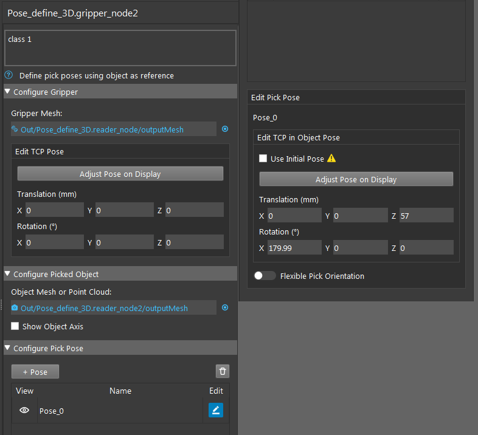

You can adjust the current pose from **Adjust Pose on Display**. You can also enter the corresponding x, y, z, rx, ry, rz values for this pose. 
TCP in flange relation is also available to tune in here, which can increase the accuracy for some situations. 

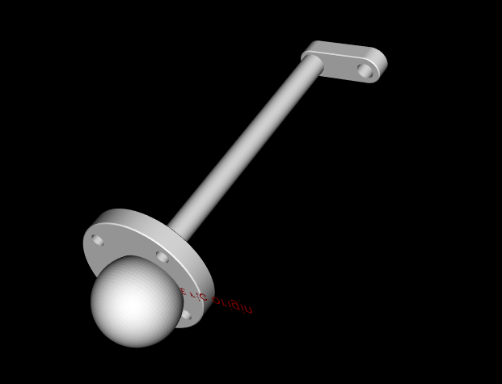

Here is an example pick pose as Gripper to Object relation(I used the ball mesh for object since it is better for demonstration).

Deep Learning 
--------------

.. image:: Images/dl_output.png
    :align: center

As discussed above, we should use Deep Learning Engine for our detection. 
You can checkout these article to see how to `collect data <https://daoai-robotics-inc-daoai-vision-user-manual.readthedocs-hosted.com/en/latest/deep-learning/dataset.html#>`_, 
`annotate your dataset <https://daoai-robotics-inc-daoai-vision-user-manual.readthedocs-hosted.com/en/latest/deep-learning/annotation/index.html>`_ 
and `train your model <https://daoai-robotics-inc-daoai-vision-user-manual.readthedocs-hosted.com/en/latest/deep-learning/jenkins-usage.html>`_. 

Picking
----------------

.. attention::
    The flowchart **picking** has became **main_flowchart** and flowchart **pose generation** has became **picking** in version newer than **2.22.4.0**.

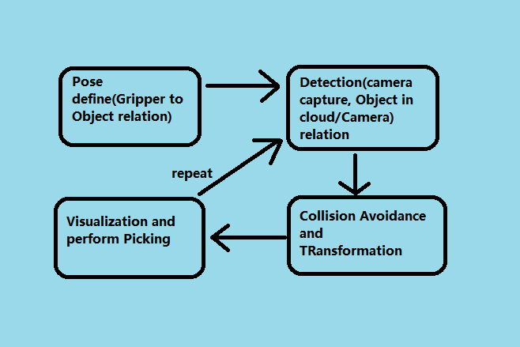

Generally, the picking process is pretty similar in terms of workflow. Define a gripper pose at the beginning, then image captures, then process through Vision algorithm; performs picking. 

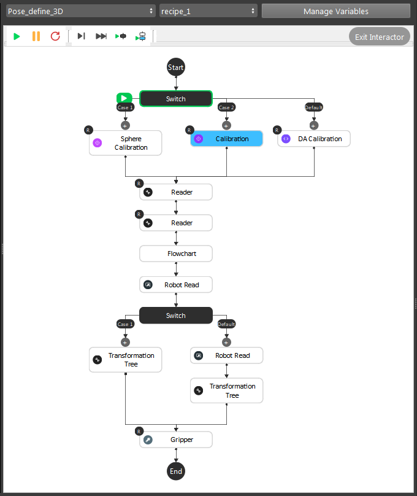
|

For Pose Define flowchart, we need to load the calibration file for current camera and robot base relation. As well as calculate the gripper pose:
    #. **Calibration**, **Sphere Calibration** and **DA Calibration** loads the ``.yml`` file and archive the relation from the file; 
    #. **Reader** nodes loading the Gripper mesh and Object mesh/cloud files; 
    #. **(Optional) Detection flowchart** and **Robot Read** to teach Vision about the picking pose; 
    #. **Gripper** node calculates the picking pose;

After pose define flowchart, you will have **Camera in Base** and **Tool in Object** relations. 

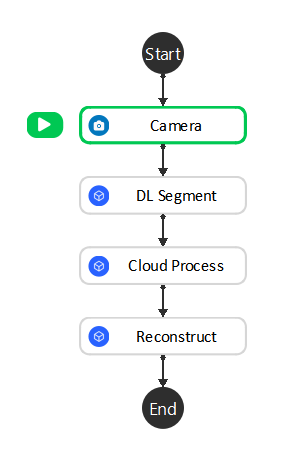

For detection flowchart, we have simplified and keep the core functionalities in it:
    #. **Camera** node -> Image Captures;
    #. **DL Segment** node -> Finding objects by the deep learning models;
    #. (Optional) **Cloud Process** node -> Cropping object models or define custom reference frame;
    #. **Reconstruct** node -> Generating 3D coordinates;

After detection flowchart, you will have **Object in Cloud** relation. 

.. note::
    Camera and Cloud is a 180 rotation of x-axis. Therefore, once we have **Object in Cloud** relation, we also have **Object in Camera** relation.

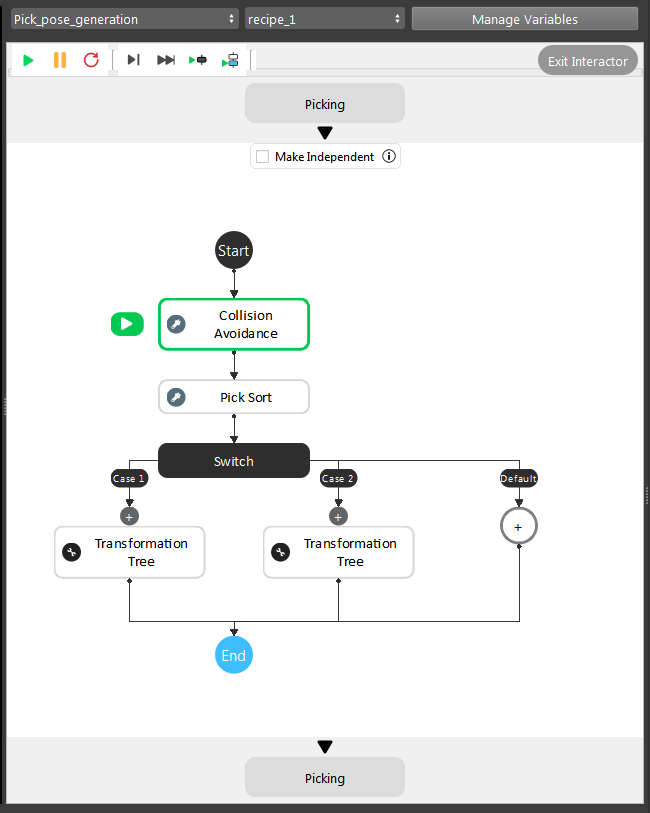

For **pose_generation** flowchart, it is basically the same pipeline. 
But the link expressions will need to change followed with detection flowchart. 
Collision Avoidance and Transformation Tree node will need input from Reconstruct node.

.. note::
    If you are using 2.22.4.0 or newer version, you will not need to worry about link expressions since you have Interface node to take care of the inputs/outputs.

Now you have **Camera in Base**, **Tool in Object** and **Object in Cloud/Camera** relations, 
last thing to do is transforming all these relations and calculate the final goal: **Tool in Base** relation and send it to the robot. 
**Transformation Tree** node is able to do the calculation. Therefore, you can apply this output to **Robot Write**.

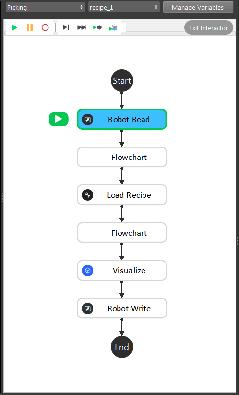

This is the modified picking flowchart for this project, since we only need these functionalities to perform picking. 
You can also use the picking flowchart from template, it only has minor changes in order to get it working. 

Interface node
----------------------

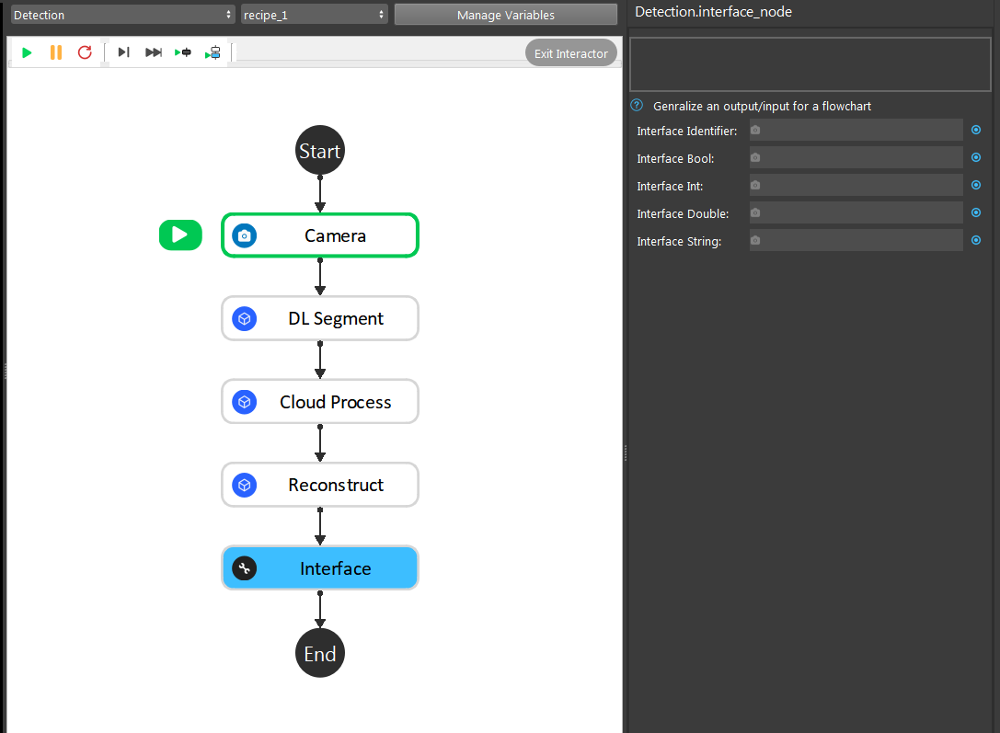

If you are using Vision Studio version newer than 2.22.4.0, you should be able to add **Interface** node to manage the outputs across different flowcharts. 

In this example project, the essential changes is in detection flowchart. When one flowchart is using another flowchart's output, 
you can link it through **Interface** node. Therefore, changing detection flowchart does not affect the link expressions on other flowcharts. 
It would be a good practice to decrease coupling between flowcharts. 