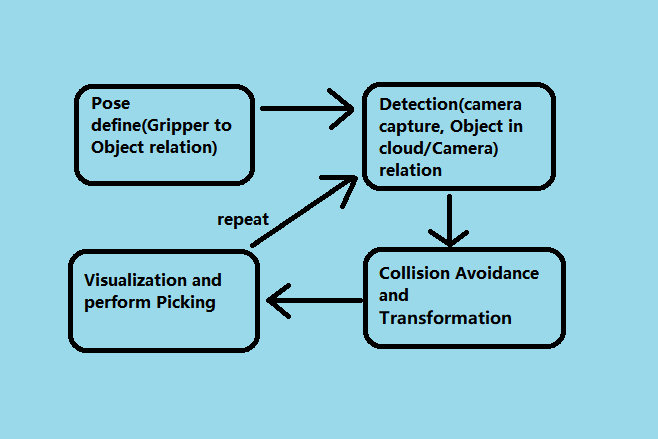
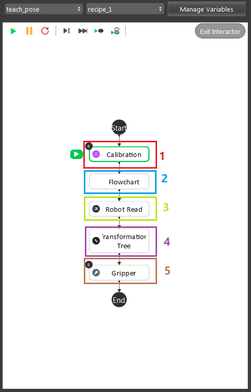
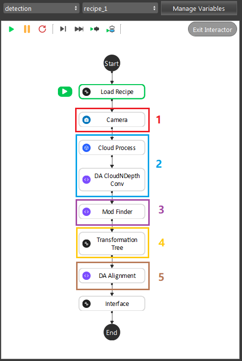
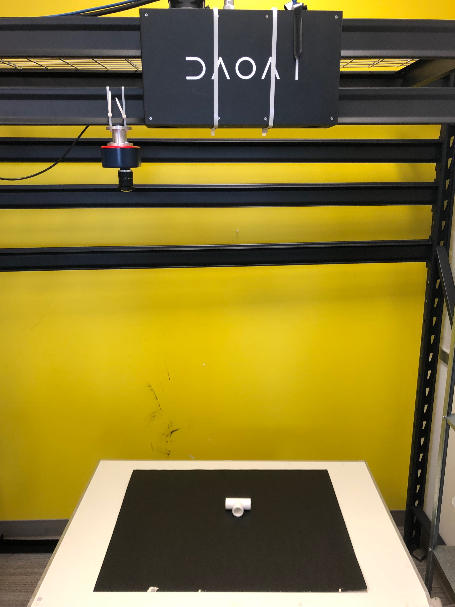
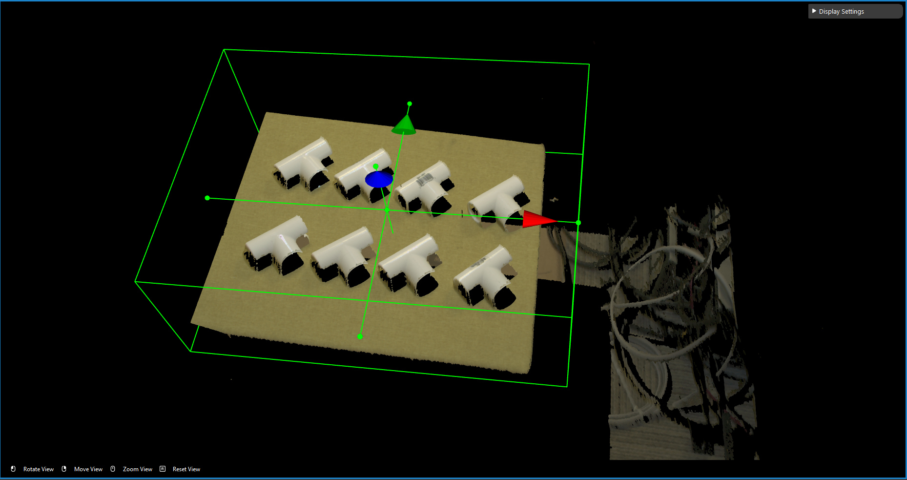
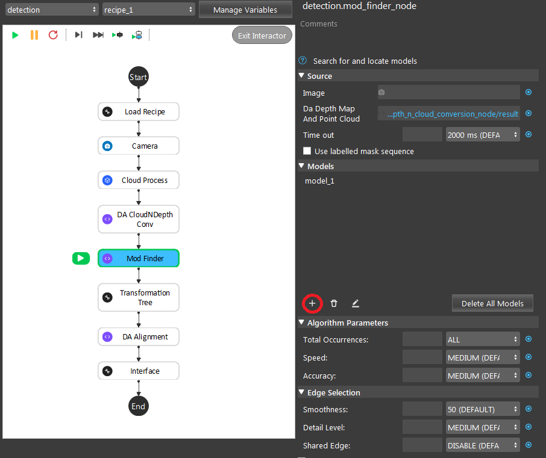
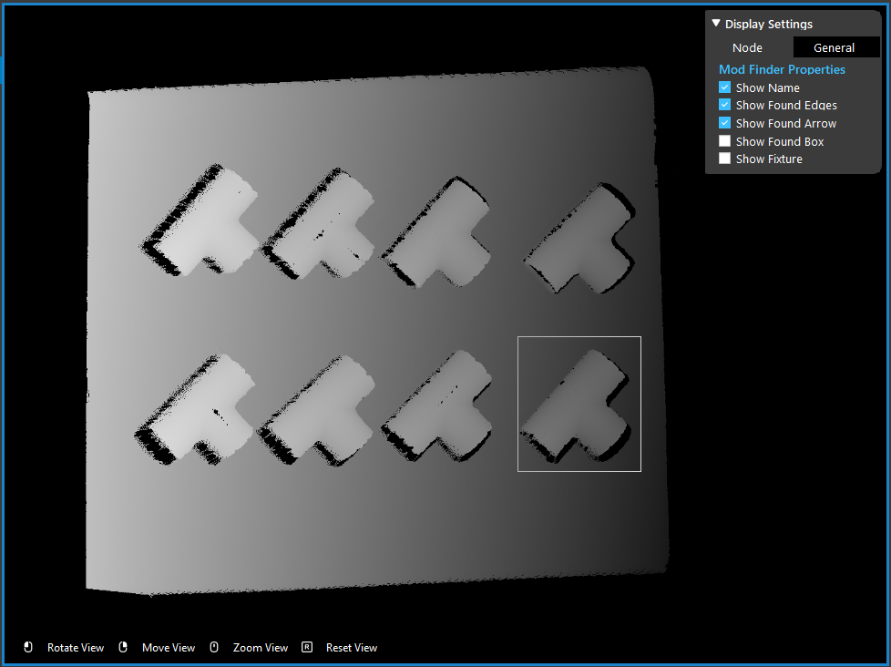
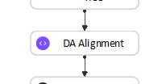
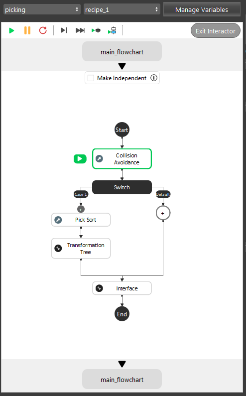

Depth Mod Finder 
===============

Pipeline Overview
~~~~~~~~~~~~~~~~~~

|

For general picking pipelines, camera & robot work together to **see** and **pick**. **Vision** is a software layer to communicate between all these hardwares. 
The stages above are essential for all the required relations in this calculation. Therefore, even if the requirements are different from project to project, the core 
calculation is similar. 

The Depth Mod Finder pipeline has 4 stages: 

    #. **Teach Pose**: Teach/demonstrate the picking pose to robot;

    #. **Detection**: Detect the object location in scene;

    #. **Pose Transformation** (Picking flowchart): Transform all the poses and relations for picking procedure;

    #. **Picking**: Robot communication and actual picking;

Teach Pose
~~~~~~~~~~~~

Teach Pose is a stage for you to show the robot: how to pick the object. It has 2 kinds of teach pose, mainly differ from whether or not the robot is involved. For **Mod Finder** templates, 
we use the teach pose which the robot is involved. 

|

The image shown above is the example of typical teach pose procedures. It is essential for robot to know how to approach its gripper to object. 
This stage is required which it calculates the **Object in Tool** relation.

You can split this pipeline into 5 major parts:

1. **Calibration** node, load in the calibration result from local ``.yml`` file. You can checkout these articles for `Calibration node <https://daoai-robotics-inc-daoai-vision-user-manual.readthedocs-hosted.com/en/latest/nodes/Calibration/calibration.html>`_ and `Sphere Calibration node <https://daoai-robotics-inc-daoai-vision-user-manual.readthedocs-hosted.com/en/latest/nodes/Calibration/sphere_calibration.html>`_. And details of calibration procedures are :ref:`Board Calibration` and :ref:`Sphere Calibration`. 

2. **Detection** flowchart is executed here to find out the current **Object in Cloud** relation. When you execute this flowchart for the first time, you will need to define the model. You can check `DA Alignment section <https://daoai-robotics-inc-daoai-vision-user-manual.readthedocs-hosted.com/en/latest/nodes/DA%20Modules/DA%20Alignment%20Node.html>`_ for instructions of defining the model. 

3. **Robot Read** node is reading in the robot current pose, **Tool in Base** relation. 

4. **Transformation Tree** node collects all the relations and generate the **Tool in Object** pose for **Gripper** node. 

Detection
~~~~~~~~~~~~~~~~~~

As the image above shows, the Gray Mod Finder contains 5 sections in the whole flow:

* Section 1: Used the camera to capture 3D data.
* Section 2: Use cloud process (adjust bounding box feature) to set the working cell of the project, and parse the cloud into depth(8-bit).
* Section 3: Used mod finder 3D mode to find the object in the 8-bit depth map.
* Section 4: Perform the inverse operation on the model cloud in order to align the model cloud with scene cloud.
* Section 5: The alignment in this section was used to align the 3D model into the 3D space. Mod Finder node outputs the initial pose of the object here.

During the runtime, the execution flow is section 1 -> 2 -> 3 -> 5. And during the defining time, the execution flow is section 1 ->2 -> 3 -> 4 -> 5. After defining the model, as long as you do not redefine the model again, **DA Alignment** node will not update the pose from **Section 4**. Therefore, when performing picking procedure, you do not need to worry about **Section 4**.

.. tip:: You can also learn about the main ideas behind the depth mod finder engine by watching this video tutorial. (TODO, record a video)

Teach model from camera
~~~~~~~~~~~~

Teaching an object model is important step when setting up the DaoAI Mod Finder engine to detect objects. 
Mod Finder needs a good model to identify objects in scene. Mod Finder uses RGB or Depth image to detect objects, therefore anything captured in camera could be possibly the oobject. 
How can Vision recognizes these objects? By comparing from the model and the image. Hence, good model plays the essential role in this process.
  
The rest of this article is about how to define model. If you want to know what is good model, please see `How to define good models <https://daoai-robotics-inc-daoai-vision-user-manual.readthedocs-hosted.com/en/latest/complete-vision-guidance/detection/mod-finder/good_model.html>`_

Placing the object under the camera
~~~~~~~~~~~~~~

Place your object under the camera and try to put it as close as possible to the center of your working environment (center height of the working cell, and at the center of the image) to capture the sample image while making sure that the object is lying fully in the field of view of the camera. It’s useful to run the camera node continuously, and turn on the point cloud view to see the image quality of the object. 

|

Isolating the object 
~~~~~~~~~~~~~~
Usually the camera field of view will be larger than the region of interest, thus the first step usually is to setup the boundary for the useful information. 
You could run to the **Section 2** Cloud Process node, and make sure the **Adjust Bounding Box** options was on in the cloud process display setting. 
Then execute the Cloud Process node. Then you could adjust the bounding box. 

.. tip:: When adjust the bounding box, you could press **R** to reset to the original view. For more information of Adjusting Box, checkout this `article <https://daoai-robotics-inc-daoai-vision-user-manual.readthedocs-hosted.com/en/latest/faq-trouble-shooting/adjust_box/index.html>`_.

Define the Model with the Image
~~~~~~~~~~~~~~~

We use the depth output from the DA CloudNDepth Conv node, and now we run the Mod Finder node once to load in the image. 
Then click **add model**, then select a bounding box on the image. 
To define a model, click the ``+`` sign. 

|

Then defining the model in scene.

|

.. Masks
.. ~~~~~~~~~~~~~~~
.. TODO: How does mod finder calculate the depth? Please wait for new updates!

Poses Generation & Transformation
~~~~~~~~~~~~~~~~~~~~~~~~~~~~~~~~~~~~~~~~~~~~~

|

The **DA Alignment** nodes in Detection flowchart will generate the poses output the **Object in Cloud** relation for further calculations. 
We will skip this part here, and you can checkout the articles for 
`DA Alignment node <https://daoai-robotics-inc-daoai-vision-user-manual.readthedocs-hosted.com/en/latest/nodes/DA%20Modules/DA%20Alignment%20Node.html>`_. Which it will cover the pose transformation detail as well. 

After the Detection pipeline, you have the objects locations in scene. Then, these poses will need transformations, since the robot requires the **Tool in Base** relation for 
all the objects. As the image shown above, our template will process the collision avoidance for these objects in scene. Then providing the orders for these objects, and send it 
to robot.

You can checkout details about `Gripper node <>`_, `Collision Avoidance node <>`_ and `Pick Sort node <>`_.

After these transformations, robot will receive a pose regarding to its **Tool in Base** relation to perform picking.