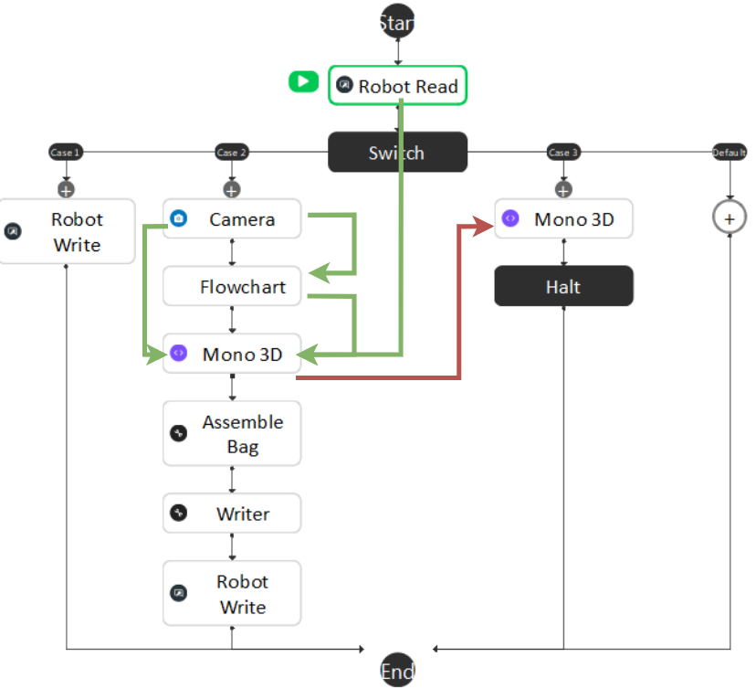
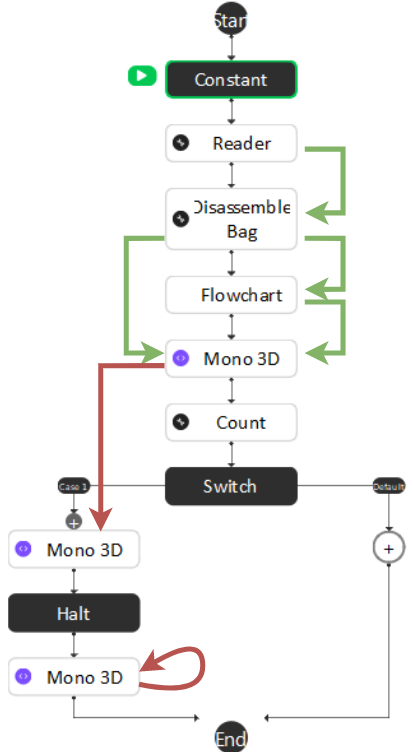
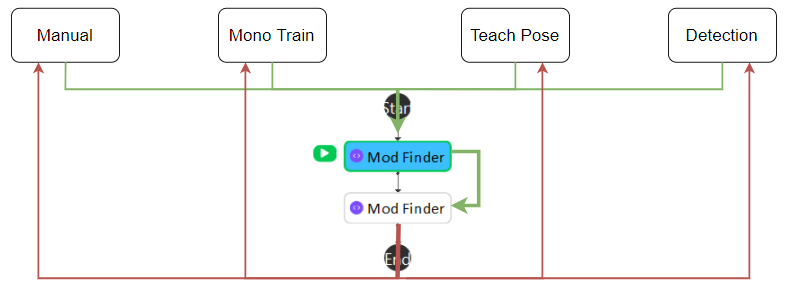
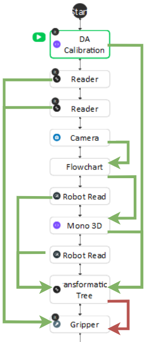
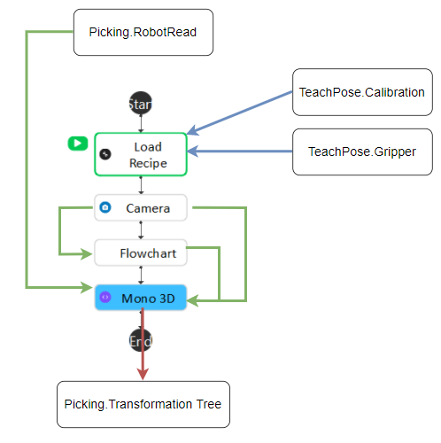
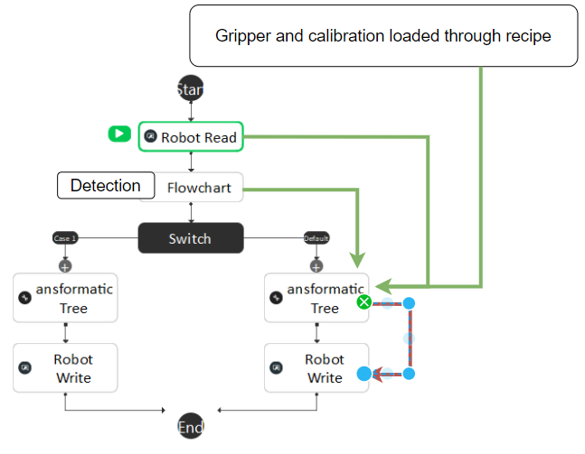

Mono 3d template usage
======================

It used the 2d feature to extract the 3d position of the object. 

(reference https://docs.pickit3d.com/en/latest/examples/build-a-showcase-demo-with-a-m-camera-and-suction-cup.html)

Use Case 
~~~~~~~~~~~
TODO: Upload Benz Battery project vedio after done.

Requirment 
~~~~~~~~~~
TODO: Abstract Benz Battery project Requirments after done.

Mounting instructions 
~~~~~~~~~~~~~~~~~~~~~
TODO: Abstract Benz Battery project instructions after done.

Setting up the picking pipeline
~~~~~~~~~~~~~~~~~~~~~~~~~~~~~~~
Calibrate the camera 
""""""""""""""""""""
Nest step is the Hand-Eye Calibration. This process must use the DA Calibration nodes. It generates the relative positions between the robot flange and the camera. This relation is used to transform the object pick points into robot coordinates. Details can be found in .. _my-reference-label: TODO: Add DA Calibration reference rst.

Define the feature and train the object
"""""""""""""""""""""""""""""""""""""""
After Hand-Eye Calibration, head to :ref:`mono-3d<Placing the object under the camera>` and follow the instructions to define features and train/set an object model.

Teach the picking pose
""""""""""""""""""""""
Teach picking pose process is made to find the relative positions between the robot flange and the object. Once this relation is generated, the relative position between tool and object will remain the same while picking.
 * Head to the **Teach_Pose** flowchart and click **DA Calibration** node. On the configuration window, select Hand Eye Config setting to be eye-in-hand, and enter the DA calibration output file name.
 * Click **Manage Variables** button and set Mode to **2**, and 2_Step to **False** by unchecking the value box.

    .. image:: Images/mono-3d-teach-pose-variable-cali.png
        :align: center 

 * Click on the first reader node and load browse the gripper mesh file. Then click on the second reader node and load the object mesh file.

    .. image:: Images/mono-3d-teach-pose-reader.png
        :align: center 

 .. hint:: If there's no gripper and object mesh file matching the real ones, load any mesh file. 
 
 * Click on the **Mono 3D** node pose estimate mode, set the calibration Context and mono training file name just like what was defined in **Detection** flowchart.
  
    .. image:: Images/mono-3d-pose-estimate.png
        :align: center 

 * Use **Next Step** to run the flowchart step by step, first **Robot Read** node require the robot to send the detection pose which is the pose where the camera captures. The second **Robot Read** node require the robot to send the picking pose of how gripper should pick the object.

 * After running the first **Gripper** node, click on it, and click on the existing pose, click the trash icon button to remove previously saved poses. Then click ** + TCP in Object Pose**, and click the **View** button to see preview of relative position between tool and object.
    
    .. image:: Images/mono-3d-gripper.png
        :align: center 

.. note:: Ignore the second gripper. It is used for 2 step picking.

Execute the picking 
"""""""""""""""""""

* Click **Manage Variables** button and set Mode to **3**, and 2_Step to **False** by unchecking the value box.

    .. image:: Images/mono-3d-variable-picking.png
        :align: center 

* Get Robot picking script ready and run the **Picking** flowchart. UR Picking Experiment Script example below:

    .. image:: Images/mono-3d-picking-ur.png
        :align: center 

Flowchart Summary
~~~~~~~~~~~~~~~~~

+----------------+---------+----------------------------------------------------+
| Flowchart Name | Purpose |                                                    |
+================+=========+====================================================+
| Manual         | 0       | Aquire Object geo feature relations.               |
+----------------+---------+----------------------------------------------------+
| Mono Train     | 1       | Aquire Object geo feature relations.               |
+----------------+---------+----------------------------------------------------+
|| Mod Finder    || N/A    || Use given image selected by Variable.Mode         |
||               ||        || to aquire relative position between camera        |
||               ||        || and geo features.                                 |
+----------------+---------+----------------------------------------------------+
|| Detection     || N/A    || Use Trained geo features and detected geo         |
||               ||        || features to generate object location in 3D        |
+----------------+---------+----------------------------------------------------+
| Teach Pose     | 2       | Set picking pose                                   |
+----------------+---------+----------------------------------------------------+
|| Picking       || 3      || Use object location, picking pose, hand-eye       |
||               ||        || relationship to generate pick pose to guide Robot |
+----------------+---------+----------------------------------------------------+

Manual 
""""""
The data flow for this flowchart is basicly gathering the camera captured image, mod finder result, and robot pose into **Mono 3D** Accumulate mode and use **Mono 3D** final mode to generate a training file.

Mono Train
""""""""""
The data flow for this flowchart is similar to **Manual**. Instead of aquiring image from camera and pose from robot read, it gets data from assembled bag, plus mod finder result into **Mono 3D** Accumulate mode and use **Mono 3D** final mode to generate a training file. If **Mono 3D** Set feature mode is used, none of the data will be needed.

Mod Finder
""""""""""
The image input for **Mod Finder** nodes comes from different flowchart depending on the value of Variable.Mode. Then Second **Mod Finder** node uses first one as it's reference fixture which anchors the geo features. Then the output goes back to different flowcharts.

Teach Pose  
""""""""""
Firstly, **DA Calibration** node will load the relative position between camera and flange. Secondly, **Camera** node will provide image for **Mod Finder** flowchart which will generate geo features in camera 2D location for **Mono 3D** pose estimate mode. First **Robot Read** node will read the robot pose for detection pose, second **Robot Read** node will read the robot pose for picking pose, and both will be passed to **Transformation Tree* node. **Mono 3D** pose estimate mode will generate the object in camera 3D location for **Transformation Tree** node. Afterwards, **Transformation Tree** node will calculate the Flange in object relative position and pass it to **Gripper** node. Since **Gripper** node is added to recipe, the saved pose will be loaded thourgh **Load Recipe** node in **Detection** flowchart.

Detection
"""""""""
The **Load Recipe** node will load **Calibration** and **Gripper** node output from **Teach Pose** flowchart. Then Mono 3D will gather detection pose, image, and mod finder result to generate the actual object in camera location.

Picking
"""""""
The **Robot Read** node will recieve the detection pose and pass it to **Transformation Tree** node. **Mono 3D** node in **Detection** flowchart will provide object in camera 3D location for **Transformation Tree** node. The **Gripper** and **DA Calibration** node will be loaded through **Load Recipe** node and provide camera in tool and tool in object location. Finally **Transformation Tree** node will generate the tool in base and guide robot to pick the object.

Cautions
~~~~~~~~
2 Step Picking
""""""""""""""
* This document is only for 1 step picking. Two step picking is only for high accuracy requirement which the first step is to move camera to a better detection position. In the switch node of **Picking** flowchart, case_1 is to generate the better detection pose, and payload from robot will be needed to switch first and second step. The 2 Step Picking will be enabled by changing the **Variable.Mode** to True.

    .. image:: Images/mono-3d-picking-switch.png
        :align: center 

The **Mod Finder** nodes input image is decided by the **Variable.Mode**.

    .. image:: Images/mono-3d-mod-finder-expression.png
        :align: center 

The **Switch** node in **Mono Train** flowchart will be evaluated to True if the **Count** node in front of it is equals the number of bags set in **Constant** node.

    .. image:: Images/mono-3d-mono-train-switch.png
        :align: center 

The **Manual** flowchart will be using the same robot script as Manual Calibrations. The switch node will check the recieved command from **Robot Read** node.
