Shape Finder
==============

The DaoAI Shape Finder uses designated shape to create 2D object locations, applied to Reconstruct node in order to generate 3D object locations. 
This is useful when you encounter objects like this:

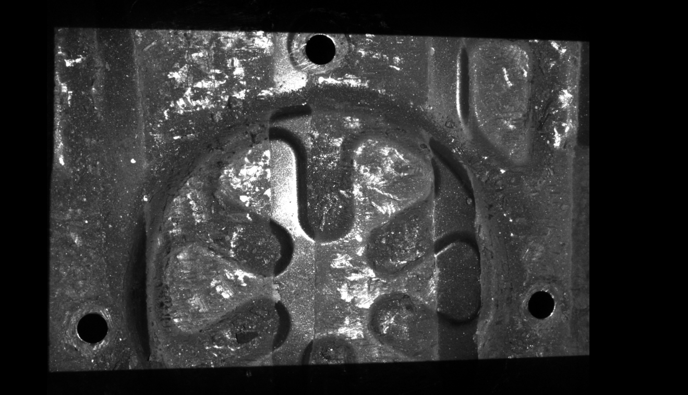

There are 3 circles on the metal part, our goal is to assemble another part through these circles. Hence we need the 3D object locations of these circles. 

**Why not RGB Mod Finder or Depth Mod Finder?** Mod Finder is similar to Shape Finder, only difference is This node is very similar to mod_finder node, Mod Finder Node Implementation , the only difference is Shape Finder use parameters to define shapes, Mod Finder uses the user-defined edge models. 
Objects like image shown, perfect circles are more handy using Shape Finder. Shape Finder does not require edge model from scene, hence we do not need alignment in Shape Finder detection. 
We only need to setup the parameters of certain shapes. 

Pipeline Overview
----------------

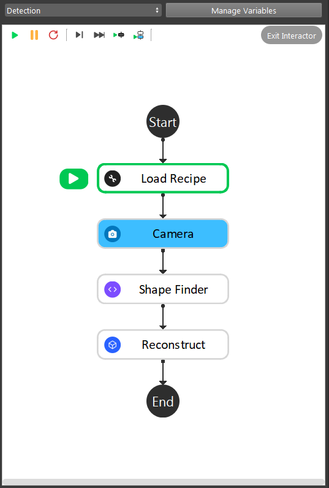

As the image above shows, the Shape Finder detection is straight forward pipeline flow:
    #. Camera captures, then feeds output to Shape Finder node;
    #. Add shapes and set the corresponding parameters;
    #. Reconstruct node generates the 3D object picking pose;

.. tip:: You can also learn about the main ideas behind the Box Volume Estimate by watching this video tutorial(TODO, record a video) and `Sample Workspace <https://drive.google.com/uc?export=download&id=1S4iL9rzlIMeGlSVbGf4RZbIEkDROQJNR>`_ . 

Deep Learning Model
----------------

All the shapes in Shape Finder has been taught to **Vision**, you can go ahead to use Shape Finder, it is ready! For more details about Deep Learning, please see `Deep Learning <https://daoai-robotics-inc-daoai-vision-user-manual.readthedocs-hosted.com/en/latest/deep-learning/index.html>`_

Setup Shape Parameters
--------------------

Clicking on ``+`` button to add shape. You can see the Shape Parameter Configuration window. You can edit your shape parameters and type here.

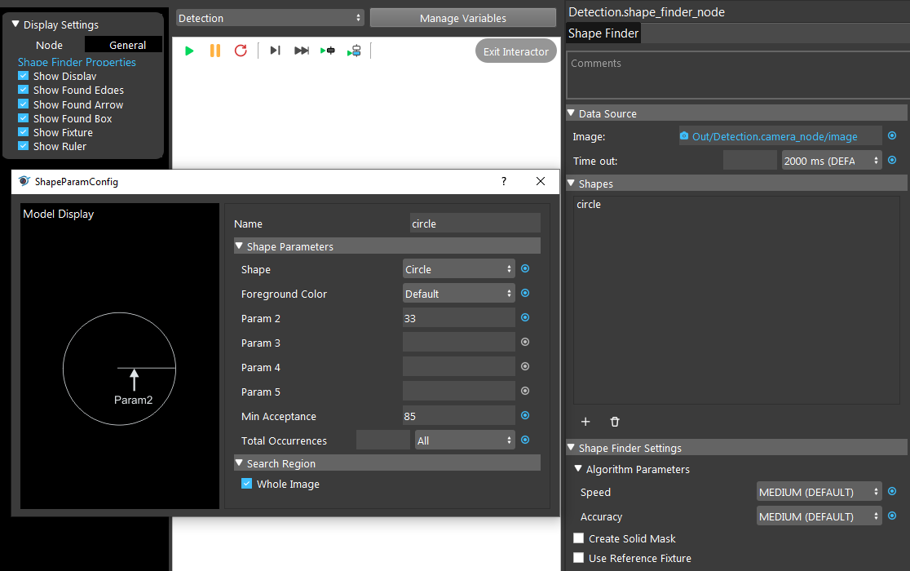

|

You are able to choose the shape for your object from **Vision** defined shapes. Like image shown below:

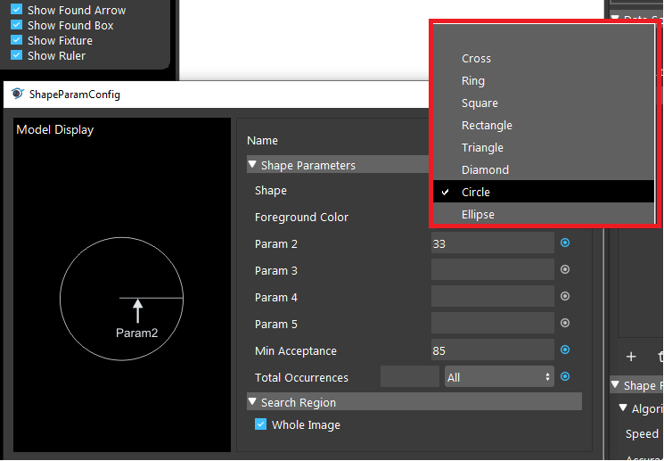

``Param 2`` is the radius of the circle. Different shapes require different parameters, without the correct parameters, it is difficult for **Vision** to detect the objects in scene. 

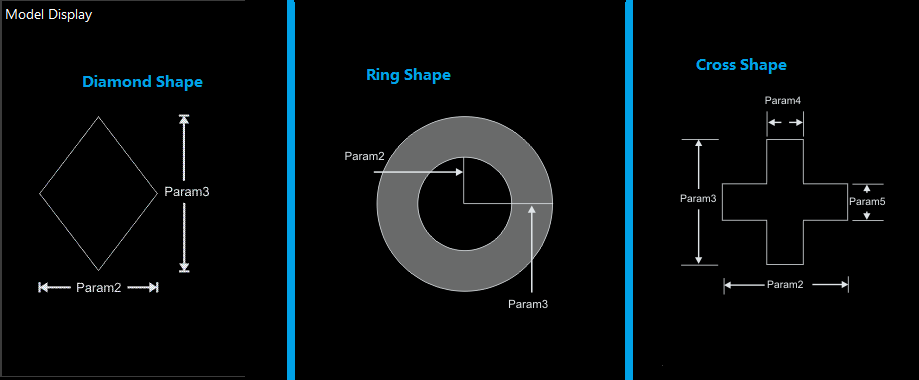

For example, Diamond Shape requires ``Param 2`` and ``Param 3`` inputs, Ring Shape requires ``Param 2`` and ``Param 3`` inputs and Cross Shape requires ``Param 2``, ``Param 3``, ``Param 4`` and ``Param 5`` inputs. 
Without these inputs, Shape Finder would display errors since there are not enough parameters to detect objects in scene.

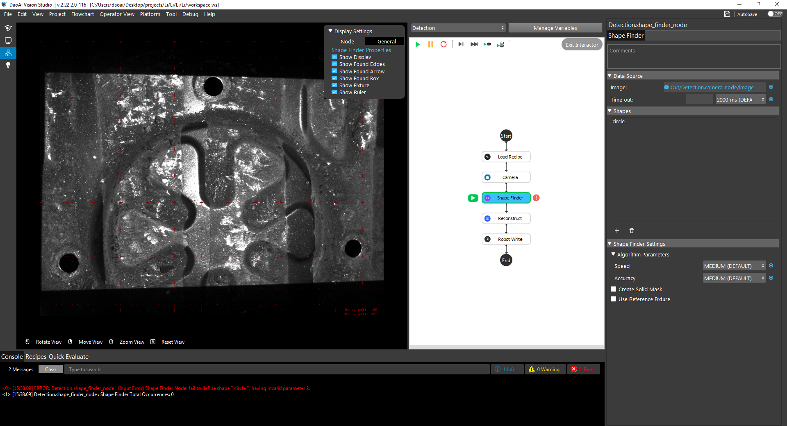

**Min Acceptance** is the acceptance level of objects in scene. We should increase the acceptance higher to ensure it detects the objects and objects only. 
But if the acceptance is too high, Vision would try to look for objects which has similar shape. 
This is not so true in real life environment since objects might be in different place, when camera captures, the shape of object would slightly change due to angle changes or lighting changes.

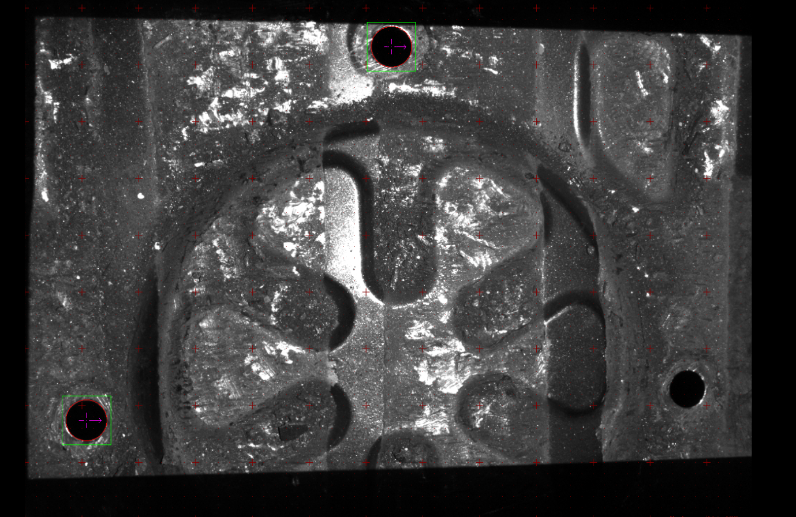

When setting acceptance too high, detected 2 occurrence of objects but there are 3

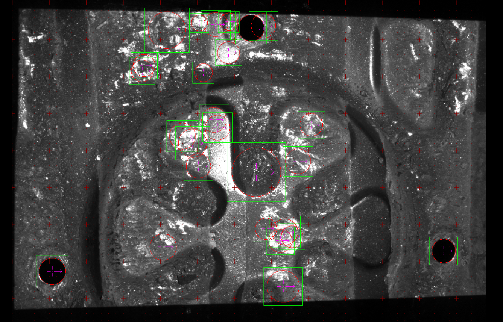

When setting acceptance too low, detected 32 occurrence of objects but there are 3

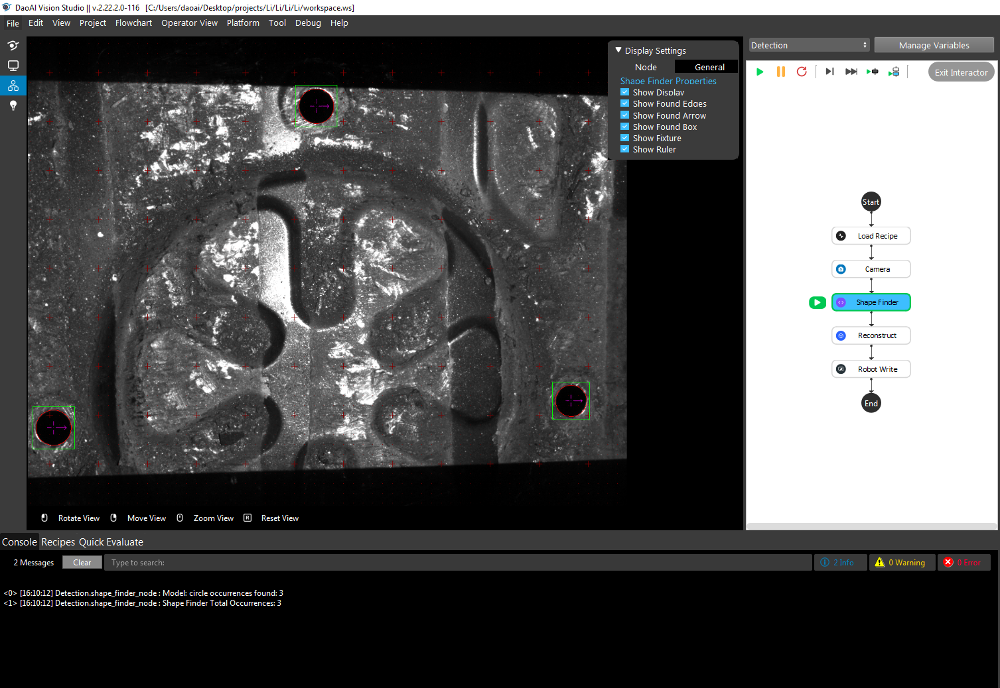

Correct output should looks like this.

Occurrence option controls the output result to be single or multiple. In this example, we want the robot to assemble all the holes hence we need all occurrence of objects in scene.

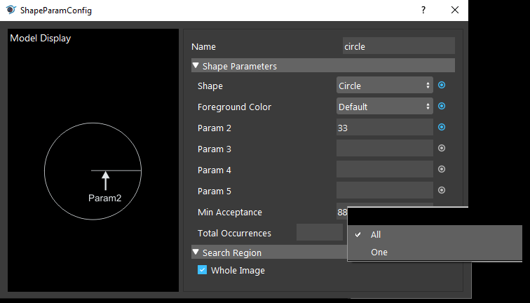

Generate Poses
----------------

Now we can execute Reconstruct node with Shape Finder outputs to generate 3D picking poses.

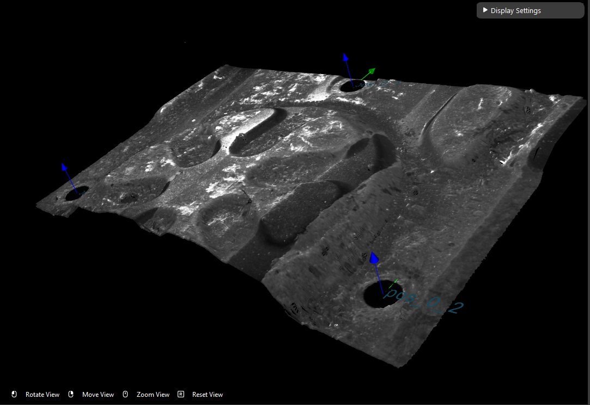

Reconstruct node requires **Object Locations** and **Object Masks** from Shape Finder. Then Reconstruct node generates the picking poses for **Collision Avoidance** for further calculations.