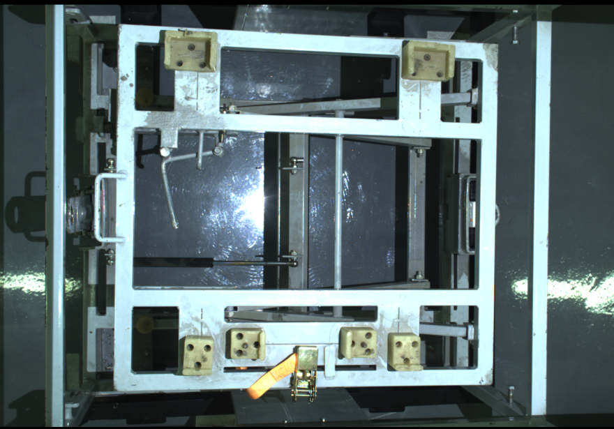
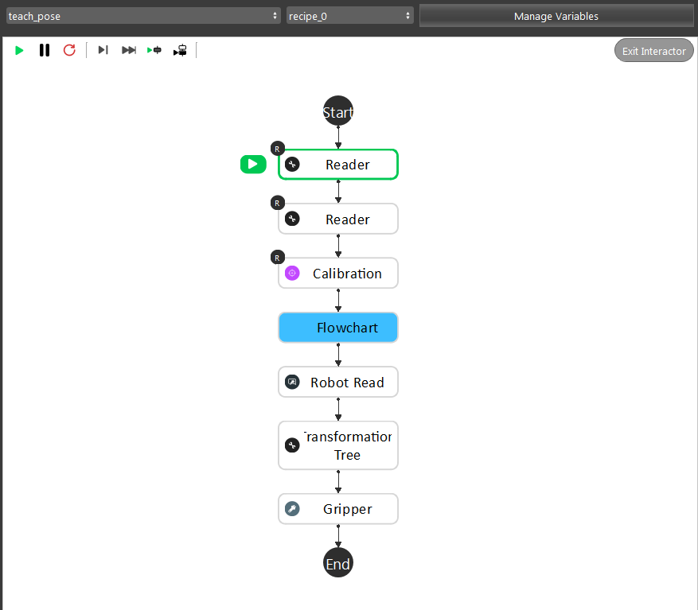
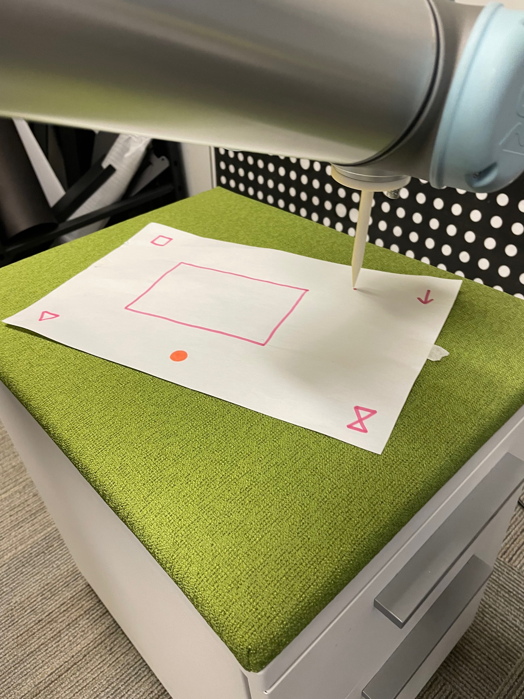
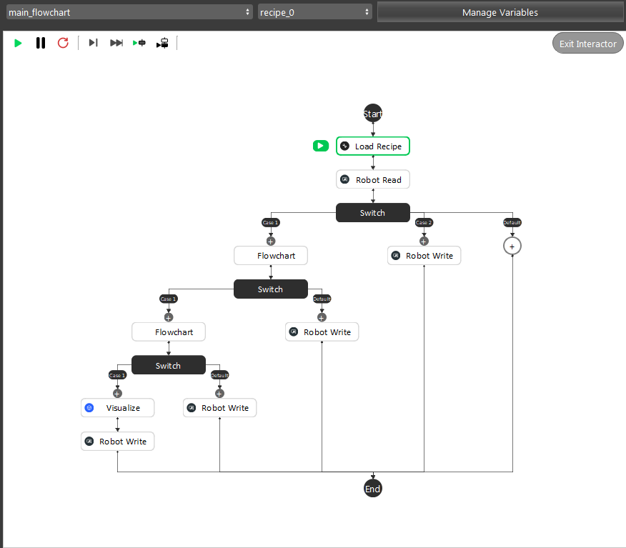

Trans 3D
========

It uses multiple feaetures to define one object.

Use case
~~~~~~~~

The template is useful when a single feature point cannot define the target object properly. The Trans 3D node takes 4 features from Mod Finder to generate the position of an object.
It is useful for detecting something like this:

Mounting instructions
~~~~~~~~~~~~~~~~~~~~~

Eye-to-hand picking only.

Setting up the picking pipeline
~~~~~~~~~~~~~~~~~~~~~~~~~~~~~~~

Calibrate the camera 
""""""""""""""""""""
Nest step is the Hand-Eye Calibration. This process can use the DA Calibration node or the Calibration node. It generates the relative positions between the robot flange and the camera. This relation is used to transform the object pick points into robot coordinates. Details can be found in .. _my-reference-label: TODO: Add DA Calibration reference rst.

Teach the picking pose
""""""""""""""""""""""

Load the calibration file from the Calibration node.

.. note:: Note

    In the "detection" flowchart, give each model a distinct label in the Mod Finder node. And manually click the "Learn Feature" button 
    for the first time running it.

    .. image:: image/3.png
        :align: center

Read the picking pose for the Robot Read node.

Execute the picking 
"""""""""""""""""""
The picking process is straight-forward. Starting with a robot pose that does not block the camera. 
The control flow will first go in the detection stage. Then the pick pose will be calculated in the picking flowchart. 
The correctness can be checked by looking at the Visualize node.

